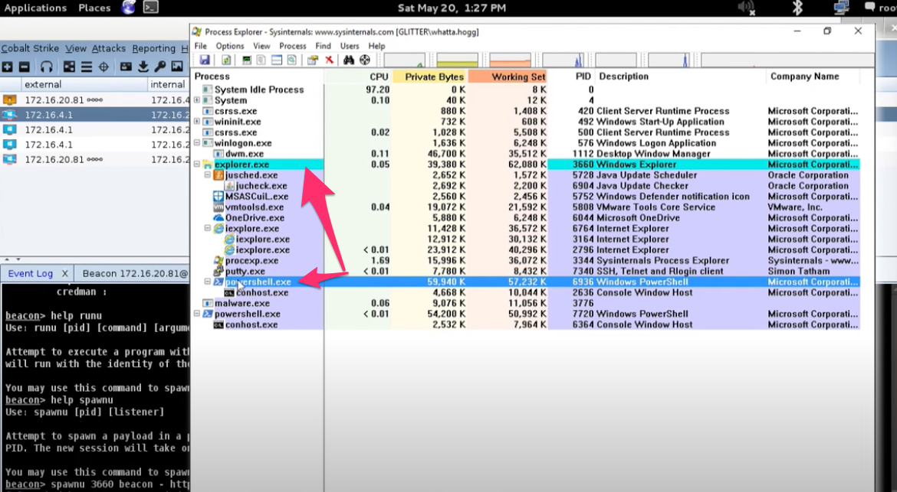
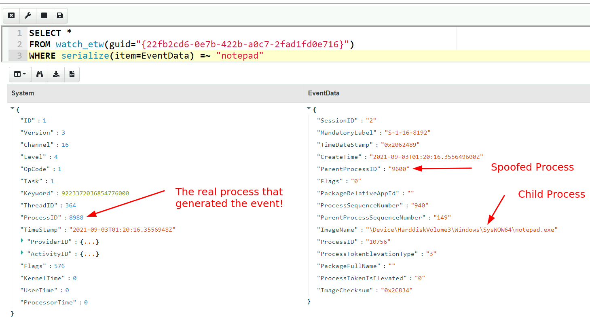
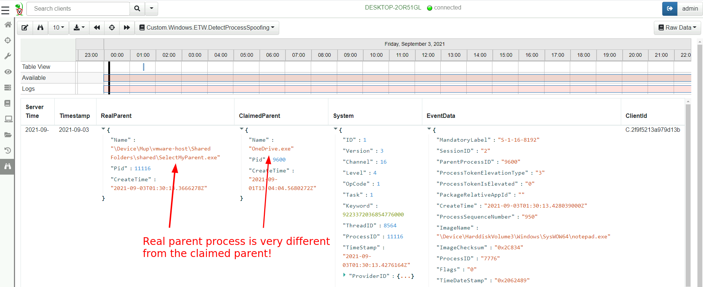

<!-- .slide: class="title" -->

# Monitoring events from endpoints

---

<!-- .slide: class="content" -->
## What are event artifacts?

Event artifacts are never-ending VQL queries that watch for events on
clients and stream those events to the server.


---

<!-- .slide: class="content" -->
## Client event tables

* Monitoring
    * Clients can be made to monitor events and forward them to the server.

* Response
    * Clients can automatically respond to events autonomously
    * E.g. Kill processes, quarantine machines etc.

---

<!-- .slide: class="content" -->

## Enable sysmon collection

<div class="container small-font">
<div class="col">

* Client event queries are targeted by label group.
* Sysmon will be installed automatically and events will be forwarded.

</div>
<div class="col">


</div>
</div>

---

<!-- .slide: class="full_screen_diagram" -->
## Viewing Sysmon events relayed to the server


---

<!-- .slide: class="content" -->
## Turning artifacts into a detection

* We have previously looked at log enable/disable by examining registry keys.
* Can we detect when these registry keys are changing?
* The diff() plugin periodically runs a query and reports on changes.

* Install the `Windows.Events.EventLogModifications` artifact

---

<!-- .slide: class="full_screen_diagram" -->
## Windows.Events.EventLogModifications


---

<!-- .slide: class="full_screen_diagram" -->
## System changes relayed to server

Good for slow changes


---

<!-- .slide: class="title" -->
# The process tracker

## Complimenting forensic analysis with monitoring...

---

<!-- .slide: class="content" -->
## What is the point of Forensics?

* Forensics is used to reconstruct past events from artifacts left on
  the system.
* We are at the merci of lucky accidents and side effects of system
  behavior!
* When Velociraptor is running permanently on the endpoint, we can
  deliberately monitor the endpoint and record a more accurate
  timeline of events!

---

<!-- .slide: class="content" -->
## Tracking processes

* One of the critical questions we ask is `Where did this process come
  from?`

* Context of where the process came from is important in establishing
  initial access vector!

* We could collect all process execution from all endpoints, but:
    * This will generate a large volume of events.
    * Vast majority of events are not interesting.
    * Often we determine which process is interesting is determined by
      context.

---

<!-- .slide: class="content" -->
## The process tracker

* Velociraptor can track processes locally on the endpoint at runtime.
* If the need arises, we can enrich with process execution information.
* This can be done **EVEN IF THE PROCESS EXITED**

---

<!-- .slide: class="full_screen_diagram" -->
## Exercise: Enable the process tracker


---

<!-- .slide: class="content" -->
## Emulate a typical attack

```powershell
psexec.exe /s powershell
ping.exe www.google.com
curl.exe -o script.ps1 https://www.google.com/
notepad.exe
```

---

<!-- .slide: class="full_screen_diagram" -->
## Inspect the notepad process


---

<!-- .slide: class="content" -->
## Using Generic.System.Pstree


---

<!-- .slide: class="content" -->
## View process tree


---

<!-- .slide: class="content" -->
## Inspect the process call chain


---

<!-- .slide: class="title" -->
# USN Journal monitoring

## File modification monitoring at scale.

---

<!-- .slide: class="content" -->
## USN Journal

* We have previously seen that the USN journal is useful for
  recovering evidence of file modification.
* Sadly in practice the USN journal rolls over fairly quickly (days!)
* Wouldn't it be nice to feed the events to the server continuously?

---

<!-- .slide: class="content" -->
## Windows.Detection.USN

* Enable the Windows.Detection.USN artifact - target paths of
  interest.


---

<!-- .slide: class="full_screen_diagram" -->
## Inspect streaming results

* See direct evidence of execution, tasks creation etc.


---

<!-- .slide: class="title" -->

# Event Tracing For Windows
## Bring in the big guns!

---

<!-- .slide: class="content" -->

## Event Tracing for Windows (ETW)

<div class="container small-font">
<div class="col">

* Framework Built into windows
* Matches Consumers to Providers
* Forms the basis of the windows event logs
* Traces can be either written to file or read directly by consumers.

https://docs.microsoft.com/en-us/windows-hardware/test/weg/instrumenting-your-code-with-etw

</div>
<div class="col">


</div>
</div>

---

<!-- .slide: class="content" -->
## How does ETW work ?

* Various software packages throughout the Operating System register themselves as an Event Provider using a unique GUID
* As the software operates, various logging points within the code send "Events" to the provider.
* The operating system simply matches consumers with providers
* A consumer registers interest in a particular provider using the GUID
* Note that if no consumers are interested ETW logging points are essentially free.

---

<!-- .slide: class="content" -->
## ETW Providers

* Any software can define an ETW provider
* There is no consistency - some providers are detailed - some not
* Discoverability is an issue! Some providers are less documented
* It is sometimes possible to infer a lot of providers from their manifest files.
* There are some public efforts to better document the available providers.

---

<!-- .slide: class="content" -->
## View ETW providers registered

<div class="small-font">


* Some information can be gathered by using the command

```powershell
logman query providers
```

</div>


---

<!-- .slide: class="content" -->

## Monitoring the ETW stream

* As an example, we will illustrate how to follow an ETW stream with
  the `watch_etw()` plugin.

* VQL allows Velociraptor to attach to an ETW stream and filter,
enrich or respond to events directly on the endpoint.

* We can use [WEP
Explorer](https://github.com/lallousx86/WinTools/tree/master/WEPExplorer)
to explore interesting sources of ETW events.

---

<!-- .slide: class="full_screen_diagram" -->
## WEP Explorer shows the different events available


---

<!-- .slide: class="content" -->
## Monitoring for DNS sources


---

<!-- .slide: class="content" -->
## Collecting DNS lookup from the entire fleet


---

<!-- .slide: class="content" -->
## Unique ETW sources: Process parent spoofing

* ETW can provide information that is not normally available - for
  example reliable process parent/child relationships.
* Many detections rely on parent/child relationships
* The Windows CreateProcess() API allows the caller to specify the
  parent of a process.
* This means it is trivial to spoof the parent process without any
  privileges - this is a very effective way to defeat parent/child
  based detections.

---

<!-- .slide: class="full_screen_diagram" -->

* SelectMyParent.exe is a free to tool test this API but any software can use the API

https://blog.didierstevens.com/2009/11/22/quickpost-selectmyparent-or-playing-with-the-windows-process-tree/


---

<!-- .slide: class="content" -->
## SelectMyParent.exe


---

<!-- .slide: class="full_screen_diagram" -->
## Can sysmon detect it?
### No unfortunately…


---

<!-- .slide: class="full_screen_diagram" -->
## Cobalt Strike process parent spoof

* Parent Process Spoofing and Session Prepping with Cobalt Strike
https://www.youtube.com/watch?v=DOe7WTuJ1Ac




---

<!-- .slide: class="full_screen_diagram" -->
## Microsoft-Windows-Kernel-Process provider



---

<!-- .slide: class="full_screen_diagram" -->
## Windows.ETW.DetectProcessSpoofing

https://docs.velociraptor.app/exchange/artifacts/pages/windows.etw.detectprocessspoofing/


---

<!-- .slide: class="full_screen_diagram" -->
## Installing parent spoofing detection in Velociraptor



---

<!-- .slide: class="full_screen_diagram" -->
## False positives - UAC elevation


---

<!-- .slide: class="content small-font" -->

## What did we not cover?

* Velociraptor has a lot more than we were able to cover here:
* Many more sources of data: Event logs, ETW, WMI eventing
* Multi-Platform: Linux, MacOS, Windows, FreeBSD
* Endpoint monitoring in real time: Detect and identify compromises in real time!
* Automatic remediation: Apply active remediation to remove the driver and ensure all endpoints are clean.
* Server automation and monitoring in real time with a python API.

---

<!-- .slide: class="content" -->
## Conclusions

* In this workshop we introduced Velociraptor - a powerful endpoint
  visibility solution, as used in a typical DFIR exercise.

* We introduced VQL and gave some examples…
    * Searching for files,
    * registry keys and other endpoint state Hunting everywhere

---


<!-- .slide: class="content" -->
## Conclusions

We only scratched the surface of what Velociraptor can do!

Check out the following links and join our community…

<table class="noborder">
<tr>
    <td>Docs</td><td>
        <a href="https://docs.velociraptor.app/">https://docs.velociraptor.app/</a>
    </td>
</tr>
<tr>
    <td>Github</td><td>
        <a href="https://github.com/Velocidex/velociraptor">https://github.com/Velocidex/velociraptor</a>
    </td>
</tr>
<tr>
    <td>Discord</td><td>
        <a href="https://docs.velociraptor.app/discord/">https://docs.velociraptor.app/discord/</a>
    </td>
</tr>
<tr>
    <td>Mailing list</td><td>
        <a href="mailto:velociraptor-discuss@googlegroups.com">velociraptor-discuss@googlegroups.com</a>
    </td>
</tr>
</table>
