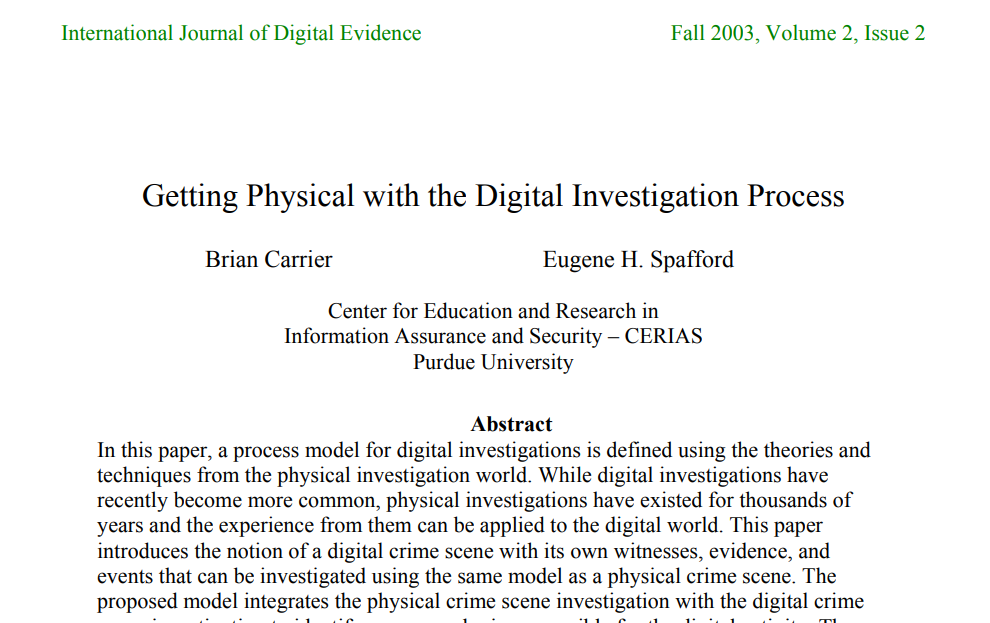
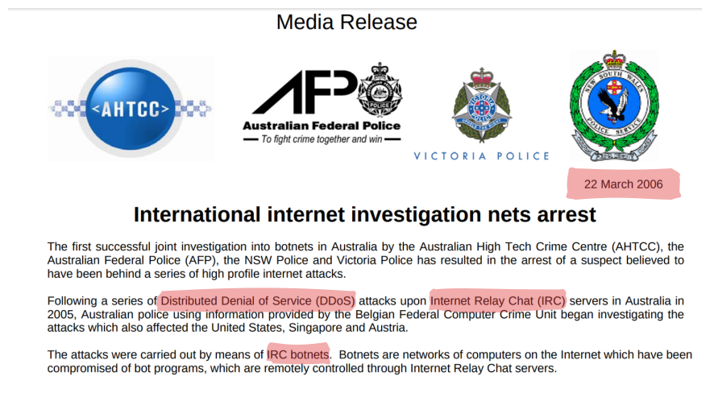
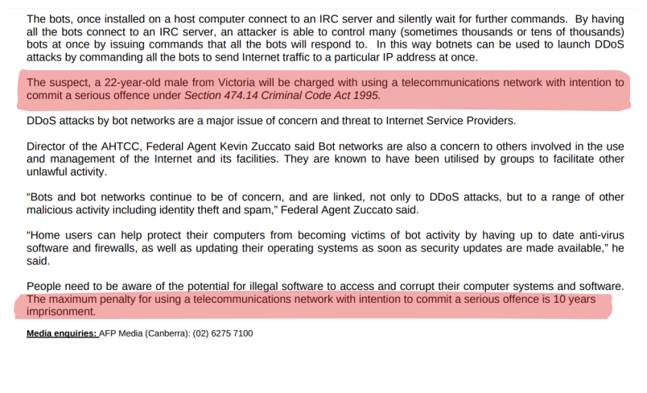
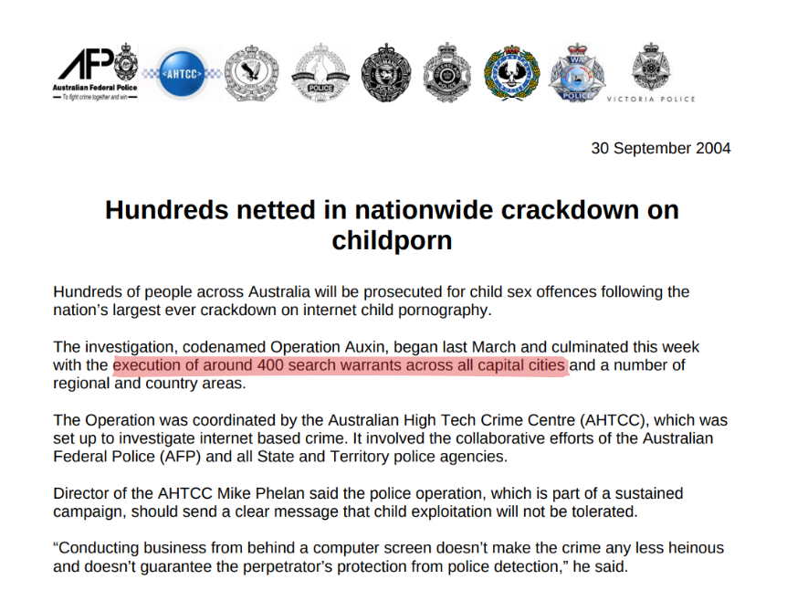

<!-- .slide: class="content" -->

## A trip down memory lane...

* What is Digital Forensics anyway?

* Trying to reconstruct the past
  * What occurred on this system?
  * When did this occur?

* Locard's exchange principal

> "Every contact leaves a trace”

---

<!-- .slide: class="full_screen_diagram" -->

---

<!-- .slide: class="content" -->

## A hacking case...

<a href="nat_060322internetarrest.pdf">

<a>

---

<!-- .slide: class="content" -->

## A hacking case...

<a href="nat_060322internetarrest.pdf">

<a>

---

<!-- .slide: class="content" -->

## A hacking case...

* A complex case consisting of
  * Manual investigation of multiple server drives.
    * Compromises over a couple of years

  * Images shipped from multiple countries.

* Arrest made of 22yo University Student
* Outcome was no conviction recorded
  * let off with a warning: motive was curiosity and desire to learn computer security.

* Really good exercise for all involved!
  * Best practice evidence collection, chain of custody etc!

---

<!-- .slide: class="content" -->

## Large scale operation! 🚨

---

<!-- .slide: class="content" -->

## How do you execute 400 search warrants simultaneously?

* A large scale co-ordinated operation poses a lot of challenges!
   * We dont have hundreds of DF experts! 👮
   * We can not take images of absolutely everything (Even in 2004!)
   * We can not seize every device. 🖥️ 💻📵
   * 72 hours to determine relevance!
   * Need to have chain of custody and follow correct procedures!

---

<!-- .slide: class="content" -->

## How do you execute 400 search warrants simultaneously?

* Solution: Triage!

* Created a custom bootable CD 📀
  * Knoppix!
  * Carve images from disk!
  * Present them in a page of thumbnails!

* Distribute CD in advance
* Use every available resource to triage!
  * No specialist DF skill required 🧑‍💻
  * It is usually pretty obvious when a system requires proper
    escalation to DF experts 😱

---

<!-- .slide: class="content" -->

## Key takeaways...

* Digital Forensics is a rigorous science with strong evidentiary procedures!
* However... We are trying to solve real life problems!
   * Need to be flexible and evolve to meet operational challenges
   * Scale, resourcing and time are critical challenges

> Triage is a pragmatic tradeoff between time and accuracy

---

<!-- .slide: class="content" -->

## This was 20 years ago!
### Could we do the same today?

* Unlikely to be very effective!
   * Modern devices don't generally have DVD drives
   * Full Disk Encryption is widely available
   * Trusted boot, protected BIOS to prevent booting into DVD
   * Many devices are hardened (e.g. Chromebooks)
   * Modern drives are huge

* Bad actors have better Op Sec
   * Much more awareness of DF techniques
   * Widely available encryption and security products
