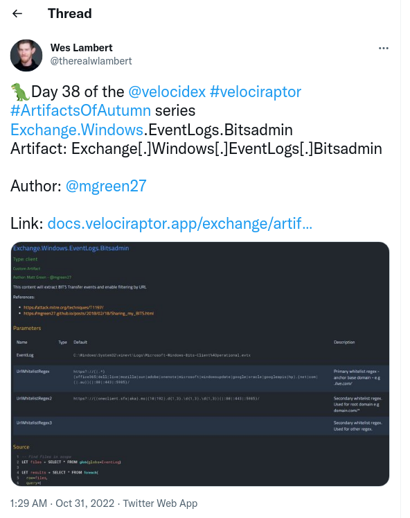
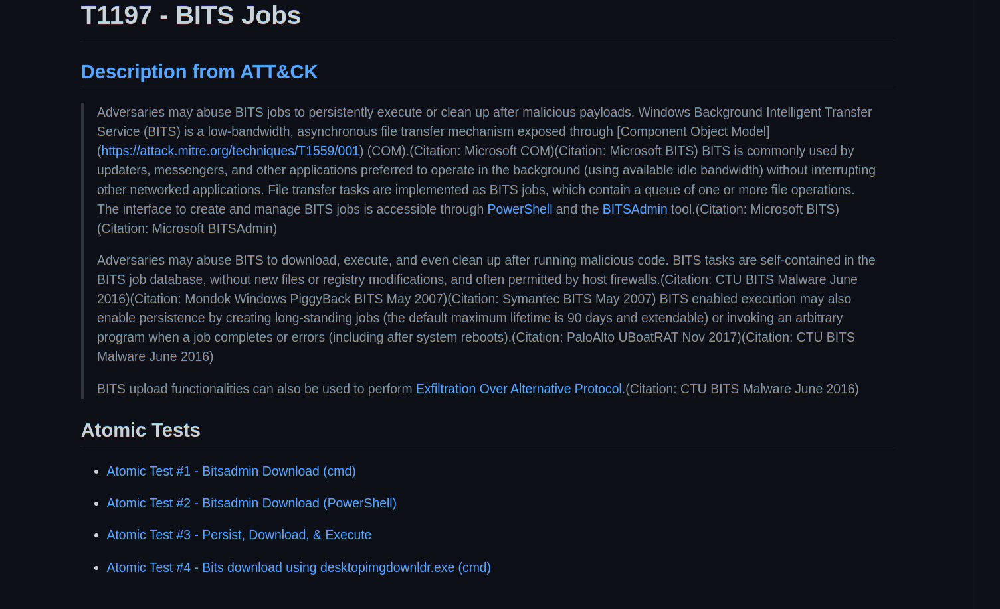

<!-- .slide: class="title" -->
## Artifacts Of Autumn #38

---

<!-- .slide: class="content" -->

## Bitsadmin service

* Windows has a generic downloader service called Bits
* It is a signed and trusted service but anyone can use it!
* Nice way to bypass software allow-listing approaches.

---

<!-- .slide: class="content" -->
## Exercise - Atomic Red Team

Work through the examples from the [Atomic Red Team](https://github.com/redcanaryco/atomic-red-team/blob/master/atomics/T1197/T1197.md#atomic-test-2---bitsadmin-download-powershell)

---

<!-- .slide: class="content" -->
## Detecting the attack

Using the Windows.EventLogs.Bitsadmin artifact we can check the local
event logs for signed of misuse...

