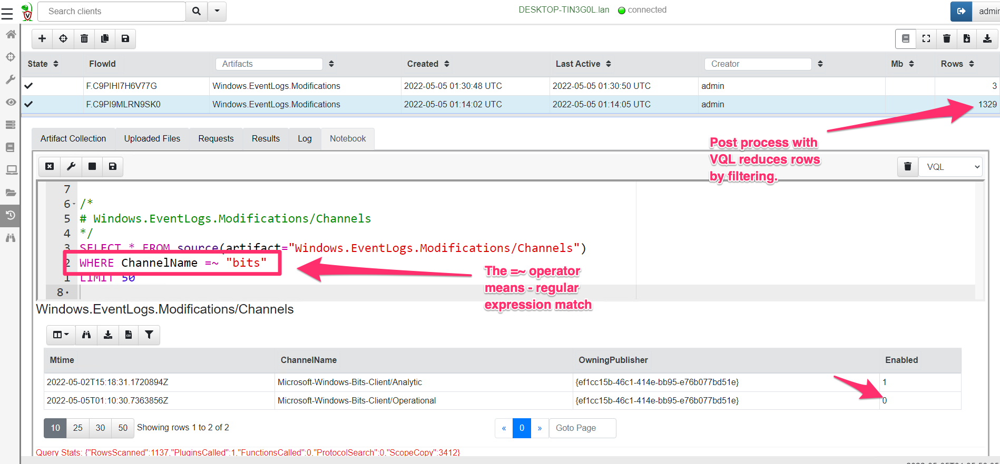
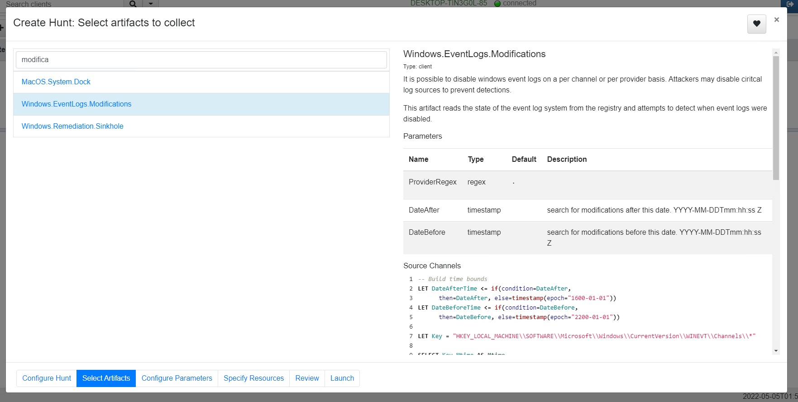

<!-- .slide: class="title" -->

# Querying the registry

## Detecting event log modifications

---


<!-- .slide: class="content" -->
## The Windows Registry

* Windows uses the registry to store configuration data.
* Many attackers modify system configuration to achieve persistence
* It is very useful to be able to query the registry!
* Velociraptor has two types of registry accessors:
    * "registry" uses the APIs
    * "raw_reg" parses the registry hives themselves


---


<!-- .slide: class="content" -->
## Example: Disable event logs

* Windows event logs are crucial for detection
* Many detection solutions rely on forwarding event logs to a backend
* It is trivial to enable/disable event log collection
* Let's look at disabling the BITS client events

---


<!-- .slide: class="full_screen_diagram" -->
## What is BITS? Why should we care?


---

<!-- .slide: class="content" -->
## What is BITS?

<div class="container">
<div class="col">

BITS activity is visible in the logs

```text
bitsadmin.exe /transfer
  /download /priority
  foreground https://www.google.com
  c:\Users\test\test.ps1
```

</div>
<div class="col">

</div>
</div>

---

<!-- .slide: class="full_screen_diagram" -->
## Disable event logs


Note:
It is easy to disable log collections - from the GUI or programmatically
Try this yourself - disable the Bits-Client logs, clear the logs and repeat the previous step

---

<!-- .slide: class="content" -->
## Query the registry for event log config

* Disabling the event logs actually results in a configuration change in the registry.
    * The relevant keys are discussed in [Disabled Event Log Files](https://docs.velociraptor.app/blog/2021/2021-01-29-disabled-event-log-files-a3529a08adbe/)
    * We can use `Windows.EventLogs.Modifications` to query log state

---

<!-- .slide: class="content" -->
## We can get a snapshot of all event logs


---

<!-- .slide: class="content" -->
## Being more targeted in collection

<div class="container">
<div class="col">

* Most artifacts have parameters that allow us to be more targeted in
  collection
* Being targeted is good because it reduces the amount of data we
  collect!

</div>
<div class="col">

</div>
</div>

---

<!-- .slide: class="content" -->
## More targeted in collection
* Treat the endpoint as the ultimate source of truth - need more
  data? go back and re-fetch it from the endpoint.


---

<!-- .slide: class="content small-font" -->
## Post processing with notebooks

* Another alternative is to collect all the data and then post-process using the GUI
    * Helps us drill into the data and understand what is going on.



---

<!-- .slide: class="title" -->
# Hunting at scale

---

<!-- .slide: class="content" -->
## Hunting - mass collections

Hunting is Velociraptor's strength - collect the same artifact from thousands of endpoints in minutes!

* Two types of hunts:
   * Detection hunts are very targeted aimed at yes/no answer
   * Collection hunts collect a lot more data and can be used to
     build a baseline.

---

<!-- .slide: class="content" -->
## Exercise - baseline event logs

For this exercise we start a few more clients.

```text
c:\Users\test>cd c:\Users\test\AppData\Local\Temp\

c:\Users\test\AppData\Local\Temp>Velociraptor.exe
   --config client.config.yaml pool_client --number 100
```

This starts 100 virtual clients so we can hunt them
* We use pool clients to simulate load on the server

---


<!-- .slide: class="full_screen_diagram" -->
## Pool clients
Simply multiple instances of the same client


---


<!-- .slide: class="full_screen_diagram" -->
## Create a hunt


---


<!-- .slide: class="full_screen_diagram" -->
## Select hunt artifacts


---


<!-- .slide: class="full_screen_diagram" -->
## Collect results


---


<!-- .slide: class="content" -->
## Exercise - Stacking

* The previous collection may be considered the baseline
* For this exercise we want to create a few different clients.
    * Stop the pool client
    * Disable a log channel
    * Start the pool client with an additional number of clients

```
Velociraptor.exe --config client.config.yaml pool_client --number 110
```

---


<!-- .slide: class="full_screen_diagram" -->
## Stacking can reveal results that stand out


