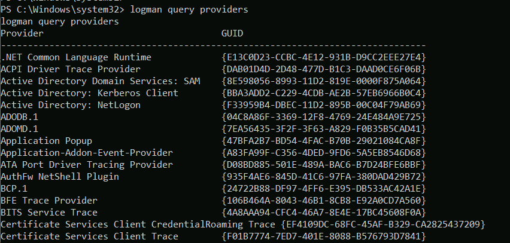
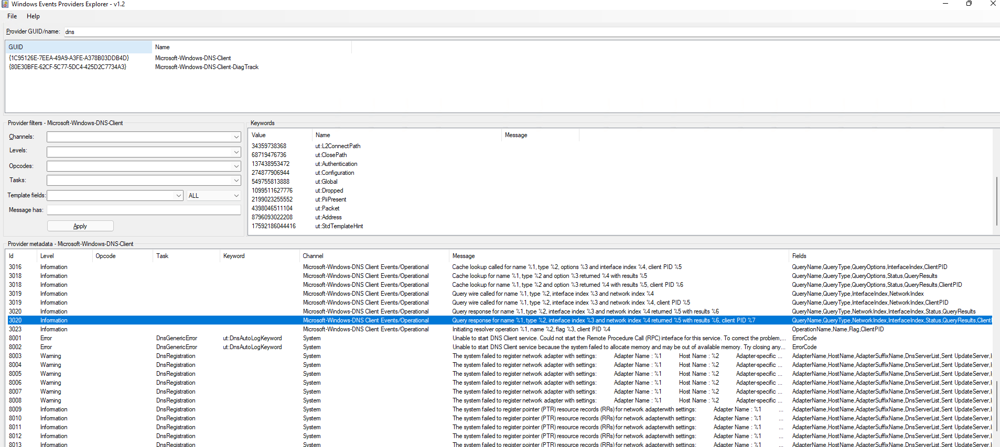
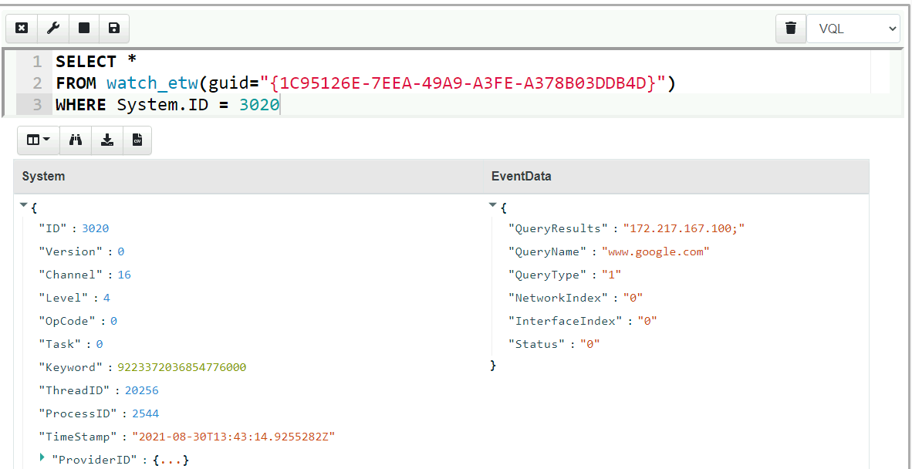

<!-- .slide: class="title" -->

# Event Tracing For Windows
## Bring in the big guns!

---

<!-- .slide: class="content" -->

## Event Tracing for Windows (ETW)

<div class="container small-font">
<div class="col">

* Framework Built into windows
* Matches Consumers to Providers
* Forms the basis of the windows event logs
* Traces can be either written to file or read directly by consumers.

https://docs.microsoft.com/en-us/windows-hardware/test/weg/instrumenting-your-code-with-etw

</div>
<div class="col">


</div>
</div>

---

<!-- .slide: class="content" -->
## How does ETW work ?

* Various software packages throughout the Operating System register themselves as an Event Provider using a unique GUID
* As the software operates, various logging points within the code send "Events" to the provider.
* The operating system simply matches consumers with providers
* A consumer registers interest in a particular provider using the GUID
* Note that if no consumers are interested ETW logging points are essentially free.

---

<!-- .slide: class="content" -->
## ETW Providers

* Any software can define an ETW provider
* There is no consistency - some providers are detailed - some not
* Discoverability is an issue! Some providers are less documented
* It is sometimes possible to infer a lot of providers from their manifest files.
* There are some public efforts to better document the available providers.

---

<!-- .slide: class="content" -->
## View ETW providers registered

<div class="small-font">


* Some information can be gathered by using the command

```powershell
logman query providers
```

</div>




---

<!-- .slide: class="content" -->

## Monitoring the ETW stream

* As an example, we will illustrate how to follow an ETW stream with
  the `watch_etw()` plugin.

* VQL allows Velociraptor to attach to an ETW stream and filter,
enrich or respond to events directly on the endpoint.

* We can use [WEP
Explorer](https://github.com/lallousx86/WinTools/tree/master/WEPExplorer)
to explore interesting sources of ETW events.

---

<!-- .slide: class="full_screen_diagram" -->
## WEP Explorer shows the different events available



---

<!-- .slide: class="content" -->
## Monitoring for DNS sources



---

<!-- .slide: class="content" -->
## Collecting DNS lookup from the entire fleet


---

<!-- .slide: class="content" -->
## Unique ETW sources: Process parent spoofing

* ETW can provide information that is not normally available - for
  example reliable process parent/child relationships.
* Many detections rely on parent/child relationships
* The Windows CreateProcess() API allows the caller to specify the
  parent of a process.
* This means it is trivial to spoof the parent process without any
  privileges - this is a very effective way to defeat parent/child
  based detections.

---

<!-- .slide: class="full_screen_diagram" -->

## Process Spoofing

* SelectMyParent.exe is a free to tool test this API but any software can use the API

https://blog.didierstevens.com/2009/11/22/quickpost-selectmyparent-or-playing-with-the-windows-process-tree/


---

<!-- .slide: class="content" -->
## SelectMyParent.exe


---

<!-- .slide: class="full_screen_diagram" -->
## Can sysmon detect it?
### No unfortunately…


---

<!-- .slide: class="full_screen_diagram" -->
## Cobalt Strike process parent spoof

* Parent Process Spoofing and Session Prepping with Cobalt Strike
https://www.youtube.com/watch?v=DOe7WTuJ1Ac


---

<!-- .slide: class="full_screen_diagram" -->
## Microsoft-Windows-Kernel-Process provider


---

<!-- .slide: class="full_screen_diagram" -->
## Windows.ETW.DetectProcessSpoofing

https://docs.velociraptor.app/exchange/artifacts/pages/windows.etw.detectprocessspoofing/


---

<!-- .slide: class="full_screen_diagram" -->
## Installing parent spoofing detection in Velociraptor


---

<!-- .slide: class="full_screen_diagram" -->
## False positives - UAC elevation


