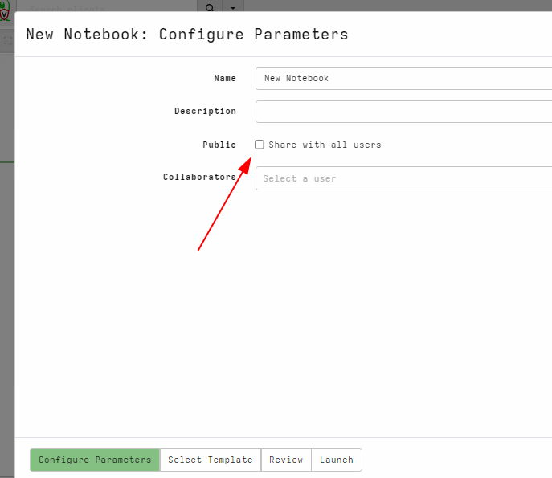
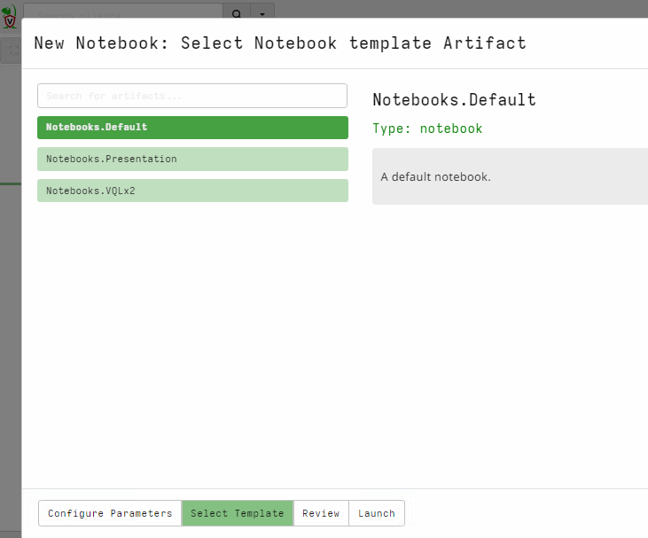
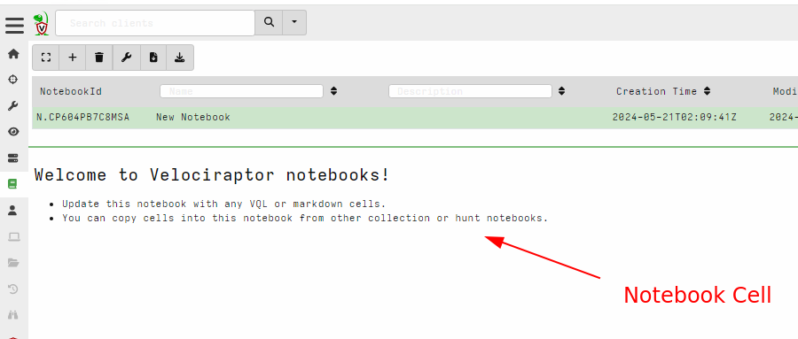
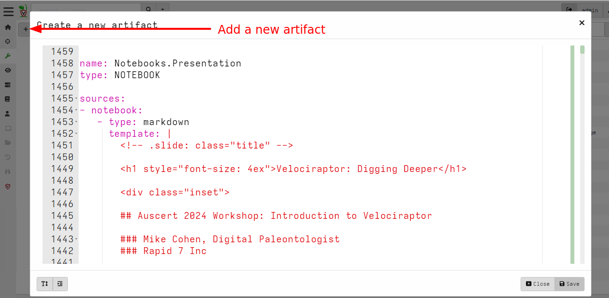
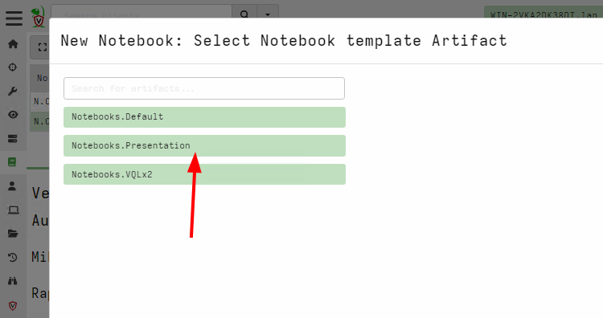
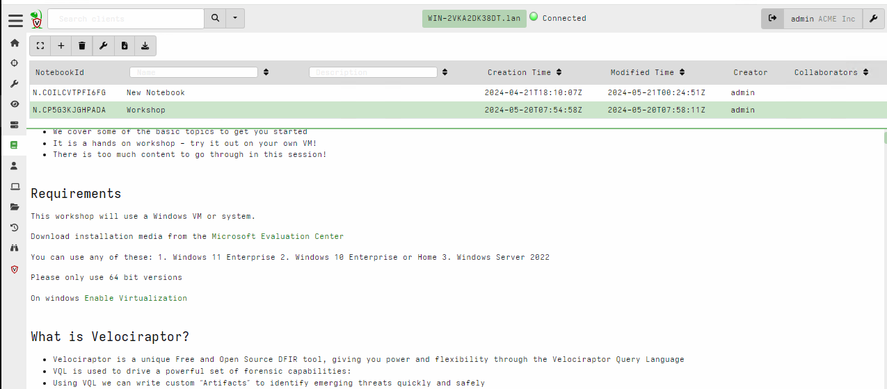
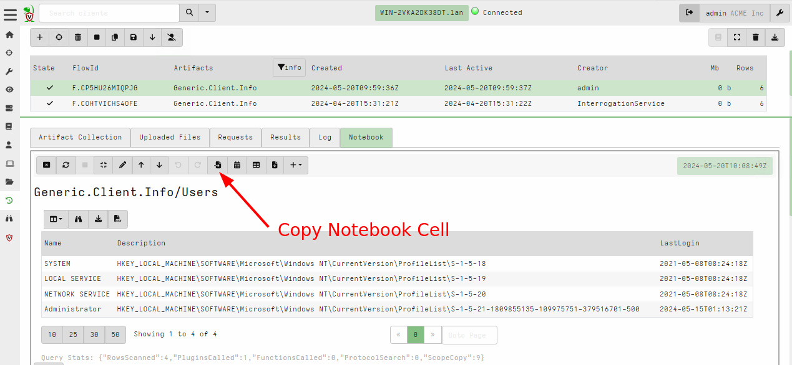
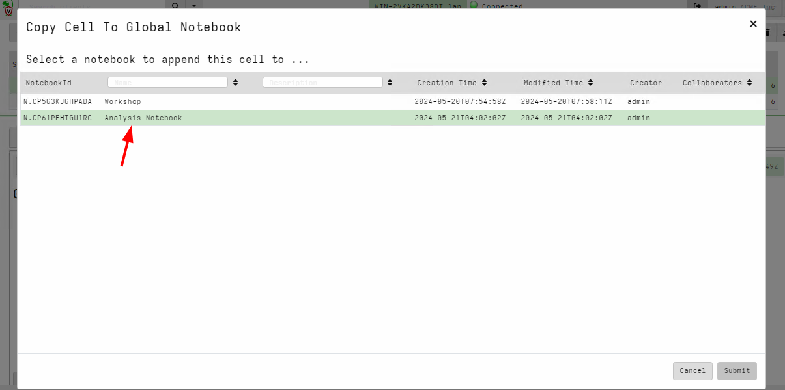
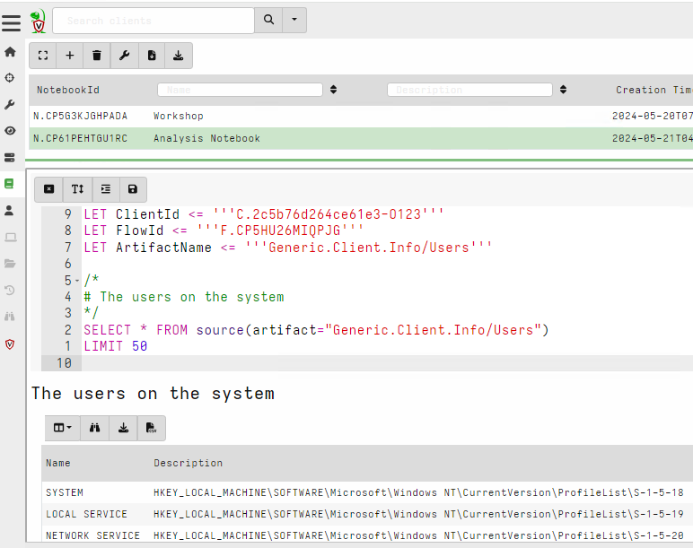

<!-- .slide: class="title" -->
# Velociraptor Notebooks

## Post processing

---

<!-- .slide: class="content" -->

## What are Velociraptor Notbooks?

* Interactive evaluation environment
* Collaborative
* Allows for drilling into data
* Central place to document investigation

---

<!-- .slide: class="content" -->

## Creating a notebook

---

<!-- .slide: class="content" -->

## Creating a notebook
### Select the initial template

---

<!-- .slide: class="content" -->

## Creating a notebook

---

<!-- .slide: class="content" -->

## Creating a custom template

* Notebooks are built from a template
* Templates are just a special kind of artifact
* You can get the notebook for this workshop <a href="artifact.yaml">Here</a>

---

<!-- .slide: class="content" -->

## Exercise - Add notebook template

* Copy the template for this workshop into the artifact editor.
* Make sure to save the file and open it in notepad
    * Sometimes copy/paste does not work because the browser corrupts
      the text

---

<!-- .slide: class="content" -->

## Exercise - Add notebook template

---

<!-- .slide: class="content" -->

## Exercise - Workshop template

---

<!-- .slide: class="full_screen_diagram" -->

## Exercise - Workshop template

---

<!-- .slide: class="content" -->

## Types of notebook

1. Global Notebooks: Used to collect finished analysis cells
    * Usually contains information from multiple hunts/collections.

2. Flow Notebooks: Operate on the result of collections
3. Hunt Notebooks: Operate on the result of hunts.

---

<!-- .slide: class="content" -->

## Exercise: Copy cell from collection

* Copy a cell from your collection to the global notebook.

---

<!-- .slide: class="content" -->

## Exercise: Copy cell from collection

---

<!-- .slide: class="content" -->

## Exercise: Copy cell from collection

---

<!-- .slide: class="content" -->

## Global notebooks

* Use global notebooks as a central place to collate findings
* Share the notebook with specific collaborators or publicly (to all
  users on the server).
* When ready, export the notebook for evidentiary storage.
