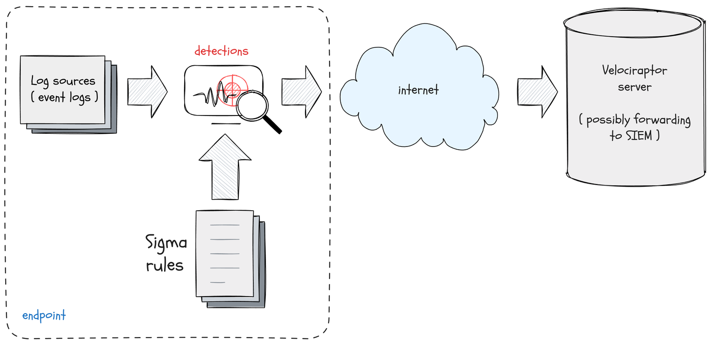
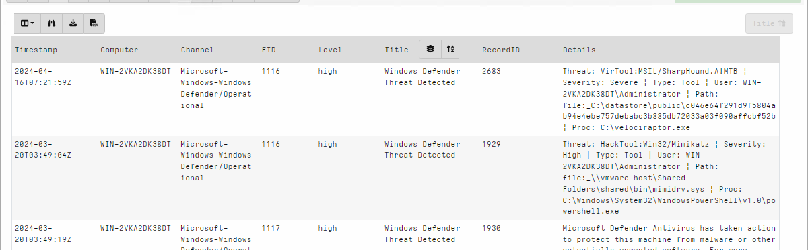

<!-- .slide: class="content" -->
## Triaging at scale

* The artifact exchange contains many artifacts
    * Some are very simple
    * But we need to remember to collect them all!

* When triaging an endpoint we want to quickly answer some questions
    * What happened here (Forensics)
    * What **bad** happened here (Detection)

* Ideally a fire and forget approach
    * Easy to use - lots of impact!

---

<!-- .slide: class="content" -->

## Triaging at scale
### VQL Uber artifacts

* VQL Artifacts can be externally managed
    * Maintain a set of rules which can be managed independently of
      the main release.

* `SQLite Hunter`: Automatically hunt and parse all Browser/OS artifacts
* `Registry Hunter`: Automatically parse all registry relevant data.
* `Evtx Hunter`: Hunt for event logs.
* `Sigma Hayabusa`: Automatically detect suspicious activity in the
  event logs.

---

<!-- .slide: class="content small-font" -->

## SQLite Hunter

* Designed for minimal configuration - just click and go!


---

<!-- .slide: class="content" -->

## SQLite Hunter

* Automatically search for various SQLite files
* Rules are based on categories
* Maintained in their own open source repository at
  https://github.com/Velocidex/SQLiteHunter/
* Have evolved to parse other files **not only SQLite**
   * For example Windows Search Index
   * Firefox/Chrome extensions are JSON

---

<!-- .slide: class="full_screen_diagram" -->

## SQLite Hunter


---

<!-- .slide: class="full_screen_diagram" -->

## SQLite Hunter


---

<!-- .slide: class="content small-font" -->

## Registry Hunter

* The Windows Registry is a treasure trove of information!
   * Contains critical information about installed software
   * System configuration
   * Sometimes has remnants of old activity

* Contains thousands of keys and values
   * Need to know where to look
   * Sometimes we need to parse the values in some way (e.g. Binary
     Data or timestamps)

* We really need to automate this!
  * https://github.com/Velocidex/registry_hunter/
  * https://registry-hunter.velocidex.com/

---

<!-- .slide: class="content small-font" -->

## Registry Hunter
### Analysis for each key is specified by rules


---

<!-- .slide: class="content" -->

## Registry Hunter
### Importing the latest artifact


---

<!-- .slide: class="content small-font" -->

## Registry Hunter

* Designed for minimal configuration - just click and go!


---

<!-- .slide: class="content small-font" -->

## Registry Hunter
### Postprocessing the results


---

<!-- .slide: class="content small-font" -->

## Registry Hunter
### Stacking on a column


---

<!-- .slide: class="content small-font" -->

## Registry Hunter
### Open stacking groups window


---

<!-- .slide: class="content small-font" -->

## Registry Hunter
### View stacking groups


---

<!-- .slide: class="content small-font" -->

## Registry Hunter
### Examine hits


---

<!-- .slide: class="content small-font" -->

## Registry Hunter
### Hunting with VQL

* Sometimes we already know what we are looking for...
* Lets see if anything mentions the word `Velociraptor`
* The `=~` operator means `Regular Expression Match`

```sql
SELECT * FROM source()
WHERE Details =~ "velociraptor"
```

---

<!-- .slide: class="content small-font" -->

## Registry Hunter
### Hunting with VQL


---

<!-- .slide: class="content" -->
## Evtx Hunter

* Event logs are an important source of information.
* Many event sources, files and event IDs
* Sometimes the best approach is the brute force approach!
* Search for any event that happens to mention `Velociraptor`!
    * We dont need to know in advance what service will log it
    * Cast a wide net!

---

<!-- .slide: class="content small-font" -->

## Evtx Hunter


---

<!-- .slide: class="content small-font" -->

## Evtx Hunter

* Clean up the table by removing extra columns

```sql
SELECT EventTime, Provider, EventID, EventData, Message
FROM source(artifact="Windows.EventLogs.EvtxHunter")
```


---

<!-- .slide: class="content small-font" -->

## Evtx Hunter

### Extra stacking gives many more event logs


---

<!-- .slide: class="content small-font" -->

## Evtx Hunter


---

<!-- .slide: class="content" -->

## Sigma Hayabusa
### Detecting evil!

* So far we saw what happened on the system
* But - what **bad** happened on the system?
    * This is the difference between detection and forensics.
    * We previously did it manually - can we automate it?

* Sigma is a way to write detection rules for event logs

---

<!-- .slide: class="content small-font" -->

## What is a Sigma Rule?


```yaml
title: PSExec Lateral Movement
logsource:
    product: windows
    service: system
detection:
    selection:
        Channel: System
        EventID: 7045
    selection_PSEXESVC_in_service:
        Service: PSEXESVC
    selection_PSEXESVC_in_path:
        ImagePath|contains: PSEXESVC
    condition: selection and (selection_PSEXESVC_in_service or selection_PSEXESVC_in_path)
```

---

<!-- .slide: class="content" -->

## Triaging Using Sigma

* Endpoint tools can directly evaluate Sigma rules on the event logs




---

<!-- .slide: class="content small-font" -->

##  Collecting the sigma artifact


---

<!-- .slide: class="content small-font" -->

## Triaging an endpoint


---

<!-- .slide: class="content small-font" -->

## Stacking rules by title


---

<!-- .slide: class="content small-font" -->

## Viewing the stacking stats


---

<!-- .slide: class="content small-font" -->

## Viewing common rows


