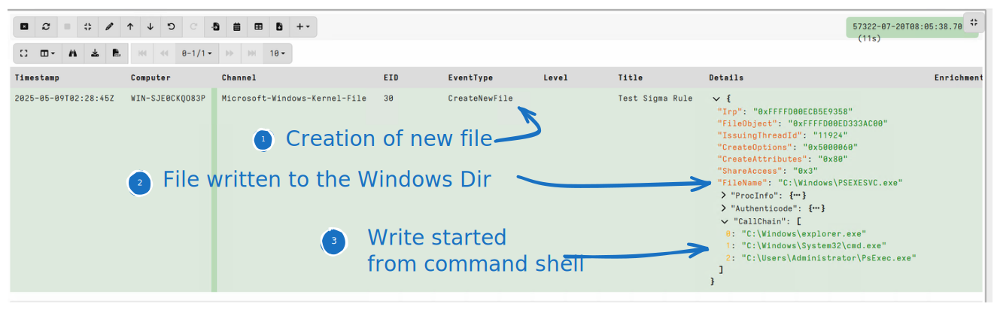
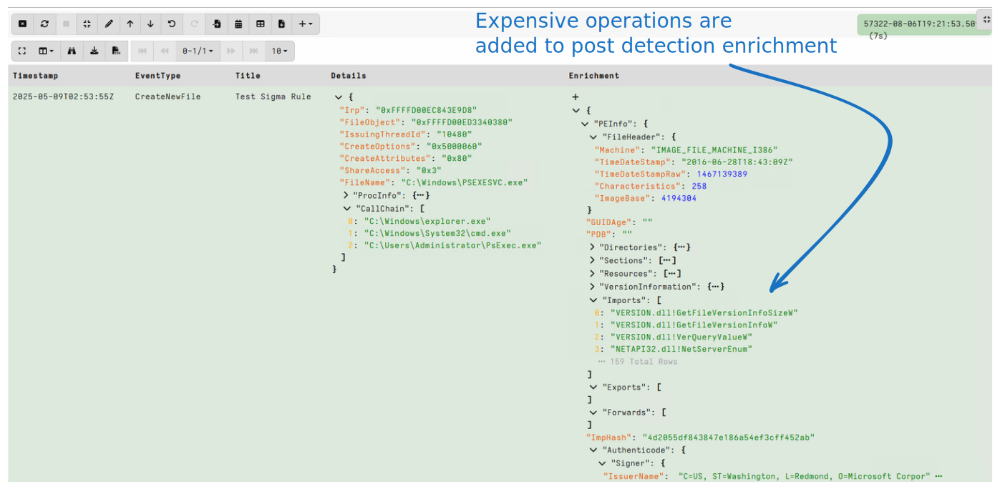
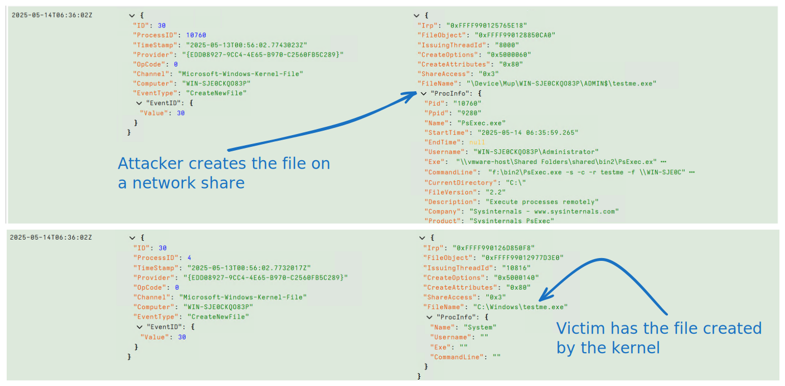
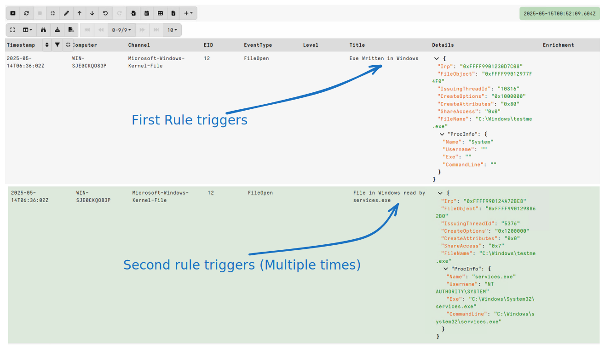
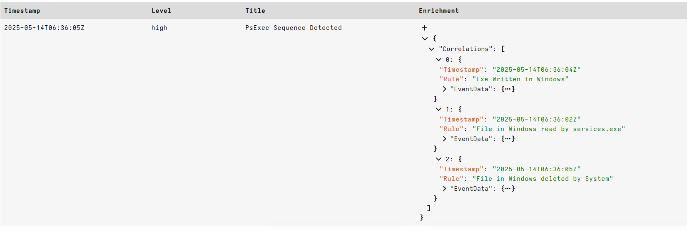

<!-- .slide: class="title" -->

## Forensic Enrichment
### Enriching events with endpoint state

---

<!-- content -->

## Enrichment with endpoint state

* So far we only applied detection on event logs
* Usually endpoint state provides important context
   * Helps us to triage hits to eliminate false positives

* Many SOC workflows rely on a detection/response loop
   * Analysts need to respond to the detection to retrieve more
     endpoint context

* Velociraptor allows direct enrichment
  * Forensic enrichment adds data outside the pure log source directly
    to the detected event.

---

<!-- content small-font -->
## The Velociraptor Sigma Engine Extensions
### Pre-evaluation enrichment

* Prior to evaluating the rule, the Velociraptor Sigma engine can
  transform the original event using VQL functions.
* This allows us to add additional fields from the live system.
* In this case we add the field `CallChain` to be the [full call
  chain](https://docs.velociraptor.app/vql_reference/other/process_tracker_callchain/)
  of the process mentioned in the event.
   * Velociraptor's process tracker is extremely efficient way to
     calculate process lineage
* Let's try this detection logic:
   * A file is created in the Windows directory
   * The process that created the file is launched interactively

---

<!-- content small-font -->
## Exercise: Enrich data with Process Call Chain

```sql
LET SigmaRules = '''
title: Test Sigma Rule
logsource:
  category: etw
  product: windows
  service: file

detection:
  selection_event_type:
    EventType: CreateNewFile
  selection_filename:
    FileName|re: ^C:\\Windows
  selection_callchain_interactive:
    EventData.CallChain|re: cmd.exe|powershell.exe

  condition: selection_event_type and selection_filename and selection_callchain_interactive

vql: |
  x=>dict(
    EventData=x.EventData + dict(
      CallChain=process_tracker_callchain(id=x.System.ProcessID).Data.Exe))
'''
SELECT *
FROM Artifact.Windows.Sigma.ETWBase(SigmaRules=SigmaRules)
```

---

<!-- content small-font -->
## Enriching detection with endpoint state



---

<!-- content small-font -->
## Post Evaluation Enrichment

* Enriching events before evaluation can be expensive - it happens on
  all events, even the ones that do not match.

* Sometimes we just want to get additional information when the rule
  fires!
  * This is much cheaper as it only happens when the rule fires 🙂
  * But you can not use that enrichment in a detection condition! 🤨

---

<!-- content small-font -->
## Post Evaluation Enrichment

* Expensive enrichment can be added to the `enrichment` section of the rule
* When the rule fires, the enrichment will be added to the results
    * This allows us to capture this state in the event itself!
    * If the file is removed subsequently we still have important context!

```sql

enrichment: |
   x=>dict(PEInfo=parse_pe(file=x.EventData.ProcInfo.Exe))

```

---

<!-- full_screen_diagram small-font -->

## Post Evaluation Enrichment




---

<!-- content small-font -->
## Exercise: Better PsExec detection

* Think about the different steps in PsExec

   * `PsExec.exe` is launched
   * `EULA` registry key is checked
   * `psexesvc.exe` is written to the Windows directory
   * Service is created (Registry key written)
   * Service is started
   * Command shell is spawned from the service
   * Command shell is running as the system user

---

<!-- content small-font -->
## Exercise: Better PsExec detection

* How can the specifics be changed?
   * Process name can be changed
   * Binaries can be modified to change - EULA, `VersionInformation` etc
   * Service name can be changed
* What is unusual about this attack?
   * Writing an executable to the Windows directory?
   * Creating and starting a service?
   * Command shell running as SYSTEM?
   * Command shell starting from a service?

---

<!-- content small-font -->
## Exercise: Better PsExec detection
### Inspect file writing behavior

* In practice PsExec is used to move laterally.
* Let's examine file activity

```
SELECT * FROM Artifact.Windows.Sigma.ETWBase.CaptureTestSet(
   LogSourceFilter="etw/windows/file")
WHERE EventData.FileName =~ "testme.exe"
```

* Start the attack across the network.

```
PsExec.exe -s -c -r testme -f \\WIN-SJE0CKQO83P\ cmd.exe
```

---

<!-- full_screen_diagram small-font -->

## Exercise: Better PsExec detection



---

<!-- content small-font -->

## Exercise: Better PsExec detection

* From the file activity point of view

   * On the Victim:
      * File created in `C:\windows\testme.exe` by `System`
      * File opened `C:\windows\testme.exe` by `services.exe`
      * File deleted in `C:\windows\testme.exe` by `System`

   * On the attacker:
      * File created on a network share `\Device\Mup\WIN-SJE0CKQO83P\ADMIN$\testme.exe` by `PsExec.exe`
      * File deleted on a network share `\Device\Mup\WIN-SJE0CKQO83P\ADMIN$\testme.exe` by `PsExec.exe`

* Each action on its own is not very unique!
   * Let's detect the attack on the victim using the Kernel File provider.

---

<!-- content small-font -->

## Exercise: Better PsExec detection
### Writing Sigma Rules

```sql
LET Rules <= '''
title: Exe Written in Windows
logsource:
  category: etw
  product: windows
  service: file

detection:
    file_name:
      EventType: FileOpen
      EventData.FileName|startswith: C:\Windows
      EventData.FileName|endswith: exe
    process_name:
      ProcessName|contains: System
    condition: file_name and process_name

---
title: File in Windows read by services.exe
logsource:
  category: etw
  product: windows
  service: file

detection:
    file_name:
      EventType: FileOpen
      EventData.FileName|startswith: C:\Windows
      EventData.FileName|endswith: exe
    process_name:
      ProcessName|contains: Services.exe
    condition: file_name and process_name

---
title: File in Windows deleted by System
logsource:
  category: etw
  product: windows
  service: file

detection:
    file_name:
      EventType: NameDelete
      EventData.FileName|startswith: C:\Windows
      EventData.FileName|endswith: exe
    process_name:
      ProcessName|contains: System
    condition: file_name and process_name

'''

SELECT *
FROM Artifact.Windows.Sigma.ETWBase.ReplayTestSet(
   JSONDump="C:/Users/Administrator/Downloads/file_test.json",
   SigmaRules=Rules,
   Debug=FALSE)
```

---

<!-- content small-font -->
## Exercise: Better PsExec detection
### Each of these detection is not very strong on its own.



---

<!-- content small-font -->

## Sigma Correlation Rules

* So far we saw Sigma detection rules
    * Think of those as `grep` for event logs
    * We match the event one at the time

* Sometimes an attack is based described as a sequence of steps
    * Each step in isolation is not a very unique event
    * But the combination of the steps are a `Strong Signal`

* Sigma correlation is about correlating multiple rules across time
    * https://sigmahq.io/docs/meta/correlations.html

* Several types of correlations:
    * `event_count` - check a rule fires enough within the time span
    * `value_count` - Check that a field appears more often
    * `temporal` - Check that multipe rules fire within a time span

---

<!-- content small-font -->
## Sigma Correlation Rules

* Each rule carries a `name` field.
* The Correlation rule refers to other rules
   * Those other rules will be suppressed
   * Only when the correlation fires all the rule hits will be
     reported in the `_Correlations` field.
* Rule matches are only considered with the `timespan` parameter.

```yaml
title: PsExec Sequence Detected
correlation:
  type: temporal
  rules:
    - rule1
    - rule2
    - rule3
  timespan: 100s
enrichment: |
  x=>dict(Correlations={
     SELECT Timestamp, _MatchingRule AS Rule, EventData
     FROM x._Correlations
     GROUP BY Rule
   })
```

---

<!-- content small-font -->

## Sigma Correlation Rules
### Full example

```sql

LET Rules <= '''
title: Exe Written in Windows
name: rule1
logsource:
  category: etw
  product: windows
  service: file

detection:
    file_name:
      EventType: FileOpen
      EventData.FileName|startswith: C:\Windows
      EventData.FileName|endswith: exe
    process_name:
      ProcessName|contains: System
    condition: file_name and process_name

---
title: File in Windows read by services.exe
name: rule2
logsource:
  category: etw
  product: windows
  service: file

detection:
    file_name:
      EventType: FileOpen
      EventData.FileName|startswith: C:\Windows
      EventData.FileName|endswith: exe
    process_name:
      ProcessName|contains: Services.exe
    condition: file_name and process_name

---
title: File in Windows deleted by System
name: rule3
logsource:
  category: etw
  product: windows
  service: file

detection:
    file_name:
      EventType: NameDelete
      EventData.FileName|startswith: C:\Windows
      EventData.FileName|endswith: exe
    process_name:
      ProcessName|contains: System
    condition: file_name and process_name

---
title: PsExec Sequence Detected
correlation:
  type: temporal
  rules:
    - rule1
    - rule2
    - rule3
  timespan: 10s
level: high

enrichment: |
  x=>dict(Correlations={
     SELECT Timestamp, _MatchingRule AS Rule, EventData
     FROM x._Correlations
     GROUP BY Rule
   })

'''

SELECT *
FROM Artifact.Windows.Sigma.ETWBase.ReplayTestSet(
   JSONDump="C:/Users/Administrator/Downloads/file_test.json",
   SigmaRules=Rules,
   Debug=FALSE)

// When you are ready to test this live uncomment the following
// SELECT * FROM Artifact.Windows.Sigma.ETWBase(SigmaRules=Rules)

```

---

<!-- content small-font -->
## Sigma Correlation Rules
### Correlation rule fired




---

<!-- content small-font -->
## Recap: Improving Sigma Detections

* Enriching events with endpoint state gives valuable context
   * Additional context can preserve valuable ephemeral information
   * Cut down the detection and response loop
* We looked at full process chain enrichment
* Entichment can be expensive - especially if it is server side!
* Can split enrichment into two groups
    * Those necessary for detection
    * Those that can be done post detection for human assessment
* Correlation of hits can lead to stronger detections
    * Consider temporal dimension
    * Attacks do not occur in isolation
    * Focus on behavior rather than signatures!
