<!-- content -->

## Why detection?

* Attackers dwell time is getting quicker
* Detection coverage needs to increase to more endpoints.

* Automation!

* Ultimately detection is about:
    * Maximize probability of detecting malicious action
    * Minimize probability of false positives

---

<!-- content -->

## Why engineering?

* Involves designing a better detection process
    * Systematic - Clear process to follow.
    * Iterative - increase accuracy, reduce false positive.
    * Testable - Reduce chance of regressions

* Engineering involves design
    * Maximize the probability of detection
    * Design new event sources to increase accuracy.

---

<!-- full_screen_diagram small-font -->

## Where does Detection Engineering fit?

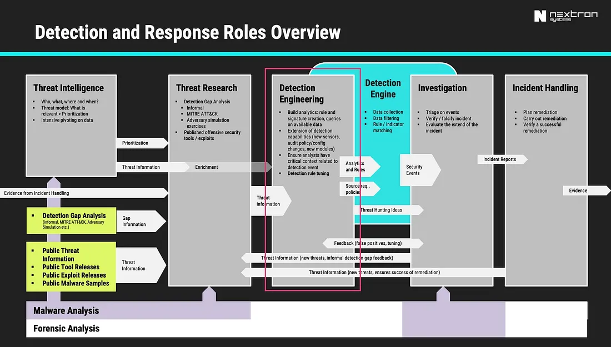

https://cyb3rops.medium.com/about-detection-engineering-44d39e0755f0

---

<!-- content -->

## Detection Engineering role

* More than just typing queries into SIEM

* More emphasis on the Engineering side.

* Feedback cycle

---

<!-- full_screen_diagram small-font -->

## The detection pipeline
### The traditional EDR-SIEM pipeline

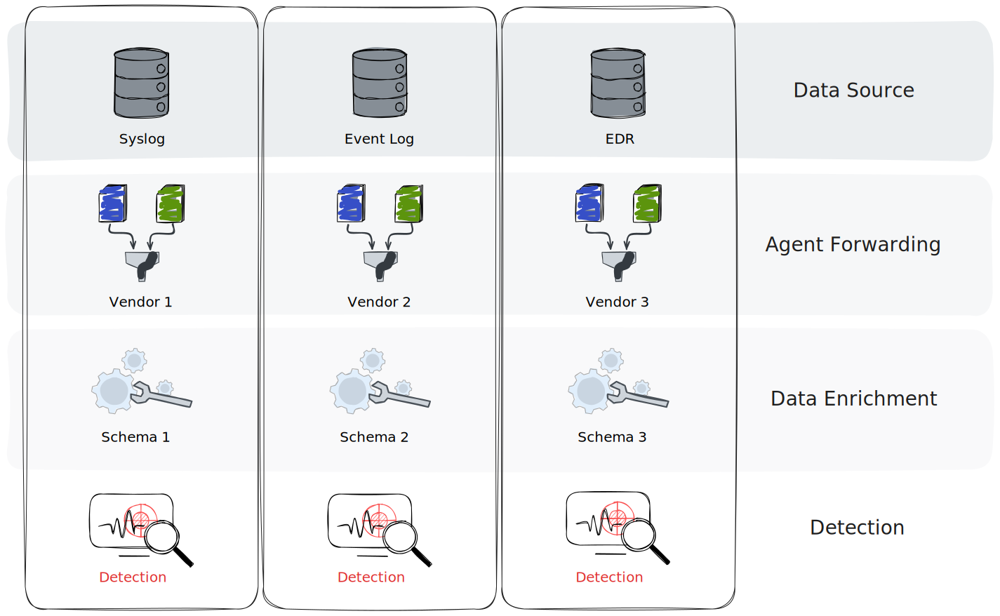

---

<!-- content -->

## The detection pipeline

1. Event Generation on the endpoint
2. Pre-filtering on the endpoint
3. Data normalization and enrichment
4. Transport and storage
5. Detection

----

<!-- content small-font -->
## Anatomy of an attack

* We will study the example of privilege escalation using `PsExec`

* It is a very well known and well detected vector.

* We just use it as an example.
    * You may be very familiar with this, but...
    * Let's think about how we can detect this attack
    * Then lets think about how to make it more robust!

* Download psexec.exe

```bash
curl -o psexec.exe https://live.sysinternals.com/psexec.exe
```

---

<!-- full_screen_diagram small-font -->
## Exercise: Installing Sysmon
### Collect the Windows.Sysinternals.SysmonInstall artifact

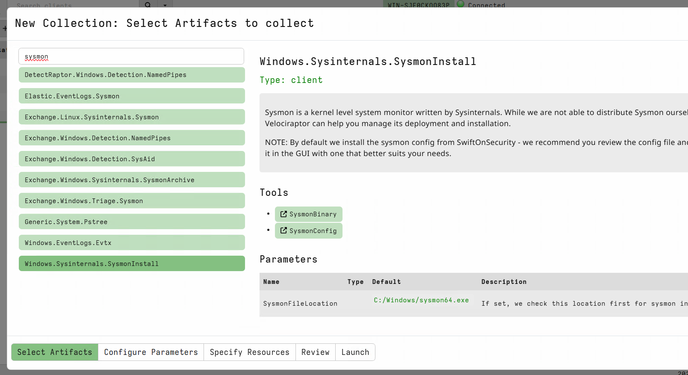

---

<!-- content small-font -->
## Exercise: Sysmon and ECS

* Generate some interesting events

```
psexec.exe /s cmd.exe
```

* Privilege escalate to `SYSTEM` user!

* This will normally be done across the network (Lateral movement)
    * For this demonstration we use it locally

* Check the event viewer for the logs!

---

<!-- full_screen_diagram small-font -->

## Attack is launched

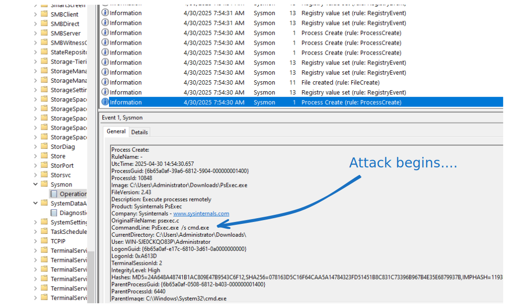

---

<!-- full_screen_diagram small-font -->

## Setting the Eula

PsExec helps detection by setting a `EULA` registry key!

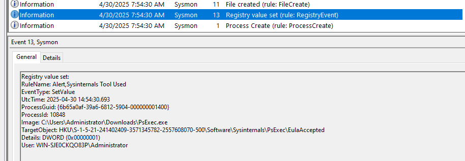

---

<!-- full_screen_diagram small-font -->

## Extract the payload and copy to the system

This will normally be done remotely over RPC

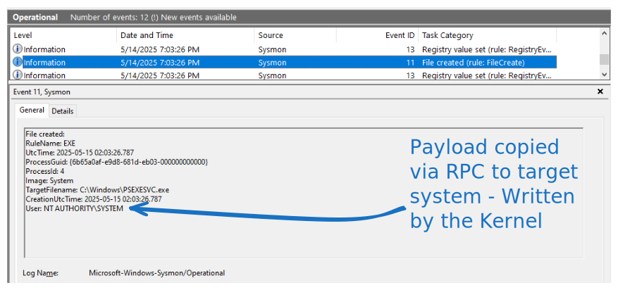

---

<!-- full_screen_diagram small-font -->

## Install the service

This will normally be done remotely over RPC

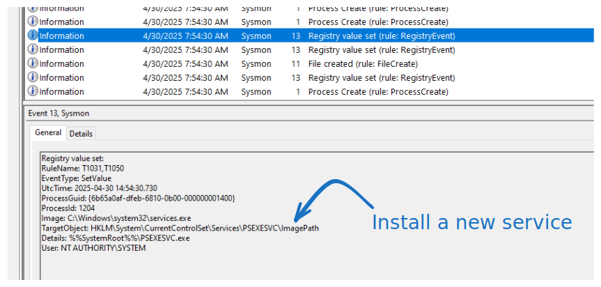

---

<!-- full_screen_diagram small-font -->

## Launch the service remotely.

Service is launched by the service manager so runs as SYSTEM

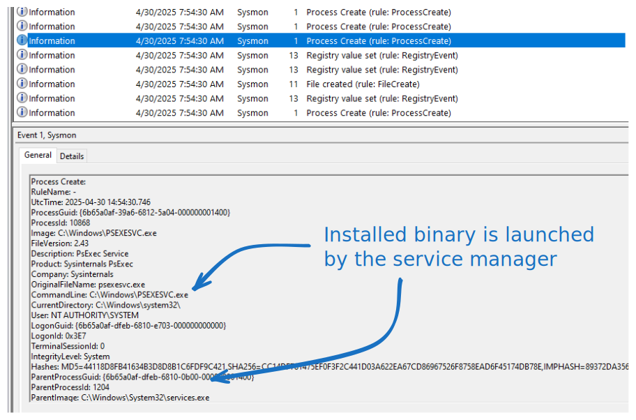

---

<!-- full_screen_diagram small-font -->

## Collect the artifact Windows.EventLogs.Evtx
### This artifact parses the raw event logs

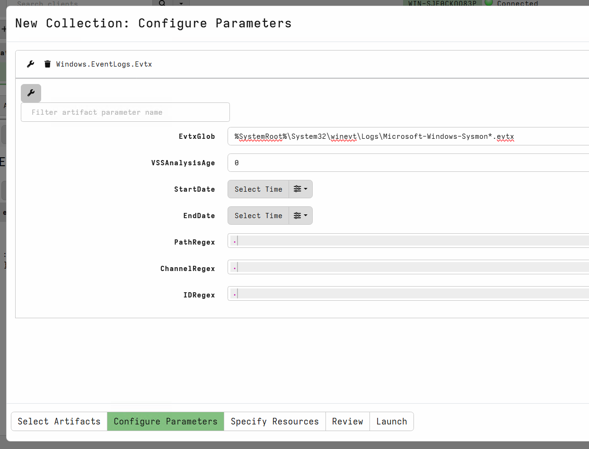

---

<!-- full_screen_diagram small-font -->
## Collect the artifact Windows.EventLogs.Evtx
### Event logs have a defined "shape"

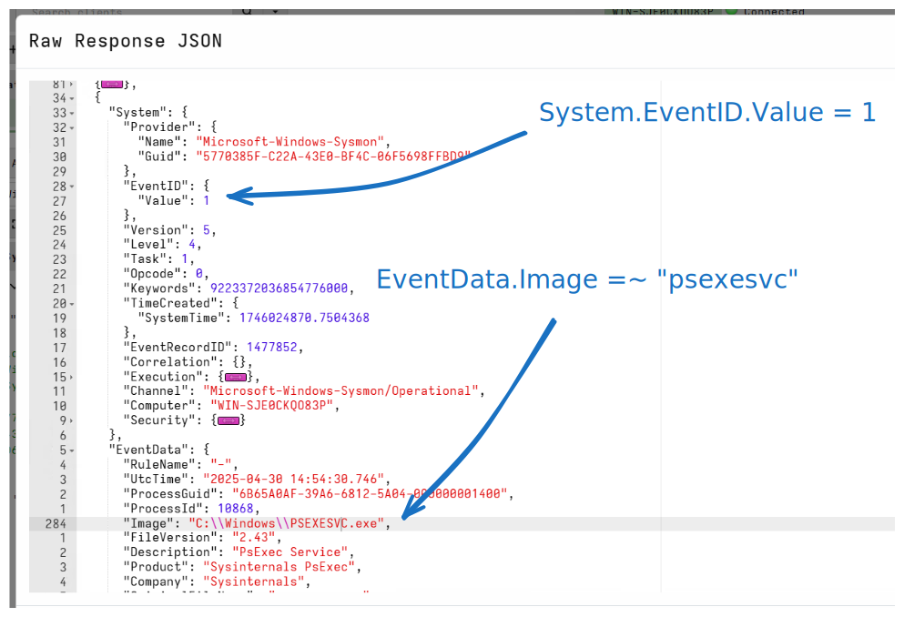

---

<!-- full_screen_diagram small-font -->

## Collect the artifact Elastic.EventLogs.Sysmon


---

<!-- full_screen_diagram small-font -->
## Collect the artifact Elastic.EventLogs.Sysmon
### ECS Events have a defined "shape"

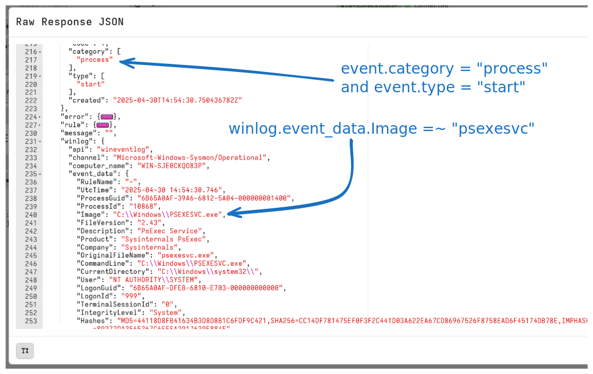

---

<!-- content small-font -->

## How would we detect this "attack"?

* Let's detect: Spawning of the `psexecsvc.exe` service

* Filter the raw Windows Event Log collection by adding a WHERE clause
  to isolate the attack.

* You can post process the collected data in the notebook

---

<!-- full_screen_diagram small-font -->

## How would we detect this "attack"?

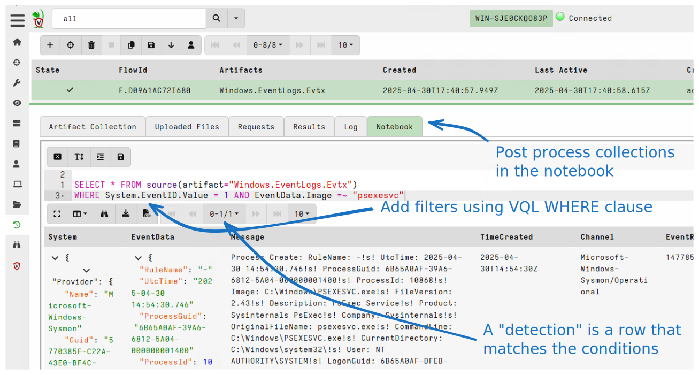

---

<!-- full_screen_diagram small-font -->

## How would we detect this "attack"?

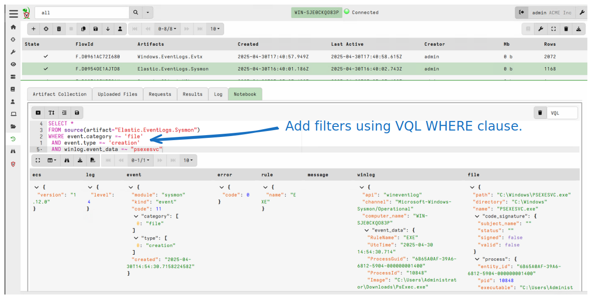

---

<!-- content small-font -->

## How can we communicate this detection?

* We could share queries with others
   * Depending on which event collection system they use, the queries
     are not easily interchanged

* What could go wrong?
    * Different pre-filtering might exclude the relevant events
    * Different fields might be collected, e.g. [Command line process auditing](https://learn.microsoft.com/en-us/windows-server/identity/ad-ds/manage/component-updates/command-line-process-auditing)
    * Data shape is different in different data storage systems.

* We will come back to this!

---

<!-- content small-font -->

## Making the detection robust

* Clear the event logs to start fresh.

* Rename the `psexec.exe` file to `nothing.exe`.

```
copy psexec.exe nothing.exe
```

* Launch the service with a different service name

```
nothing.exe -r nothing -s cmd.exe
```

---

<!-- full_screen_diagram small-font -->

## Renamed service file

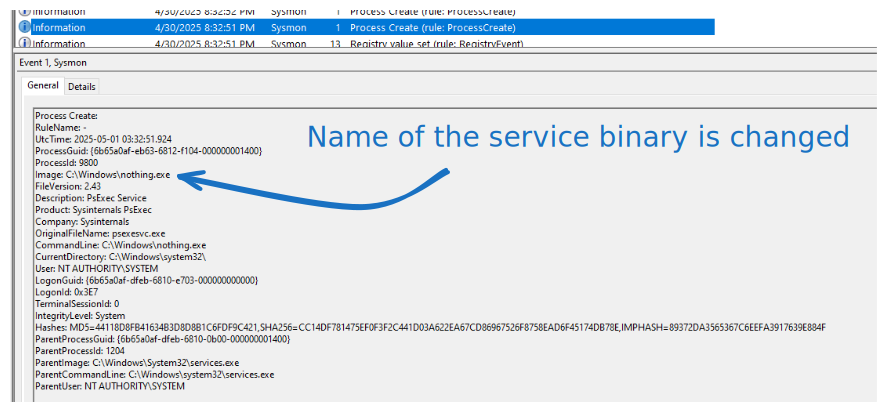

---

<!-- full_screen_diagram small-font -->

## Recollect our detection query
### No hits!


---

<!-- content small-font -->

## How can we make the detection more robust?

* Consider other pieces of information!

* Sysmon provides **some** metadata found in the executable file
  itself.

     * `OriginalFilename`
     * `VersionInformation`
     * `Product`
     * `Description`

* Simply renaming the binary does not change the data inside the file.

---

<!-- full_screen_diagram small-font -->

## Update the detection query
### Adding extra data points can improve detection

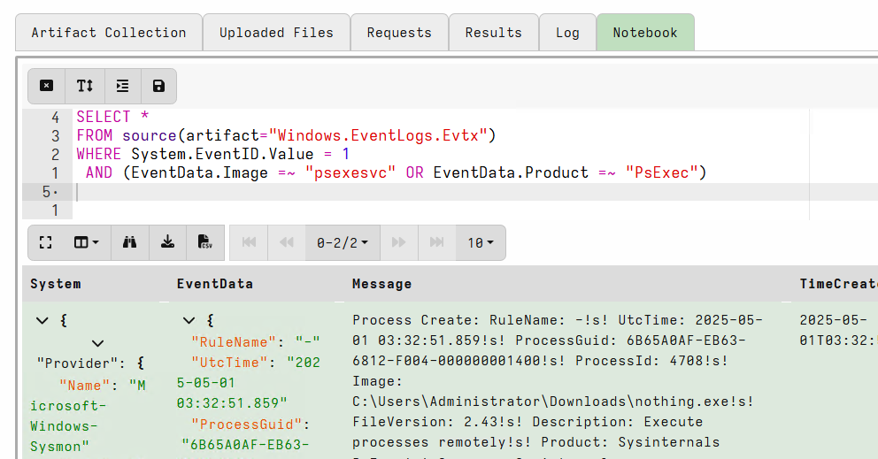

---

<!-- full_screen_diagram small-font -->

## Take it to the next level
### Modify the Product string in the file


---

<!-- content small-font -->

## Event is missing this field!


---

<!-- content small-font -->

## Recap: what have we learnt?

* Detection requires an event source
* Event sources are usually normalized to an internal schema "shape"
* Detection matches events against a "rule"
    * A match is a "hit"
* Attackers can change their methodologies to bypadd detection rules
* Rules can be improved by adding data points!

* Communicating a detection is difficult!
    * Exact rules depend on the tech stack and specific configuration.
    * Not portable
