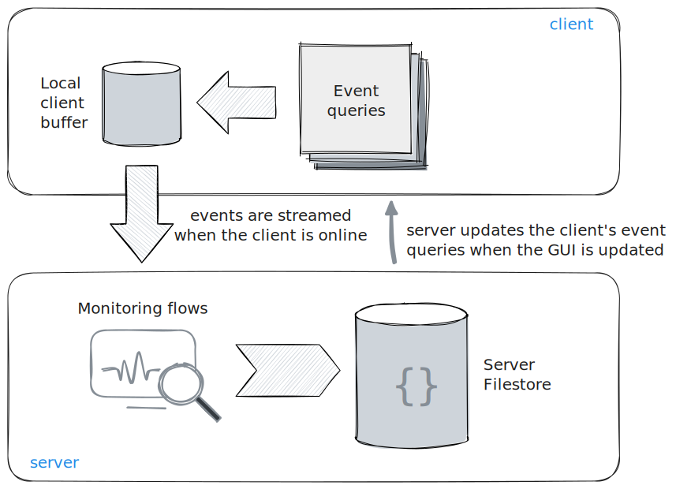
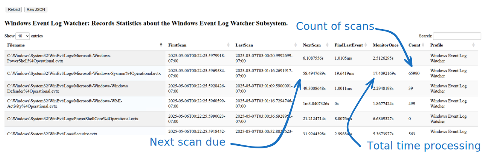
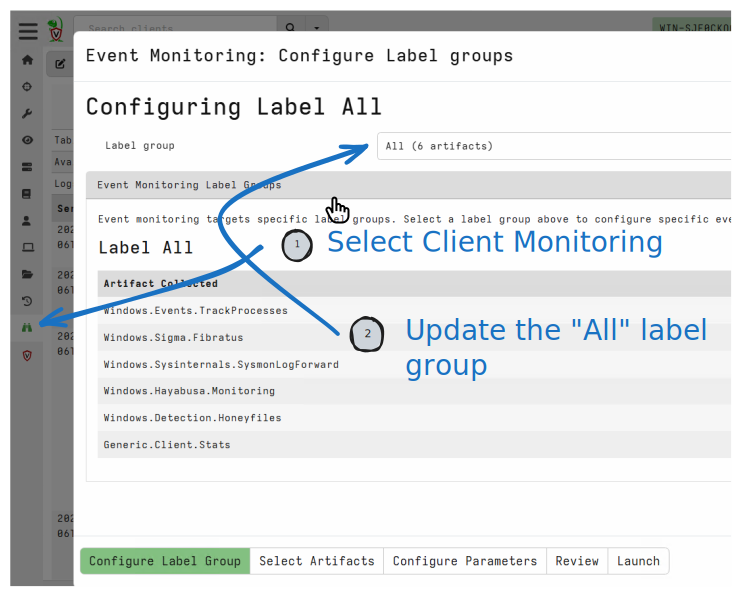
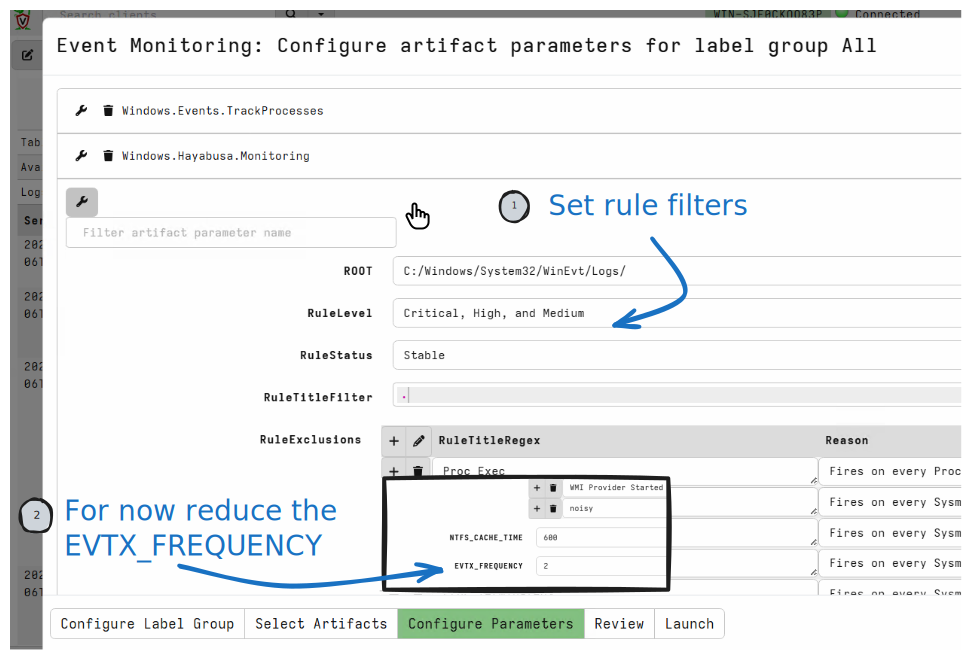
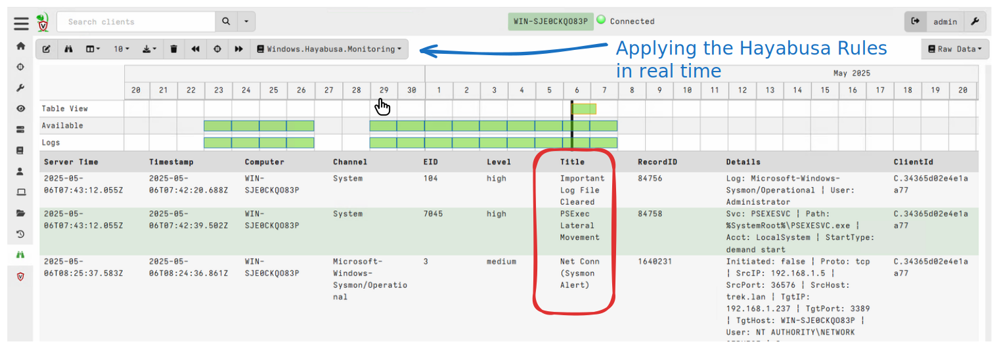

<!-- .slide: class="title" -->

## Live Detection
### Using Sigma Rules for real time detection

---

<!-- full_screen_diagram small-font -->

## Velociraptor client monitoring architecture

---

<!-- content small-font -->

## Live Detection

* We have seen how we can filter events from the event log through Sigma rules
* But we want to do it in real time!
* Real time alerting is useful:
   * Report hits immediately
   * Captures critical information off the system
   * Resilient to tampering/removal.
   * Reduce response time

---

<!-- content small-font -->

## The Windows.Sigma.BaseEvents Model

* This model is compatible with the Windows.Sigma.Base model
   * We still parse the on host event logs, but
   * We periodically check the log files for new events.
   * Only process those new events each cycle.

---

<!-- full_screen_diagram small-font -->
## The Windows.Hayabusa.Monitoring artifact
### Enable collection of the artifact

---

<!-- full_screen_diagram small-font -->
## The Windows.Hayabusa.Monitoring artifact
### Selecting the Windows.Hayabusa.Monitoring artifact

---

<!-- full_screen_diagram small-font -->
## The Windows.Hayabusa.Monitoring artifact
### Detecting attacks in real time

