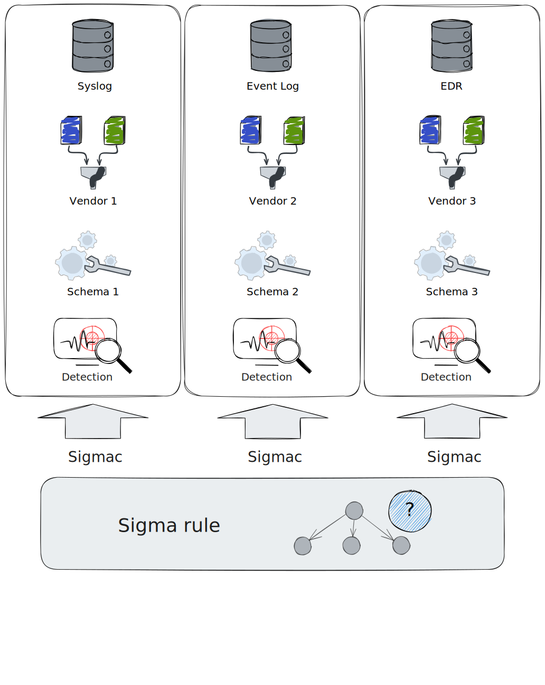
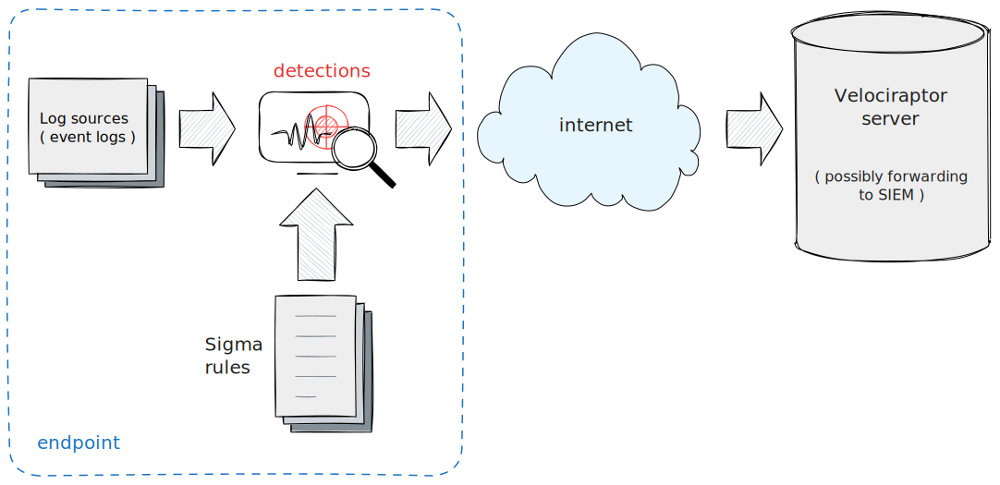
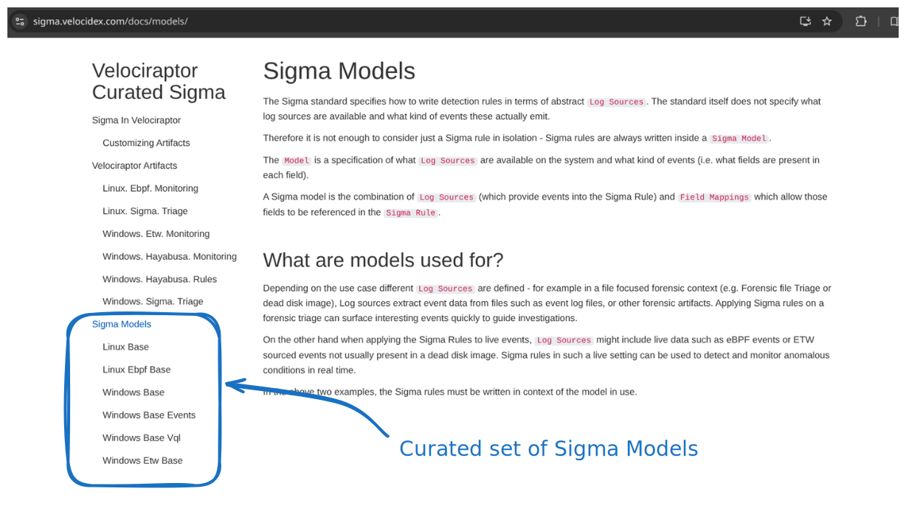
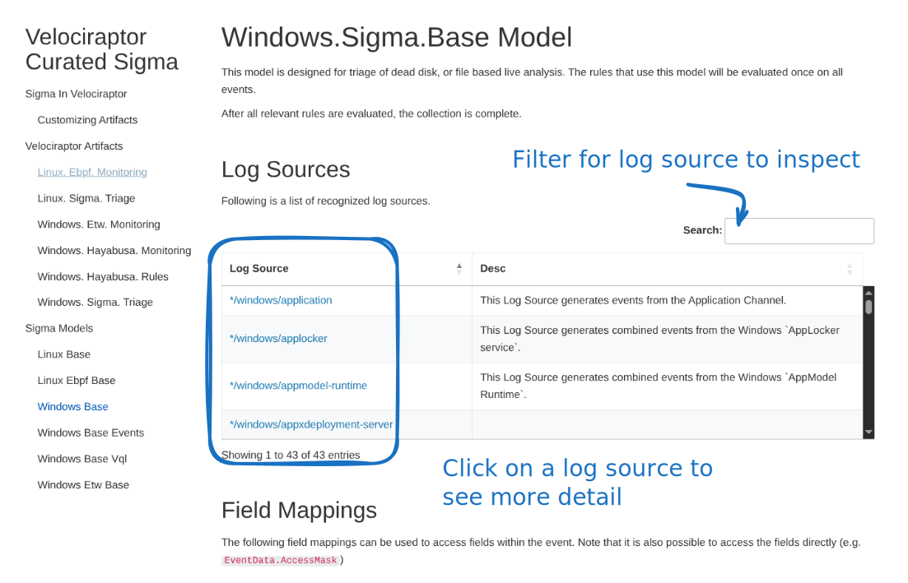
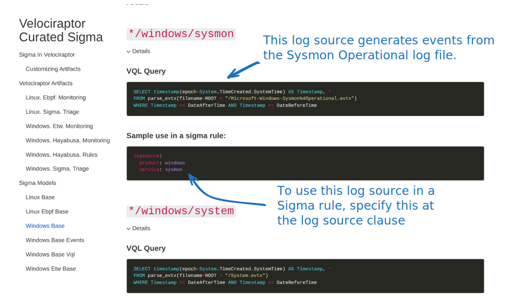
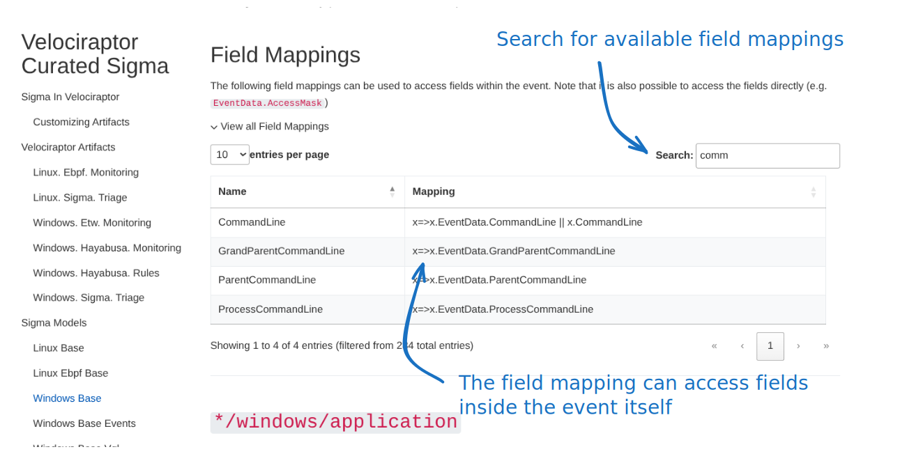
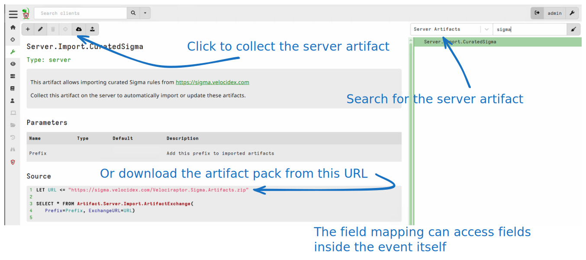
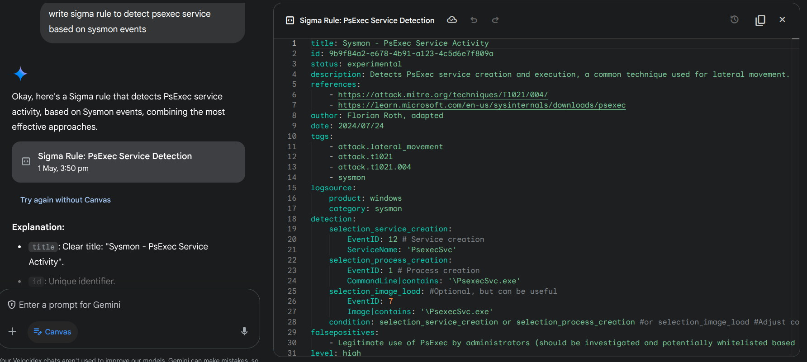

<!-- .slide: class="title" -->

## Sigma Rules - Vibe detection

```yaml
title: PsExec Service Start
description: Detects a PsExec service start
author: Florian Roth (Nextron Systems)
logsource:
  category: process_creation
  product: windows
detection:
  selection:
    CommandLine: C:\Windows\PSEXESVC.exe
  condition: selection
```

[proc_creation_win_sysinternals_psexesvc_start.yml](https://github.com/SigmaHQ/sigma/blob/b062d8ad650054cd20836d5ba38031090b8d8c33/deprecated/windows/proc_creation_win_sysinternals_psexesvc_start.yml)

---

<!-- content -->

## Sigma Rules

* A Sigma rule specifies how to detect a particular attack
   * Think of it as **grep** for event logs


* Vibe detection
   * *logsource* section specifies an event source to match the rule against.
   * *detection* clause contains a list of `selections` joined into a logical `condition`.
   * *condition* clause specifies how to combine the detection clauses logically.
   * Selections refer to abstract fields that map to actual fields
     within the event. These mappings are called `Field Mappings`.

---

<!-- content -->
## Sigma Rules

* The Sigma standard does not define:
   * What log sources are actually available
   * The specific structure of each event
   * What fields are available and what they are called.

* The intention is to convey the "vibe" of a detection.
   * A Sigma Compiler for the target SIEM is used to convert this
     "vibe" to a concrete detection for a particular engine.

---

<!-- full_screen_diagram small-font -->

## The Sigma Compiler



---

<!-- content -->

## The Sigma Model

### Converting a Vibe to a concrete detection

* To convert a Sigma rule to a concrete detection:
    * **Field Mappings**: Mapping between abstract field names and
      concrete field names.

    * **Log sources**: Mapping between abstract log source
      specification and concrete data sources.

    * Code to convert the conditional logical clauses to platform
      specific query against the backend.

* This is done by the Sigma Compiler for the target.
    * e.g. for Elastic

---

<!-- content -->

## The Sigma Model

### Converting a Vibe to a concrete detection

* It generally does not make sense to speak of a `Sigma Rule` without
  knowing the exact `model` used.

* The Sigma standard is not really portable, only the Vibe is
  portable.

  * When converting rules from one model, it helps to develop a new
    model with a 1:1 mappings.

  * For example, a Velociraptor Model to consume Sigma Rules written
    for the ECS stack.

---

<!-- content -->
## The Velociraptor Sigma Architecture

* Velociraptor has a built in Sigma engine:
* Accepts a model definition:
    * Log sources are VQL queries that generate events
    * Field mappings are VQL Lambda functions that resolve fields in the rule.
* Rules are pushed to the endpoint for direct evaluation
* Only Matches are forwarded to the server.

---

<!-- full_screen_diagram small-font -->
## The Velociraptor Sigma Architecture
### Velociraptor supports multiple models at the same time!



---

<!-- content -->

## The Velociraptor Curated Sigma Project

* A Project to maintain and curate:

   * Useful set of `Sigma Models` for different situations
   * A Curated set of `Sigma Rules` taylored for use in the models.

> https://sigma.velocidex.com/

---

<!-- full_screen_diagram small-font -->

## The Velociraptor Curated Sigma Project



---

<!-- full_screen_diagram small-font -->

## The Windows Base Model
### A dedicated model for windows event logs



---

<!-- full_screen_diagram small-font -->

## The Windows Base Model
### Log sources consume event logs



---

<!-- full_screen_diagram small-font -->

## The Windows Base Model
### Field mappings access event data




---

<!-- full_screen_diagram small-font -->

## Importing The Velociraptor Sigma Artifacts
### Using the built in artifact




---

<!-- full_screen_diagram small-font -->

## Importing The Velociraptor Sigma Artifacts
### By uploading manually


---

<!-- full_screen_diagram small-font -->

## Recap: What is Sigma ?

> It's just the vibe of the thing!

<iframe width="560" height="315" src="https://www.youtube.com/embed/97IiPli_uXw?si=VLrvR1K82vKOt5OG&amp;start=48" title="YouTube video player" frameborder="0" allow="accelerometer; autoplay; clipboard-write; encrypted-media; gyroscope; picture-in-picture; web-share" referrerpolicy="strict-origin-when-cross-origin" allowfullscreen></iframe>

---

<!-- content -->

## Recap: What is Sigma ?


