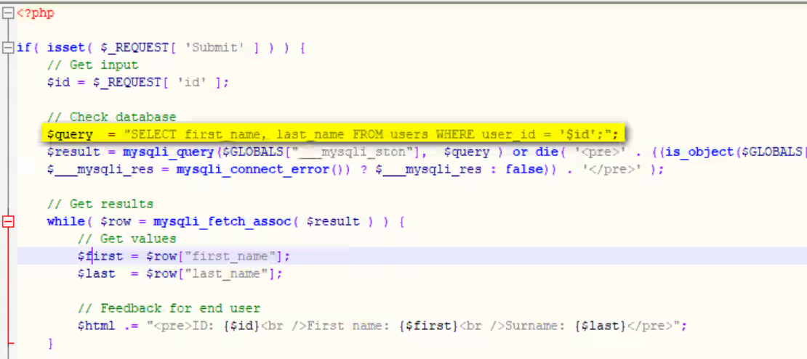
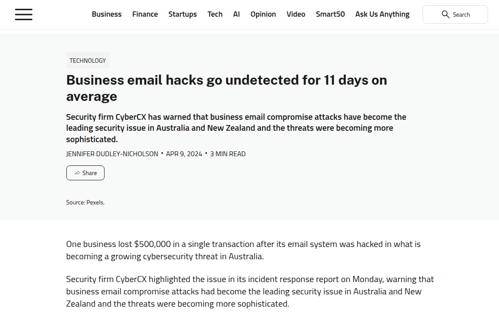

<!-- .slide: class="title" -->
# Cybersecurity

## Why choose a Cybersecurity career?
### Mike Cohen, Digital Paleontologist, Rapid7

### University of Queensland, guest lecture, CYBR7001

---

<!-- .slide: class="content" -->

## What this talk is about?

* I have been in the cybersecurity field over 25 years
* The field has changed and grown over time
* It is a challenging field with important work!

* You will find this talk on

    * https://present.velocidex.com

---

<!-- .slide: class="content" -->
## What I hope you gain from this talk

* This is a quick tour of my experience in Cybersecurity.
* I hope this will spark your interest to pursue a career in Cybersecurity!
* No two careers are the same!
    * Forge your own path.
* No one knows where they will end up at the start of the journey
    * Enjoy the ride!

---

<!-- .slide: class="content" -->
## Australian Signals Direcotorate (ASD)

* Where I started! Graduate intake program (circa 2001).
* Responsible for whole of government information security posture
* Really a great place to start your carreer - so much to learn!
* Very impactful and important work!

---

<!-- .slide: class="content" -->
## Security policy and guidance

* ASD helps set Government policy.
   * Helps departments implement secure systems.
   * Advises, assists and provides guidance.
   * [ASD Essential 8 Maturity Model](https://www.cyber.gov.au/resources-business-and-government/essential-cybersecurity/essential-eight)

* ASD also has an incident response and reporting function.
   * [Report and
     coordinate](https://www.cyber.gov.au/report-and-recover/report)
     various law enforcement and government agencies.

---

<!-- .slide: class="content" -->
## Compliance and certifications

* 20 Years ago was the wild west!
   * Outsourcing was all the rage!

* Today we have extensive frameworks:
   * [GDPR](https://gdpr.eu/) - enforces privacy guards with penalties!!!
   * [PCI](https://www.pcisecuritystandards.org/) - Required for CC data!
   * [HIPAA](https://www.cdc.gov/phlp/php/resources/health-insurance-portability-and-accountability-act-of-1996-hipaa.html) - Required for managing health data
   * [IRAP](https://www.cyber.gov.au/irap) - Certification for Aus Gov
* Many professional auditors and consultants to enforce compliance.
   * Is it perfect? No...

---

<!-- .slide: class="content" -->
## Security auditing of application code.

* Back in early 2000's:
   * Everyone was speeding to deploy a web presence
   * Security was an afterthought in many cases
   * Low skill of developers
   * Languages were not robust enough - too easy to do the wrong thing.

* Really fun to break applications!

---

<!-- .slide: class="content" -->
## Software vulnerabilities

Common vulnerabilities include [SQL Injection](https://pentest-tools.com/blog/sql-injection-attacks)
*  This vulnerability leads to complete server take over

---

<!-- .slide: class="content" -->
## Impact of software vulnerability
### In early 2000s

* When a security vulnerability was exploited:
   * It was usually a teenager or student just playing around
   * Often they tried to embarrass the agency or government department
   * Media jumped on the "incompetence of government"

* Generally not a huge impact
   * backup, restore, rebuild!

---

<!-- .slide: class="full_screen_diagram" -->
## Today: Not messing around

---

<!-- .slide: class="full_screen_diagram" -->
## Ransomware Negotiators

https://www.darkreading.com/cyberattacks-data-breaches/meet-the-ransomware-negotiators

---

<!-- .slide: class="full_screen_diagram" -->
## Impact of software vulnerabilities today

https://www.rapid7.com/globalassets/_pdfs/2024-rapid7-ransomware-radar-report-final.pdf

---

<!-- .slide: class="full_screen_diagram" -->
## Impact of software vulnerability today

* Such a vulnerability **will** result in a ransomware attack.

https://www.theguardian.com/technology/2023/may/10/ransomware-payments-nearly-double-in-one-year

---

<!-- .slide: class="content" -->
## Law enforcement

* The field of Digital Forensics was just getting started in early
  2000's
* Today most cases involve an element of Digital Forensics:
    * Computers
    * Phones
    * Cars
    * Watches and health data
    * Surveillance
    * Game consoles

---

<!-- .slide: class="content" -->

## A hacking case from 2006

<a href="nat_060322internetarrest.pdf">

<a>

---

<!-- .slide: class="content" -->

## A hacking case...

<a href="nat_060322internetarrest.pdf">

<a>

---

<!-- .slide: class="content" -->

## A hacking case...

* A complex case consisting of
  * Manual investigation of multiple server drives.
    * Compromises over a couple of years

  * Images shipped from multiple countries.

* Arrest made of 22yo University Student
* Outcome was no conviction recorded
  * let off with a warning: motive was curiosity and desire to learn computer security.

* Really good exercise for all involved!
  * Best practice evidence collection, chain of custody etc!

---

<!-- .slide: class="content" -->
## Law Enforcement challenges

* Modern criminals are highly aware of information security!
* Software has gotten a lot more secure
* Sometimes new and innovative solutions are required
* Legislation to provide access is sometimes at odds with privacy
    * End to End Encryption vs Law enforcement access
    * US [Fifth amendment](https://constitution.congress.gov/constitution/amendment-5/) vs Australia's [Section 3LA](https://www5.austlii.edu.au/au/legis/cth/consol_act/ca191482/s3la.html)

---

<!-- .slide: class="content" -->
## Operation Ironside

---

<!-- .slide: class="content" -->
## Corporate Information Security

* Companies operate business critical information systems.
* An information security incident can destroy companies in an instant!
    * Ransomware
    * Insider threats
    * IP leaks
    * Privacy breaches (PII) can result in fines and loss of confidence
    * Business Email Compromise (BEC)

---

<!-- .slide: class="content" -->
## Business Email Compromise (BEC)

* [BEC](https://www.cyber.gov.au/threats/types-threats/business-email-compromise) is very common, and extremely hard to combat.
* Can affect companies big and small.

* Also affecting
   * Property transactions
   * Large transfers etc

---

<!-- .slide: class="full_screen_diagram" -->
## Business Email Compromise (BEC)

https://www.itnews.com.au/news/australian-businesses-lose-227-million-to-bec-like-scams-582162

---

<!-- .slide: class="full_screen_diagram" -->

https://www.smartcompany.com.au/technology/business-email-hacks-undetected-11-days-average/

---

<!-- .slide: class="content" -->

## Incident Response - Blue team

* When a security breach occurs - Time is of the essence!

* Attacks typically follow the [Cyber Kill Chain](https://www.lockheedmartin.com/en-us/capabilities/cyber/cyber-kill-chain.html):
   * Installation or compromise
   * Command and Control (C2)
   * Actions on objectives - i.e. Data exfiltration or encryption.

* Dwell time is the time between initial compromise and objective.

---

<!-- .slide: class="content" -->
## Dwell time is getting shorter

https://news.sophos.com/en-us/2023/08/23/active-adversary-for-tech-leaders/

---

<!-- .slide: class="content" -->
## Security Operation Center (SOC)

> A SOC is a centralized function or team responsible for improving an
> organization’s cybersecurity posture and preventing, detecting, and
> responding to threats.

https://www.microsoft.com/en-us/security/business/security-101/what-is-a-security-operations-center-soc

---

<!-- .slide: class="full_screen_diagram" -->
## Security Operation Center (SOC)

https://www.ncsc.gov.uk/collection/building-a-security-operations-centre

---

<!-- .slide: class="full_screen_diagram" -->
### What is Detection Engineering?

https://www.crowdstrike.com/en-us/cybersecurity-101/next-gen-siem/detection-engineering/

---

<!-- .slide: class="content" -->
## What is Detection Engineering?

* Requires low level understanding of attack cycles
* Combines many fields:
    * Digital Forensics
    * Writing detection rules
    * Replicating attack methods
    * Tuning and refining

---

<!-- .slide: class="content" -->
## Security auditing: Red teams

* Perform simulated attacks against an organization
    * Test forensic readiness
    * Test application security
    * Test Incident Response

* Reporting security weaknesses to C level execs!

---

<!-- .slide: class="full_screen_diagram" -->
## Security auditing: Red teams

https://rapid7.com/fundamentals/what-is-a-red-team/

---

<!-- .slide: class="content" -->
## Software development
### Security industry

* All software developers must have a strong grounding in information
  security!

* Developing security specific software needs a working knowledge of:
    * Detection Engineering
    * Low level OS internals - gather telemetry
    * High performance computing - scaling up!
    * Large Data analytics
    * Cloud technologies

---

<!-- .slide: class="content" -->
## Software development
### Security industry

* Many companies require
   * Custom solutions
   * Integration with existing systems
   * Streamline SOC operations
   * Enhance logging and auditing from custom systems
   * Tuning and automating

---

<!-- .slide: class="content" -->
## Cybersecurity as a career

* Information Security is a huge field!
   * Over the years it has evolved
   * There is something for everyone!
   * In your career you will likely move between specializations.
   * Every day is a new challenge

* Bootstrap your career anywhere!
   * Help desk
   * Government graduate intake programs.
   * Always be the person in the room who is least experienced!

---

<!-- .slide: class="full_screen_diagram" -->
### Always be learning!

