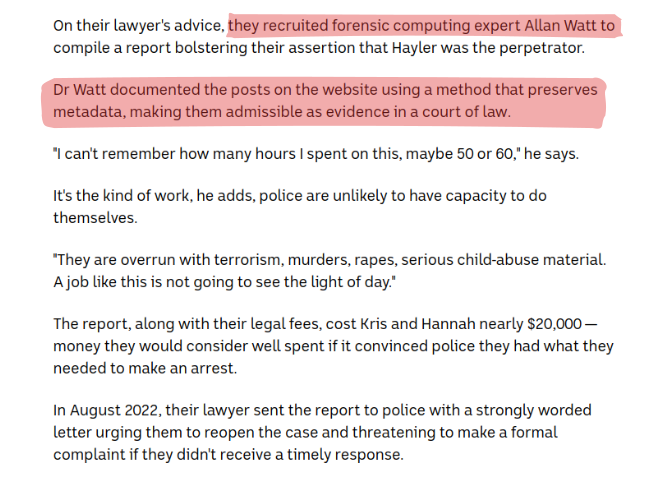

<!-- .slide: class="content" -->

## Is Digital Forensics Dead?

* Constant tension between User Privacy vs. Digital Forensics!

   * Much of the time DF undermines device security.
   * Device manufacturers now focus on security and privacy as a first
     class feature.

* For example:
   * Full disk encryption
   * Incognito browsers
   * VPN and TLS everywhere!

---

<!-- .slide: class="full_screen_diagram" -->

https://www.abc.net.au/news/2024-10-14/hannah-grundy-reveals-the-ultimate-betrayal-after-photos/104404784

---

<!-- .slide: class="full_screen_diagram" -->

---

<!-- .slide: class="content" -->

## Triage is useful!

* Digital Forensics is about capturing the best available evidence
  * As long as general principals are followed it is useful!
     * What is appropriate for this evidence?

---

<!-- .slide: class="content" -->

## Wider application of Digital Forensics

* Digital Forensics started off as a Law Enforcement tool.

    * Valuable tool to "determine what happened"

* Incident Response is a more modern application of DF techniques

    * Initially DF was used hoping for prosecution
       * Preserving evidence to evidentiary standards
       * Shipping drives via FedEx!
       * Thorough analysis and reporting by DFIR experts

---

<!-- .slide: class="content" -->

## Priority of DFIR

* As adversaries became more professional they became more efficient

   * Financially motivated! Can cause a lot of damage

   * Time to dwell is measured in days and hours

   * No time to take full disk images!

* We need to rely more on triage!

   * Faster turn around - we need answers quickly!

   * Main goal is disruption and eviction of attackers.
