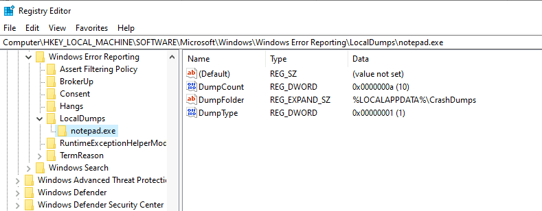
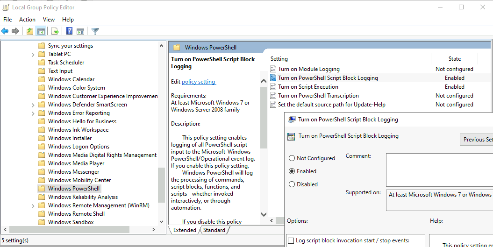
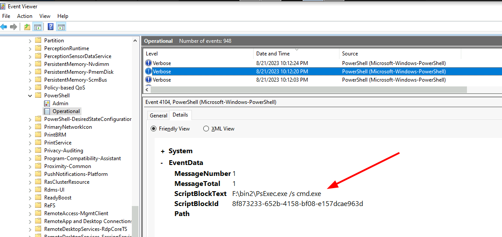

<!-- .slide: class="content" -->

## Windows Crash Dumps

* Windows Error Reporting (WER) records important information about an
  application when it crashes or hangs.
* This can be extremely important for investigating intrusions
* Exploit code will often general an application crash (E.g. Buffer
  Overflow)

    * https://bmcder.com/blog/extracting-cobalt-strike-from-windows-error-reporting

---

<!-- .slide: class="content" -->

## Windows Crash Dumps

* Settings can be applied for each process

<div class="container">
<div class="col">

    * DumpCount
    * DumpFolder
    * DumpType:
        0. Custom Dump
        1. Mini Dump
        2. Full Dump (Process)

</div>
<div class="col">



</div>

---

<!-- .slide: class="content" -->

## Powershell script logging

* Attackers use PowerShell extensively!
* Script block logging provides visibility into PowerShell activities.

```sh
New-Item -Path "HKLM:\SOFTWARE\Wow6432Node\Policies\Microsoft\Windows\PowerShell\ScriptBlockLogging" -Force

Set-ItemProperty -Path "HKLM:\SOFTWARE\Wow6432Node\Policies\Microsoft\Windows\PowerShell\ScriptBlockLogging" -Name "EnableScriptBlockLogging" -Value 1 -Force
```

---

<!-- .slide: class="content" -->

## Powershell script logging

* Use Group Policy to enable it everywhere



---

<!-- .slide: class="content" -->
## Powershell script logging

* Logging powershell gives a unique view at of attacker activities.


