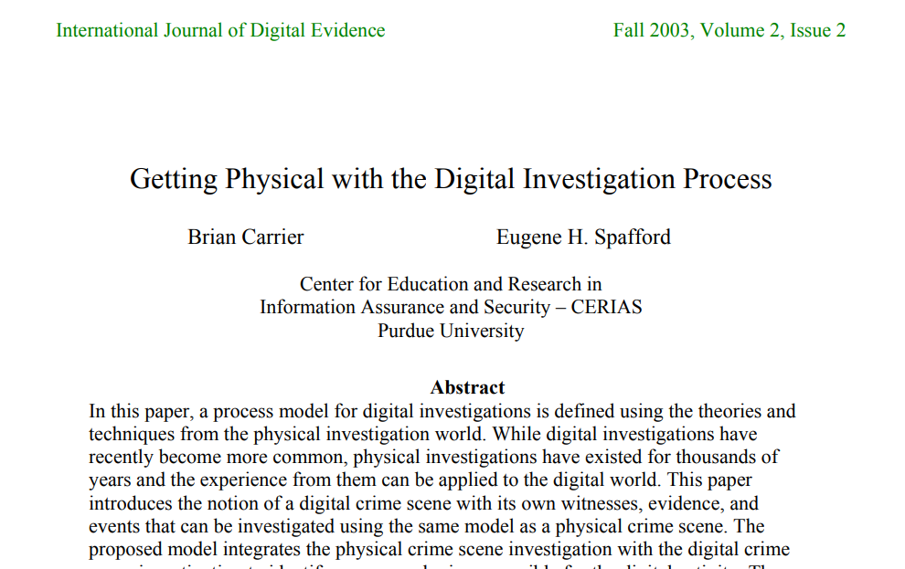

<!-- .slide: class="content" -->

## Forensic Readiness

1. Maximizing an environment's ability to collect credible digital
   evidence
2. Minimizing the cost of forensics in an incident response.

[Forensic Readiness John Tan @Stake (2001)](https://citeseerx.ist.psu.edu/viewdoc/download?doi=10.1.1.480.6094&rep=rep1&type=pdf)

---

<!-- .slide: class="content" -->

## What is Digital Forensics anyway?

* Trying to reconstruct the past
  * What occurred on this system?
  * When did this occur?

* Locard's exchange principal

> "Every contact leaves a trace”

---

<!-- .slide: class="full_screen_diagram" -->

---

<!-- .slide: class="content" -->

## Enhancing the efficacy of Forensics

* In the physical world:

  * Surveillance CCTV cameras assist in forensic investigation
  * Procedural methods (registration, auditing etc).
  * Enhanced tracking - e.g. cell phones, GPS etc

* Better forensics acts as a deterrent!

---

<!-- .slide: class="content" -->

## Why do we need Digital Forensics?

* Much of the time we arrive at the "crime scene" after the fact

* Try to reconstruct what happened from incidental information

* Forensics by its nature is **Making the best of a bad hand!**

---

<!-- .slide: class="content" -->

## Why do we need Digital Forensics?

* We use digital forensics to answer tactical questions!

   * We rely on artifacts that were not specifically designed to tell
     us what we want to know.
   * Requires a lot of interpretation to tie unrelated artifacts to
     infer what happened.

* We need to be lucky!

---

<!-- .slide: class="content" -->

## What if we could prepare for forensics?

* Sometimes we go into an incident unprepared, but a lot of the time
  we can prepare in advance!

  * In a corporate setting we can actually prepare for forensic
    investigation and incident response

  * Similar but orthogonal to system hardening

>  Taking steps in advance to increase our chances of successfully
>  investigating an incident!

---

<!-- .slide: class="content" -->

## Levels of preparedness

* Information security is a continuum and a tradeoff between
  resourcing and usability

* What can we do to improve our forensic readiness?

  * Simple things can be done cheaply!
     * Set configuration parameters in the environment.

  * More sophisticated things may involve more efforts
     * Install an agent, EDR etc.

* Consider how likely a forensic investigation will occur?
  * Tradeoff between cost and completeness

---

<!-- .slide: class="content" -->

## What types of interventions can we employ?

* Configuration change
  * Increases the system's ability to support forensic analysis

* Installation of EDR/Agents/Endpoint visibility software
  * Increases resilience against malicious anti-forensics.

---

<!-- .slide: class="content" -->

## Reimagine the forensic process

* Let's re-examine the digital forensic process critically

* Identify the things that can go wrong, the gaps and improvements

* Can we increase our chances of success?
   * Passive target: No deliberate interference with the DFIR process
   * Active Adversary: Employing Anti-Forensics to frustrate investigation
