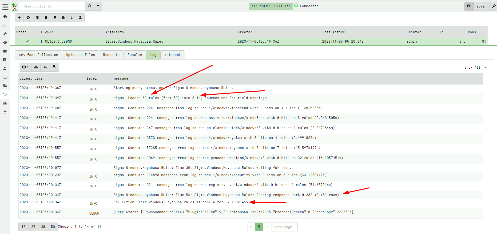

<!-- .slide: class="title" -->

<h1 style="font-size: 4ex">Sigma Discussions</h1>

<div class="inset">

## Thursday Defensive

### Mike Cohen, Digital Paleontologist

</div>


---

<!-- .slide: class="content" -->

## What is the point of Sigma?

* We have multiple SIEM vendors:
* Usual workflow is:
  1. Agent collects raw data from log files on endpoint
  2. Normalize log data into a custom Schema
  3. Upload events to central SIEM
  4. Run queries on SIEM for detections

* But we have many different types of SIEM and incompatible schemas,
  query languages and type of data collected

---

<!-- .slide: class="full_screen_diagram" -->

## The state of EDR technology


---

<!-- .slide: class="content small-font" -->

## How can we improve this

"We can solve any problem by introducing an extra level of indirection." (David Wheeler)


Let's just define a new "Standard":
* That everyone understands...
* Can be converted to all other EDR systems
* Can facilitate detection interchange

---

<!-- .slide: class="full_screen_diagram" -->

## New interchange format - Sigma


---

<!-- .slide: class="content small-font" -->

## Anatomy of a Sigma rule

* To compile a Sigma Rule into a SIEM query we need:

1. A compiler able to generate SIEM Query Language output
2. Log Sources -> Map from generic log source to concrete data collected by SIEM
3. Field Mappings -> Map from generic field names to SIEM schema transformation.


---

<!-- .slide: class="content small-font" -->

## Example

```yaml
logsource:
    category: process_creation
    product: windows
detection:
    process_creation:
        EventID: 4688
        Channel: Security
    selection:
        -   CommandLine|contains|all:
                - \AppData\Roaming\Oracle
                - \java
                - '.exe '
        -   CommandLine|contains|all:
                - cscript.exe
                - Retrive
                - '.vbs '
    condition: process_creation and selection

```

---

<!-- .slide: class="content small-font" -->

## Let's consider how a Sigma Compiler might work

* Logsource: What does `process_creation` mean exactly?
    * Could be Sysmon EID 1
    * System EID 4688
    * ... Or maybe something else?

* What fields do we need?
    * CommandLine - Do we even collect this?

* Actually this rule can only ever work on `Security.evtx`!
    * The Rule author ensures this because they specifically test for
      the right EID and Channel within the rule logic.
    * The log source is kind of redundant

---

<!-- .slide: class="content small-font" -->

## How do we know if a rule even makes sense?

* Rule do not refer directly to the fields in the event
* Instead they refer to an "abstract" field name
* The compiler maps the abstract field name to the SIEM schema
    * Assuming there is such a mapping
    * Assuming that field is actually available in the SIEM

---

<!-- .slide: class="content small-font" -->

## Example 2: Invalid Field Mapping

```yaml
title: Remote Thread Creation By Uncommon Source Image
logsource:
    product: windows
    category: create_remote_thread
detection:
    create_remote_thread:
        EventID: 8
        Channel: Microsoft-Windows-Sysmon/Operational
    selection:
        SourceImage|endswith:
            - \bash.exe
            - \cscript.exe
            ...
            - \wmic.exe
            - \wscript.exe
    filter_main_winlogon_1:
        SourceImage: C:\Windows\System32\winlogon.exe
        TargetImage:
            - C:\Windows\System32\services.exe
            - C:\Windows\System32\wininit.exe
            - C:\Windows\System32\csrss.exe
    filter_main_winlogon_2:
        SourceImage: C:\Windows\System32\winlogon.exe
        TargetParentImage: System
        TargetParentProcessId: 4
        ...
    condition: create_remote_thread and (selection and not 1 of filter_main_* and
        not 1 of filter_optional_*)
```

---

<!-- .slide: class="content small-font" -->

## How Does Velociraptor employ Sigma Rules?

The `sigma()` plugin in Velociraptor allows us to directly use rules

* Define log sources as VQL queries
* Define Field mappings as VQL lambda functions.
* Plugin stacks rules on log sources and runs them in parallel

Can be used in the following contexts

* Triaging an endpoint using existing EVTX files
* Live detection using ETW or EVTX following
* Post process analysis of collected artifacts.

Velociraptor sigma compiler transforms the rule into a VQL artifact.

---

<!-- .slide: class="content small-font" -->

## Log Source example

Many Sigma rules have nonsense log sources, but really use Channel
matches to refer to an event log.

```sql
  '*/windows/sysmon':
    query: |
      SELECT * FROM parse_evtx(filename=ROOT + "/Microsoft-Windows-Sysmon%4Operational.evtx")
    channel:
      - Microsoft-Windows-Sysmon/Operational
```

---

<!-- .slide: class="content small-font" -->

## Field Mappings are VQL fragments

```yaml
  SysmonVersion: "x=>x.EventData.SysmonVersion"
  CommandLine: "x=>x.EventData.CommandLine"
```

Velociraptor's sigma compiler checks that fields are actually valid
and rejects the rule if they are not.

```
Errored Rules which were rejected:
  Missing field mapping 'TargetName' in */windows/ntlm:
    hayabusa/sigma/builtin/ntlm/win_susp_ntlm_rdp.yml
  Missing field mapping 'ParentIntegrityLevel' in */windows/security:
    hayabusa/sigma/builtin/unsupported/win_kernel_and_3rd_party_drivers_exploits_token_stealing.yml
```

---

<!-- .slide: class="content small-font" -->

## Triaging an endpoint



---

<!-- .slide: class="content small-font" -->

## Live detection with Sigma


---

<!-- .slide: class="content small-font" -->

## Links and References

* [Live Incident Response with Velociraptor](https://www.youtube.com/watch?v=Q1IoGX--814)
* [VeloCon 2023: Fast DFIR with Velociraptor](https://www.youtube.com/watch?v=ibl4-MzW-KI)
* [AusCERT2022: Conference Day 1 - I CAN SEE YOU! IMPROVING DETECTION EFFICIENCY ON THE ENDPOINT...](https://youtu.be/lfkHBzXqA1g?si=j6aemdVgbmXbqEfa)
* [](https://github.com/SigmaHQ/sigma)
* [Velociraptor Sigma Compiler](https://sigma.velocidex.com/)
* [Sigma in Velociraptor](https://docs.velociraptor.app/blog/2023/2023-11-15-sigma_in_velociraptor/)
