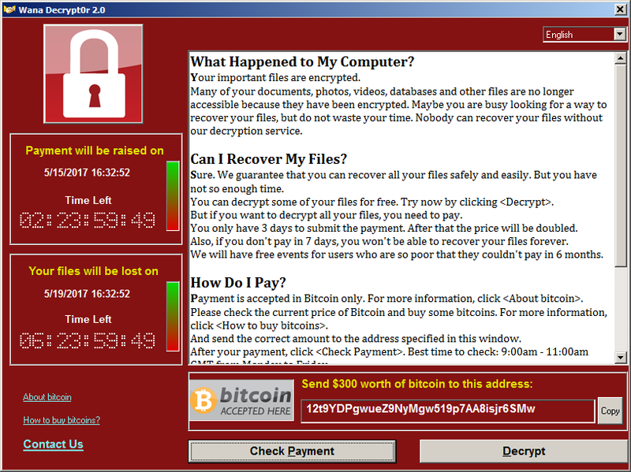

<!-- .slide: class="title" -->

<h1 style="font-size: 4ex">Velociraptor: Past, Present and Future</h1>

### DFIR in an evolving world.

### Mike Cohen, Digital Paleontologist
### Rapid 7 Inc

---

<!-- .slide: class="content" -->
## Digital Forensics

* Started as part of law enforcement
   * Secure a conviction
* Court ready
   * Chain of custody
   * Preservation of evidence for court
   * Repeatable analysis
   * Exculpatory Evidence (i.e. prove lack of guilt).
       * Example: Trojan Defence

### Bit for bit copies of everything

---

<!-- .slide: class="full_screen_diagram" -->

---

<!-- .slide: class="content" -->

## Enterprise Forensics

* Started as a way to assist Law Enforcement
    * Secure a conviction
* Still used in many applications;
    * IP Theft
    * HR Dismissals
    * Espionage
* Started off mimicking many of the Law Enforcement procedures
    * Chain of custody
    * Bit for bit copies

---

<!-- .slide: class="full_screen_diagram" -->

---

<!-- .slide: class="content" -->

## Challenges in Enterprise Forensics

* Enterprises tend to be distributed
    * Geographic separation
    * Organizational separation

* Rare to get conviction
    * A conviction does not compensate the organization
    * Profit driven - stem the bleeding

### How to stop it from happening again?

---

<!-- .slide: class="content" -->

## Time is of the essence!

* Mean dwell time is now measured in hours or days
* Adversaries are well trained and very efficient
* Laterally move inside the network

### Need to improve scale and speed!

---

<!-- .slide: class="content" -->

## Focus on answering questions

* What happened?
* How can we prevent it in future?
* What was taken?
* Can we recover anything?

---

<!-- .slide: class="content" -->

## Velociraptor is born!

Velociraptor is the premier endpoint visibility tool.

* Driven by Velociraptor Query Language artifacts.
* Primarily a DFIR tool.
* Compliance/Vulnerability management.
* Endpoint monitoring.
* Open source with a strong community

---

<!-- .slide: class="content" -->
## Architecture

---

<!-- .slide: class="content" -->
## Scalable, fast, accurate

* Support Linux, Windows, MacOS, FreeBSD …
* Server simply collects the results of queries - clients do all the heavy lifting.
* Client memory and CPU usage is controlled via throttling and active cancellations.
* Server is optimized for speed and scalability

---

<!-- .slide: class="content small-font" -->
## Interactively investigate clients

Digital forensic plugins turn VQL into a high quality DFIR tool

---

<!-- .slide: class="content small-font" -->
## Velociraptor Artifacts

Artifacts encode VQL into user shareable code snippets

---

<!-- .slide: class="content small-font" -->
## Hunts - Collecting at scale

Collecting artifacts at scale from multiple endpoints

---

<!-- .slide: class="content small-font" -->
## Postprocessing using Notebooks

Notebooks are collaborative shared VQL execution environments

---

<!-- .slide: class="content" -->

## Improving Scale and Speed

* There are many types of forensic artifacts
    * Being able to remotely collect them is a game changer
* Requires knowledge and experience!

Ultimately we want to know `What went wrong?`

### Triage the endpoint - `What looks weird?`

---

<!-- .slide: class="content" -->

## Triaging Using Sigma

* Endpoint tools can directly evaluate Sigma rules on the event logs

---

<!-- .slide: class="content small-font" -->

##  Collecting the sigma artifact

---

<!-- .slide: class="content small-font" -->

## Triaging an endpoint

---

<!-- .slide: class="content small-font" -->

## Stacking rules by title

---

<!-- .slide: class="content small-font" -->

## Viewing the stacking stats

---

<!-- .slide: class="content small-font" -->

## Viewing common rows

---

<!-- .slide: class="content" -->

## The future:
### Is Digital Forensics Good enough?

* Many of the traditional Digital Forensics artifacts are not
  specifically designed for our needs.

* For example:
   * Prefetch files
      * Evidence of execution
   * Jumplists
      * Evidence of user actions
   * USB device insertion
      * Various registry keys

---

<!-- .slide: class="title" -->

## If we rely on Digital Forensics, we have already lost!

### Digital Forensics is reactive in nature

### In a perfect world we would not need Digital Forensics!

---

<!-- .slide: class="content" -->

## What if we could prepare for forensics?

* Sometimes we go into an incident unprepared, but a lot of the time
  we can prepare in advance!

  * In a corporate setting we can actually prepare for forensic
    investigation and incident response

  * Similar but orthogonal to system hardening

>  Taking steps in advance to increase our chances of successfully
>  investigating an incident!

---

<!-- .slide: class="content" -->

## Forensic Readiness

1. Maximizing an environment's ability to collect credible digital
   evidence
2. Minimizing the cost of forensics in an incident response.

[Forensic Readiness John Tan @Stake (2001)](https://citeseerx.ist.psu.edu/viewdoc/download?doi=10.1.1.480.6094&rep=rep1&type=pdf)

---

<!-- .slide: class="content" -->

## What can we do with Velociraptor?

* We can constantly check configuration for compliance

---

<!-- .slide: class="content" -->

## What can we do with Velociraptor?

* Real time alerting on configuration modifications

---

<!-- .slide: class="content" -->

## Real Time Sigma alerting

### Configuring Velociraptor's client monitoring

---

<!-- .slide: class="content" -->
## Conclusions

We only scratched the surface of what Velociraptor can do!

Check out the following links and join our community…

<table class="noborder">
<tr>
    <td>Docs</td><td>
        <a href="https://docs.velociraptor.app/">https://docs.velociraptor.app/</a>
    </td>
</tr>
<tr>
    <td>Github</td><td>
        <a href="https://github.com/Velocidex/velociraptor">https://github.com/Velocidex/velociraptor</a>
    </td>
</tr>
<tr>
    <td>Discord</td><td>
        <a href="https://docs.velociraptor.app/discord/">https://docs.velociraptor.app/discord/</a>
    </td>
</tr>
<tr>
    <td>Mailing list</td><td>
        <a href="mailto:velociraptor-discuss@googlegroups.com">velociraptor-discuss@googlegroups.com</a>
    </td>
</tr>
</table>
