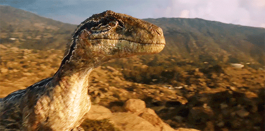
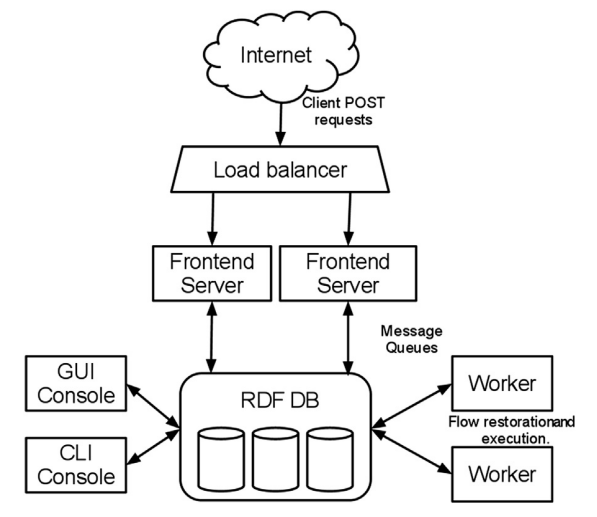
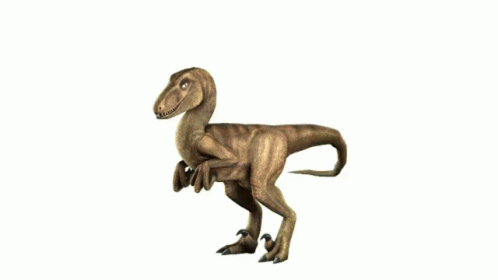
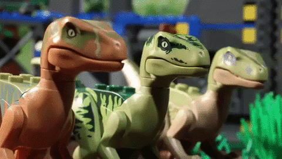
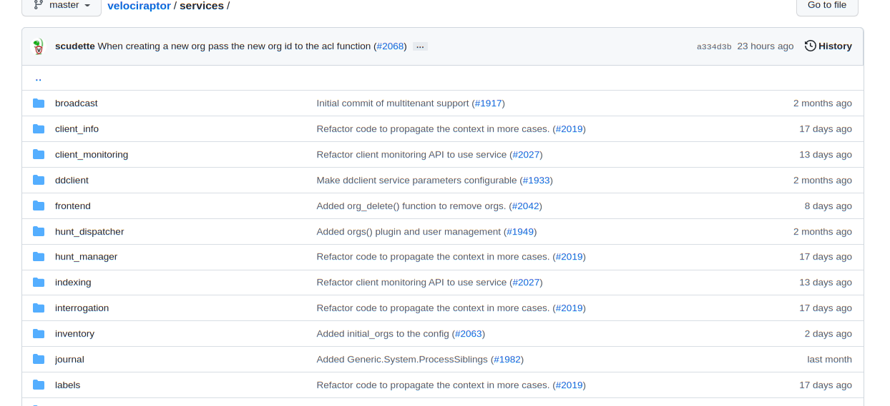
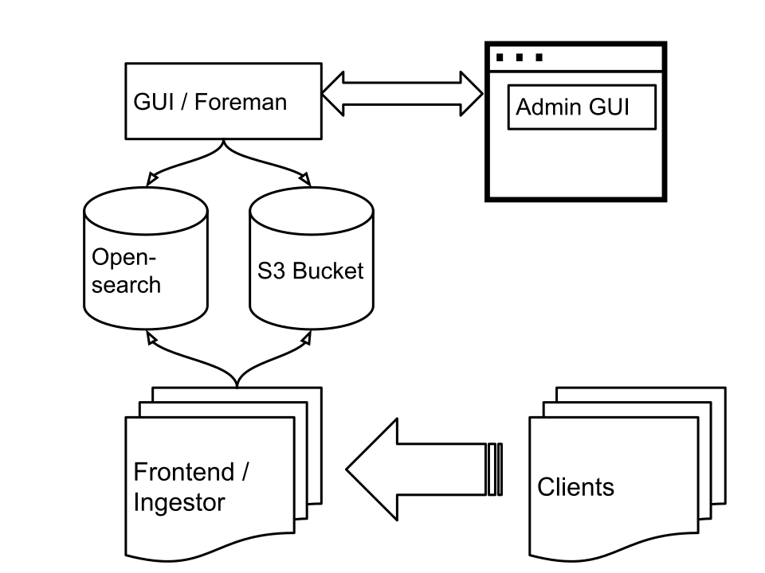

<!-- .slide: class="title" -->
# Cloud Native Velociraptor

## VeloCon 2022

### Mike Cohen, Digital Paleontologist

---

<!-- .slide: class="content" -->
## Overview

* Don't we already deploy Velociraptor in the cloud?
* Why do we mean by cloud native Velociraptor?

Cloud Velociraptor is mainly about **Scalability** and **Cloud
Native** technologies.

* Move away from local file storage
* An experimental project to explore future directions.
* **NOT** a replacement for Velociraptor

---

<!-- .slide: class="content" -->
## Velociraptor's design goals

Velociraptor was designed to be **easy** and **cheap** to deploy to
smaller scale organizations.

* Design goal was 10-15k endpoints.
* No external dependencies makes it easy to deploy.
* Using local file storage is cheaper and easier.
* Mainly catering for ephemeral consultancy type deployments.

---

<!-- .slide: class="content" -->
## New use cases!

Velociraptor has grown a lot in the past few years and it is now an
enterprise grade application.

* Permanent monitoring and response solution.
* Large number of endpoints
* Multi-Tennancy is important for large deployments.
* Needs to be horizontally scalable!

Horizontally scaling means deployment size can change quickly
balancing cost and capacity dynamically.

---

<!-- .slide: class="content" -->
## Take a trip down memory lane...

To understand where we are headed we should look at the history of
Velociraptor.

---

<!-- .slide: class="content" -->
## History of Velociraptor

Google GRR was the first large scale hunting platform but (at the
time) had issues with performance

* Written in a slow language
* A lot of work done server side
* Extensive client data model
* Cloud first architecture - worker, frontend, GUI
* Uses a database to store bulk data

---

<!-- .slide: class="full_screen_diagram" -->
## GRR Overview

    <a href="https://storage.googleapis.com/docs.grr-response.com/MoserCohenHunting.pdf">GRR Architecture</a>

---

<!-- .slide: class="content" -->
## Velociraptor was born!

Velociraptor was designed to address some of the problems with earlier
systems.

* Written in a fast and efficient language
* Designed for a small deployment (<10k endpoints)
* Query language allows the server to be very simple
* No inherent data model - Schema-less
* Easy to deploy
* File storage backend

---

<!-- .slide: class="content" -->
## Going small to go big!!

By restricting our goals to a small scale deployment we can really
simplify the whole design!

* Using file storage is really really fast!
* Throwing away the data model makes everything very efficient!
* Monolithic binary makes deployment really simple!

---

<!-- .slide: class="content" -->
## But we want to go bigger!

Single server limits reached at about 20k endpoints. What are the
limiting factors?

* TLS encryption is CPU intensive
* IO bandwidth is saturated
* GUI can consume a lot of resources because it runs notebook queries.

---

<!-- .slide: class="content" -->
## Multi Frontend Velociraptor

To scale larger than one server we support multi-frontend architecture.

* Retain the **Everything is a file** philosophy: Uses distributed filesystem (EFS)
* Multiple servers in a Master-Minion architecture
* Message passing between servers ensures coherency.
* Still no additional dependency on cloud infrastructure

Cloud technology introduce a lot of IO latency challenges. We have
`MemcacheFileDataStore`, `RemoteDatastore` etc.

---

<!-- .slide: class="full_screen_diagram" -->
## Multi-frontend Architecture

---

<!-- .slide: class="content" -->
## Velociraptor in the cloud

To scale even more we need to replace the backend with cloud centric
services.

* Horizontally auto-scale servers
* Use cloud managed storage
* Remove need for state on the server
* Can we use a database backed?

**This sounds familiar...** Are we going back full circle?

Not for everyone! More complexity and cost involved...

---

<!-- .slide: class="content" -->
## Organization of codebase

* We do not want to remove the current architecture!
* Cloud Velociraptor is a separate project with different goals!

* Previously code was abstracted at the storage layer allowing us to
  substiture EFS with attached storage but retaining all the code.
* Now code is abstracted at a higher layer we call services.

---

<!-- .slide: class="content" -->
## Velociraptor Services

Velociraptor services are interchangeable high level utilities that
are used in the codebase. e.g.

* `Indexing` service: Used to search for clients.
* `Label` service: Used to label a client.
* `ClientInfo` service: Used to manage information about clients.
* `Repository` service: Used to manage artifacts
* `Launcher` service: Used to compile and launch collections

---

<!-- .slide: class="full_screen_diagram" -->
## Velociraptor Services

---

<!-- .slide: class="content" -->
## Velociraptor Services

Having high level services allows us to swap implementations freely
and compose Velociraptor around different backend architectures

* This is a much more flexible abstraction than around data storage
  alone.
* Allows us to use a separate project to manage different
  implementations
* Much safer to experiment with different compositions of services.

---

<!-- .slide: class="content" -->
## Cloud Velociraptor

A new experimental GitHub Project https://github.com/Velocidex/cloudvelo

* Uses S3 for bulk storage
* Opensearch for structured storage
* Stateless servers (can be horizontally scaled)
* Not all features are possible in this architecture.

---

<!-- .slide: class="content" -->
## Cloud Architecture

---

<!-- .slide: class="content" -->
## Cloud Architecture

* Clients connect to a stateless frontend with an ingestor
* The ingestor writes the data in S3 or Opensearch
* The GUI runs in a stateless server
* The foreman is a batch processing job - schedules hunts, updates client event queries.

---

<!-- .slide: class="content" -->
<h1 style="margin-top: 10vh">Demo Time</h1>

---

<!-- .slide: class="content" -->
## Current limitations

The Cloud Velociraptor implementation has some limitations currently
(but they might be removed in future)

* Clients are currently polling.
* Missing notifications so updates are slower.
* Opensearch backend is much slower than attached storage!
* More expensive and complex to maintain because we have more moving pieces...

---

<!-- .slide: class="content" -->
## Future improvements

* Potential performance improvements through better schema / OpenSearch optimizations
* Currently we only use OpenSearch as a simple database - maybe a more performant database?
* Currently no server event monitoring!
* Will remain a separate project - an alternative to the standard Velociraptor...

---

<!-- .slide: class="content" -->
## Conclusions

* Velociraptor in the cloud is an alternative Velociraptor.
* We hope it can scale to much larger deployment sizes.
* Use as a test case for further architectural experiments.

<table class="noborder">
<tr>
    <td>Docs</td><td>
        <a href="https://docs.velociraptor.app/">https://docs.velociraptor.app/</a>
    </td>
</tr>
<tr>
    <td>Github</td><td>
        <a href="https://github.com/Velocidex/cloudvelo">https://github.com/Velocidex/cloudvelo</a>
    </td>
</tr>
</table>
