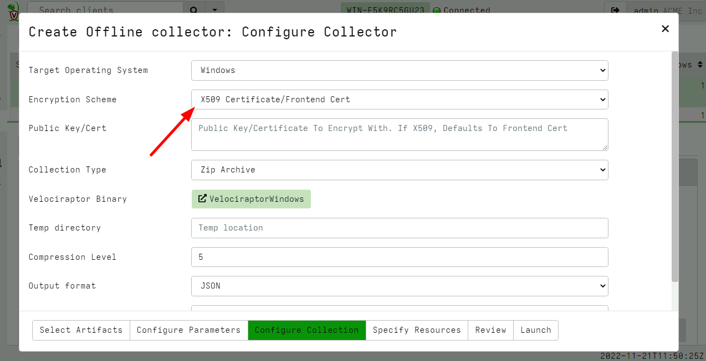
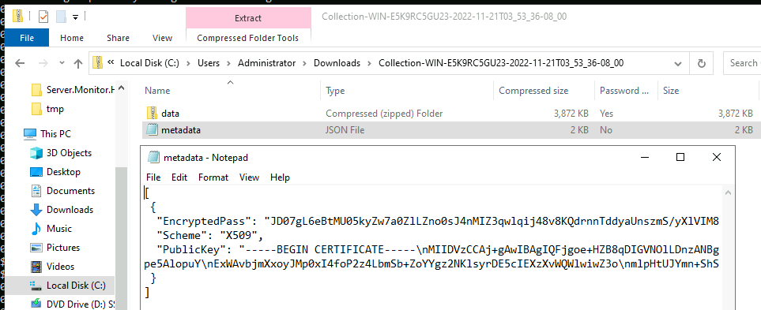
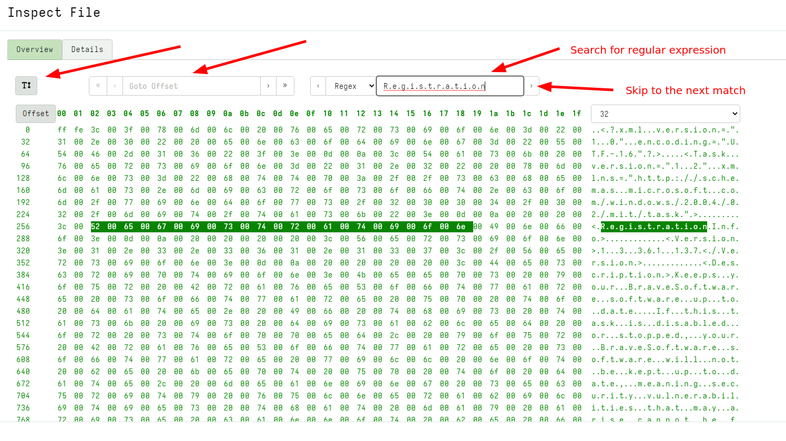

<!-- .slide: class="title" -->
# Velociraptor - Year In Review

<div class="inset">

## VeloCon 2023

### Mike Cohen, Digital Paleontologist

</div>


---

<!-- .slide: class="content" -->
## The year was a productive year!

* Latest release 0.7.0
* Stability and bug fixes with community engagement
* So many new features it is hard to keep track of
* More enterprise ready!

A quick tour of the past year...


---

<!-- content -->

## NTFS Parser

* MFT Reconstruction returns all the hard links
   * The MFT can contain multiple $FILENAME streams
   * Each $FILENAME stream may indicate a different parent MFT Entry
   * Therefore each file may exist in multiple directories at the same time
   * This is called hard links!

---

<!-- content -->

## NTFS Parser

* The same file can be accessed using multiple paths.


---

<!-- content -->
## The offline collector: Encryption

* The Offline Collector produces a ZIP file containing sensitive data
* Previously only protected with ZIP password.
   * This requires the password be in plain text in the collector binary.

* Since 0.6.7 the offline collector can produce Asymmetric Encrypted
  ZIP files.
   * This ensures they are protected in transit - Only the server can
     decrypt them!

---

<!-- content small-font -->

## The offline collector: Encryption

Selecting X509 encryption during the Offline Collector preparation  process.




---

<!-- content small-font -->

## The offline collector: Encryption

The collector produces an encrypted container that requires the X509
private key to decrypt.



---

<!-- content small-font -->

## Importing/Exporting collections

Users need to be able to easily export/import collections between
Velociraptor servers.

Therefore we need a standard collector format that can be read in
again!


---

<!-- content small-font -->

## Importing/Exporting collections

The following container types can be reimported into Velociraptor with  `Server.Utils.ImportCollection`

* Offline collector produced collections
* Collections exported using the GUI
* Contains all metadata to recreate the collection records


---

<!-- content -->

## Performance improvements
### New Client/Server Protocol

* Offloads a lot of tracking to the client
* Means the server can handle many more clients

---

<!-- content small-font -->
## The Virtual File System

* Used to view files on the endpoint
* Synced with the server
* Previously design was limited to smallish directories
* New design means we can handle arbitrary sized directories.


---

<!-- content small-font -->
## VQL improvements

### Memory/Performance tradeoffs

* Previously certain operations resided in memory leading to excessive
  memory user.
* Now VQL resorts to disk for these operations so they are safe.

```sql
LET X <= SELECT * FROM glob(globs=specs.Glob, accessor=Accessor)

SELECT *, count()
FROM glob(globs="C:/Windows/System32/*")
GROUP BY Name
```

---

<!-- content small-font -->
## VQL improvements
### Debugging VQL queries

New keyword `EXPLAIN` allows VQL to explain how the query works.


---

<!-- content small-font -->

## GUI Improvements

### Column filtering and sorting

All tables now allow directly filtering and sorting on each column.


---

<!-- content small-font -->

## GUI Improvements

### Built in Hex Viewer/Preview

A Hexviewer is now included directly in the GUI allowing quick preview
of collected data.
   * Can search collected files by Regular Expression or hex strings.



---

<!-- content small-font -->

## GUI Improvements

### Enhanced client search

Client indexing has been improved and is now extremely fast.
   * We can also report total matches in the GUI


---

<!-- content -->
## Locking down the server

Some security improvements:

* Lockdown mode:
   * Prevent the server from issuing new collections, updating
     artifacts etc.

* Plugin allow-listing:
   * On shared servers prevent certain plugins from being registered.

* IP Filtering the GUI:
   * Restrict GUI connections from certain CIDR ranges

---

<!-- content -->

## New Accessors

Many new accessors facilitate sophisticated automation

* Direct SMB access: Allows reading or uploading to remote SMB shares.

* Azure blob storage upload.

* S3 accessor allows reading from and uploading to S3 buckets

---

<!-- title -->
# The Velociraptor Community

## Who are our users?

---

<!-- content small-font -->

## The Velociraptor Community survey

We wanted to understand our user base - [so we asked!](https://docs.velociraptor.app/blog/2023/2023-04-03-velociraptor-survey/)

* Users range from
   * very small (30%)
   * large companies (20%)
* Use cases include
   * Digital Forensic Collection (20%)
   * Digital Forensic Analysis (21%)
   * Incident Response (hunting) (21%)
   * Monitoring and Detection (12%)

---

<!-- content -->
## The Velociraptor Community survey

* Deployment sizes vary a lot
    * Many users run deployments of less than 250 endpoints (44%)
    * About 40% of users deploy to less than 5,000 endpoints.
    * Approximately 10% of users have deployment sizes larger than 25,000 endpoints
    * Approximately 2% of users over 100,000 endpoints.

---

<!-- content small-font -->
## The Velociraptor Community survey

Thank you for the Community and product feedback!

> This is a game changer for the DFIR industry. Keep up the great work.

> Keep the file system based back end, its simplicity makes chain of custody/court submissions possible.

> I thoroughly love Velociraptor. The team and community are absolutely fantastic.

---

<!-- title -->

# Looking into the future

## Velociraptor as a platform!

---

<!-- content -->

## Velociraptor as a platform!

Having a widely deployed Velociraptor installation creates many
opportunities for automation and wider use cases!

> Any time we can ask a question of many endpoints at once we can use
> Velociraptor!

> Monitoring endpoints for changes makes Velociraptor an excellent
> candidate.

---

<!-- content -->

## Auditing and Compliance

We can apply hardening checks to ensure endpoints are in compliance!
   * Automatically generate VQL for hunting.

New project to explore Auditing and Compliance Checks
https://github.com/Velocidex/Audit


---

<!-- content -->
## SQLite Hunting

Started of as a consolidated SQLite artifact inspired by SQLECmd

Grew into much more than that! (ESE, Chrome, IECache, MacOS artifacts)

   * Fully automated
   * Flexible
   * Extremely fast!

https://github.com/Velocidex/SQLiteHunter

---

<!-- .slide: class="content" -->
## We need your help!

Velociraptor needs you to join the community and help drive future
development!

Filing bug reports and feature requests helps building the ultimate
DFIR tool **YOU** want to use!


---

<!-- .slide: class="content" -->
## Conclusions

* Join all the fun on Discord and Github!
* If you have not yet played with Velociraptor what are you waiting
  for?

<p>

<table class="noborder"> <tr> <td>Docs</td><td> <a
href="https://docs.velociraptor.app/">https://docs.velociraptor.app/</a>
</td> </tr> <tr> <td>Github</td><td> <a
href="https://github.com/Velocidex/cloudvelo">https://github.com/Velocidex/cloudvelo</a>
</td> </tr> <tr> <td>Discord</td><td> <a
href="https://docs.velociraptor.app/discord/">https://docs.velociraptor.app/discord/</a>
</td> </tr> <tr> <td>Mailing list</td><td> <a
href="mailto:velociraptor-discuss@googlegroups.com">velociraptor-discuss@googlegroups.com</a>
</td> </tr> </table>
