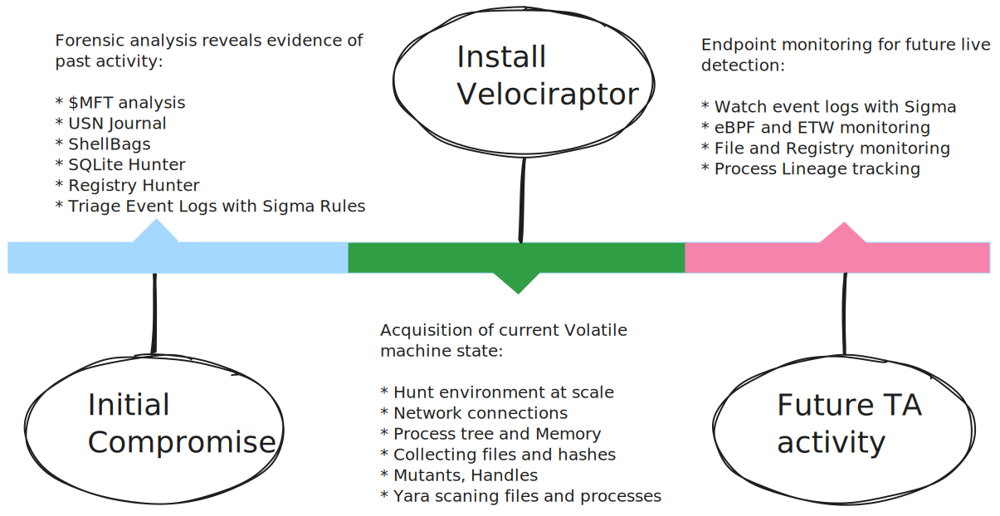
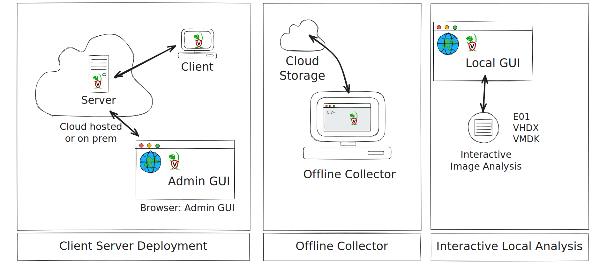
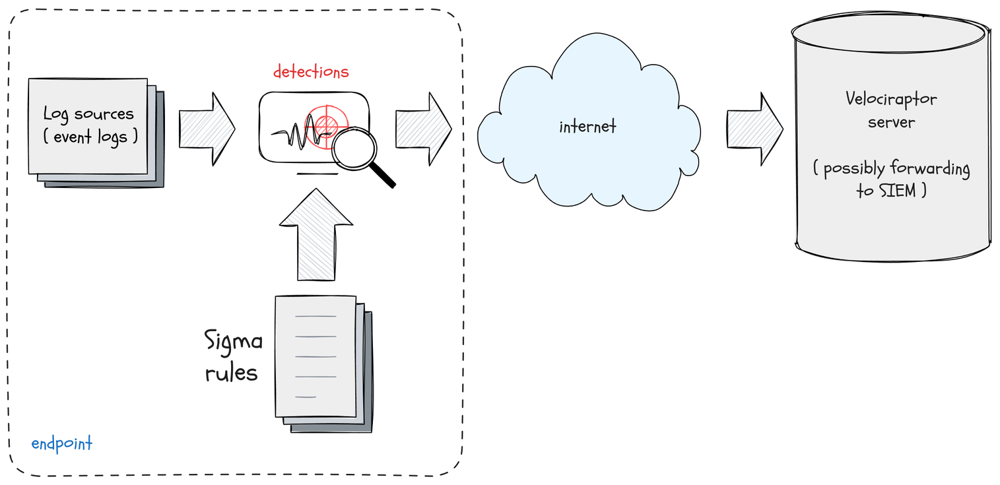
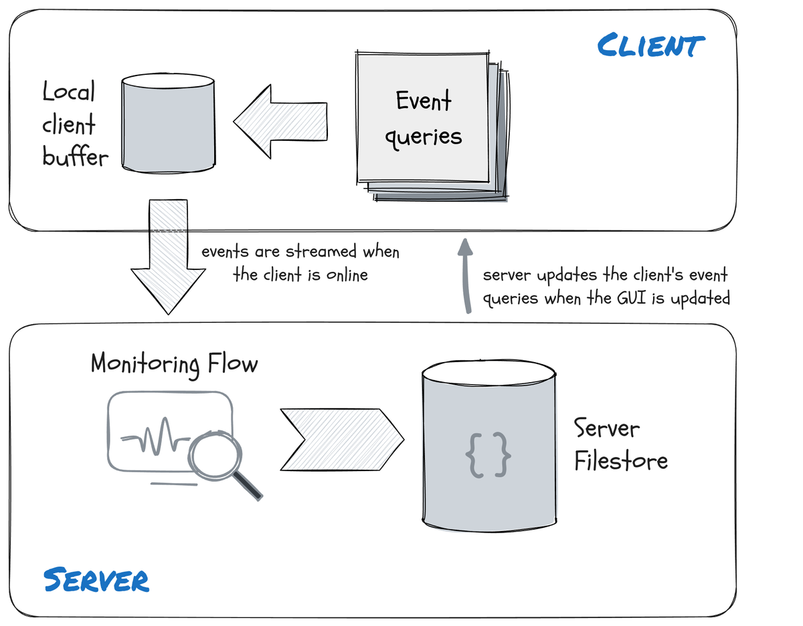
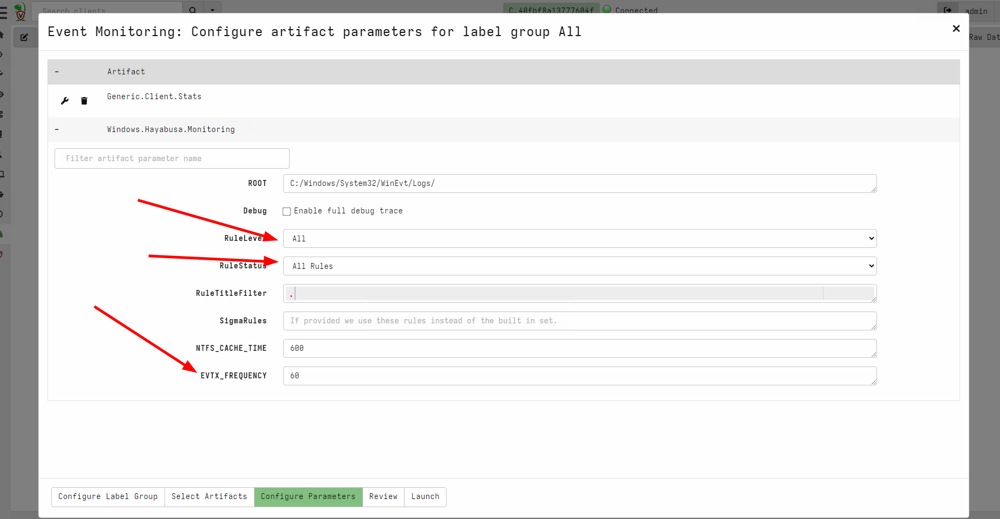
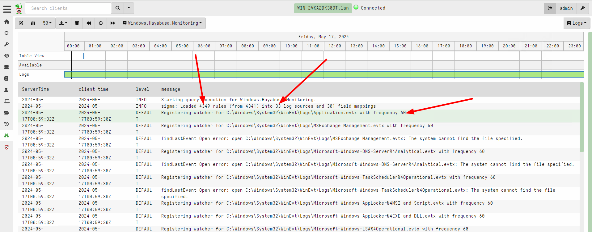
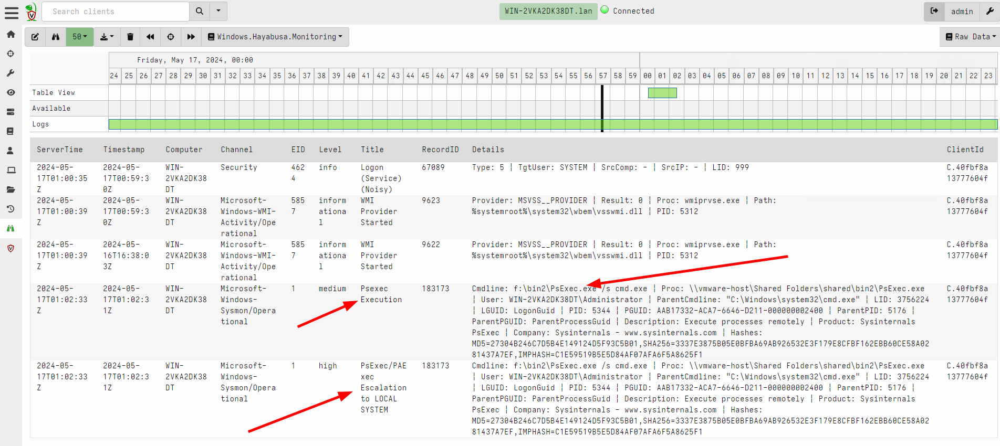

<!-- .slide: class="title" -->

<h1 style="font-size: 4ex">Velociraptor: Digging Deeper</h1>

## Introducing Velociraptor

### Mike Cohen, Digital Paleontologist
### Rapid 7 Inc

---

<!-- full_screen_diagram small-font -->
## What is Velociraptor?
### A DFIR tool to handle every stage of the attack timeline

---

<!-- full_screen_diagram small-font -->
## How can I use Velociraptor?
### Flexible tool to handle every use case

---

<!-- .slide: class="content" -->
## Scalable, fast, accurate

* Support Linux, Windows, MacOS, FreeBSD …
* Server simply collects the results of queries - clients do all the
  heavy lifting.
* Client memory and CPU usage is controlled via throttling and active
  cancellations.
* Server is optimized for speed and scalability
* Concurrency control ensures stability
* Bandwidth limits ensure network stability
* Single or multi-server modes (20k EP/server).

---

<!-- .slide: class="content small-font" -->
## Interactively investigate clients

Digital forensic plugins turn VQL into a high quality DFIR tool

---

<!-- .slide: class="content small-font" -->
## Velociraptor Artifacts
### Artifacts encode VQL into user sharable code snippets

---

<!-- .slide: class="content small-font" -->
## Hunts - Collecting at scale
### Collecting artifacts at scale from multiple endpoints

---

<!-- .slide: class="content small-font" -->
## Postprocessing using Notebooks
### Collaborative shared VQL execution environments

---

<!-- .slide: class="content" -->

## Triaging Using Sigma

* Endpoint tools can directly evaluate Sigma rules on the event logs

---

<!-- .slide: class="content small-font" -->

##  Collecting the sigma artifact

---

<!-- .slide: class="content small-font" -->

## Triaging an endpoint

---

<!-- .slide: class="content small-font" -->

## Stacking rules by title

---

<!-- .slide: class="content small-font" -->

## Viewing the stacking stats

---

<!-- .slide: class="content small-font" -->

## Viewing common rows

---

<!-- .slide: class="content" -->

## Detection vs. Forensics

* VQL Sigma rules bridge detection with forensics.
* Forensics: `What happened here?`
    * Recover all the information - relevant or not
    * Get a full picture.

* Detection: `What bad things happened here?`
    * Take the forensic information and rapidly zero in on obvious bad
      signals.
    * Not designed to be exhaustive! Triage oriented

* Complimentary capabilities

---

<!-- .slide: class="content" -->

## Real Time Sigma alerting
### VQL is fully asynchronous - real time queries.

---

<!-- .slide: class="content" -->

## Real Time Sigma alerting

### Configuring Velociraptor's client monitoring

---

<!-- .slide: class="content" -->

## Real Time Sigma alerting

### Configuring Velociraptor's client monitoring

---

<!-- .slide: class="content small-font" -->

## Live detection with Sigma

---

<!-- .slide: class="content small-font" -->
## Administration and automation

* All server administration tasks can be automated with VQL artifacts
* API access available for external automation
* Automatic upload of data to Elastic/Slack/Discord
* Open ended architecture enables novel use cases.

---

<!-- full_screen_diagram small-font -->
## The Velociraptor Ecosystem

---

<!-- .slide: class="content" -->
## Conclusions

We only scratched the surface of what Velociraptor can do!

Check out the following links and join our community…

<table class="noborder">
<tr>
    <td>Docs</td><td>
        <a href="https://docs.velociraptor.app/">https://docs.velociraptor.app/</a>
    </td>
</tr>
<tr>
    <td>Github</td><td>
        <a href="https://github.com/Velocidex/velociraptor">https://github.com/Velocidex/velociraptor</a>
    </td>
</tr>
<tr>
    <td>Discord</td><td>
        <a href="https://docs.velociraptor.app/discord/">https://docs.velociraptor.app/discord/</a>
    </td>
</tr>
<tr>
    <td>Mailing list</td><td>
        <a href="mailto:velociraptor-discuss@googlegroups.com">velociraptor-discuss@googlegroups.com</a>
    </td>
</tr>
</table>
