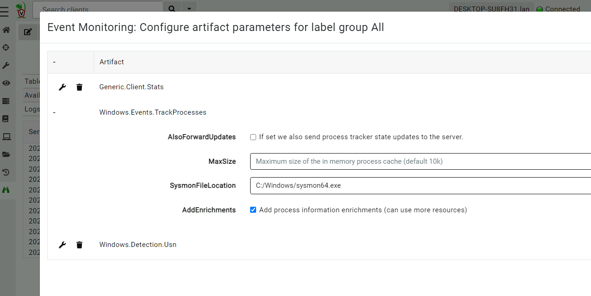
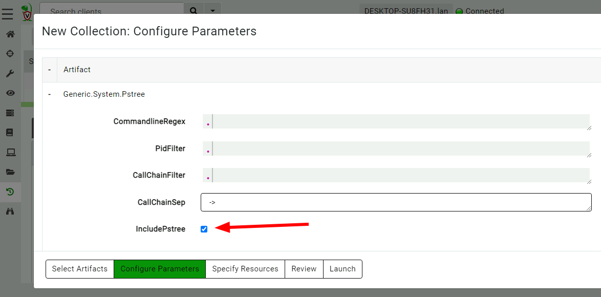
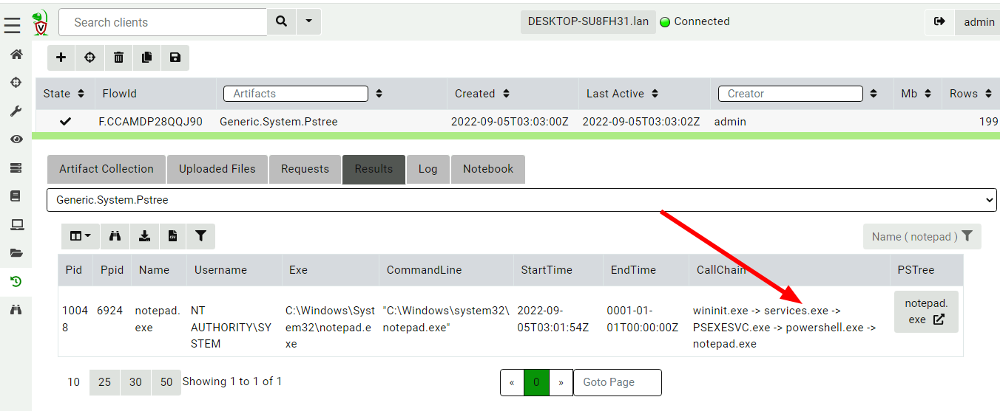
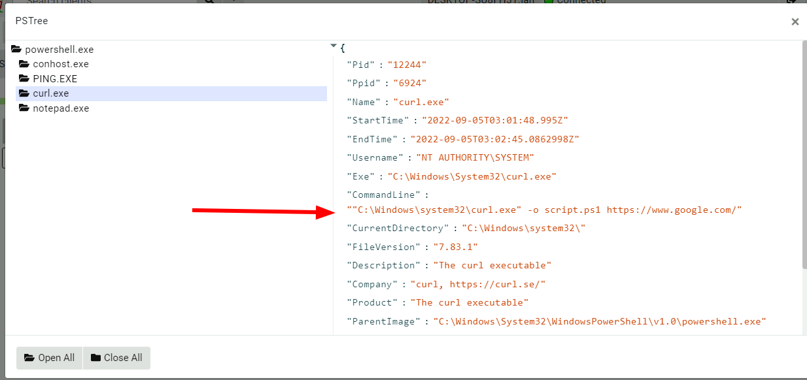
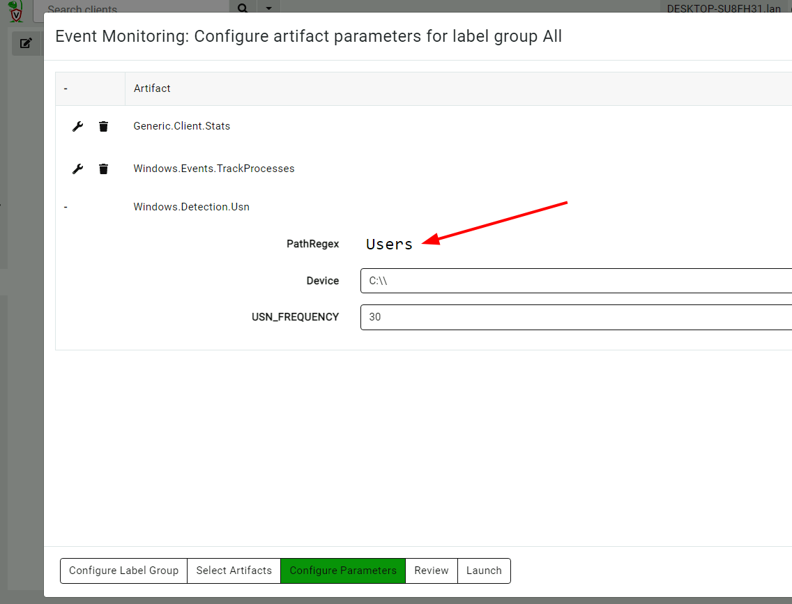

<!-- .slide: class="title" -->

<h1 style="font-size: 4ex">Enhancing detection through endpoint monitoring</h1>

<div class="inset">

## Thursday Defensive

### Mike Cohen, Digital Paleontologist

</div>


---

<!-- .slide: class="content" -->
## What is DFIR?

<div class="container">
<div class="col">

#### Digital Forensics

1. Look at the past
2. Answer the question "what happened?"
3. Locard exchange principal
4. Rigorous: "stand up in court"

</div>
<div class="col">

#### Incident Response

1. Time critical - Triage...
2. Damage control
3. Answer questions like
    * How did they get in?
    * What data was accessed

</div>

---

<!-- .slide: class="content" -->

## Digital Forensics

* The art and science of deducing the past by happenstance
    1. Microsoft records prefetch statistics - we can leverage it to
       deduce execution occurred.

    2. When an NTFS file is copied in a certain way we observe $FN
       time > $SI time

* The Locard exchange principal is rooted in physical evidence - it is
  just an analogy


---

<!-- .slide: class="content" -->
## Improving the quality of Digital Forensics

<div class="container">
<div class="col">

* Preparation for Forensics can vastly improve the quality of data
  available during an investigation.

* Configuration changes can improve the level and quantity of logs
  available.

</div>
<div class="col">

#### Be prepared


</div>

---

<!-- .slide: class="content" -->
## Limitations of Digital Forensics

Digital Forensics is limited in the type and quality of data it may
provide.

* Memory images are limited by smear, parsing issues (profiles) and
  size.

* Some artifacts only exist on certain OS version (eg prefetch)

* Some artifacts are not kept very long (e.g. USN Journal). Some have
  way too much data.

---

<!-- .slide: class="title" -->

# Why do Digital Forensics?

---

<!-- .slide: class="content" -->
## Going back to basics

We really just want to answer the pertinent question as quickly as
possible:

1. What happened?
2. How did it happen?
3. How can we stop it happening again.

---

<!-- .slide: class="content" -->
## Leveraging an agent to prepare

If we have an agent already running on the endpoint:

#### Enhance forensic preparedness

---

<!-- .slide: class="content" -->

## Example: Sysmon

Sysmon provides enhanced visibility into process creation

1. The purely DFIR approach relies on Prefetch, AMCache etc
2. Sysmon running on the endpoint makes these artifacts redundant!

---

<!-- .slide: class="content" -->
## Tracking processes

* One of the critical questions we ask is `Where did this process come
  from?`

* Context of where the process came from is important in establishing
  initial access vector!

* We could collect all process execution from all endpoints, but:
    * This will generate a large volume of events.
    * Vast majority of events are not interesting.
    * Often we determine which process is interesting by context.

---

<!-- .slide: class="content" -->
## The process tracker

* Velociraptor can track processes locally on the endpoint at runtime.
* If the need arises, we can enrich with process execution information.
* This can be done **EVEN IF THE PROCESS EXITED**

---

<!-- .slide: class="full_screen_diagram" -->
## Exercise: Enable the process tracker



---

<!-- .slide: class="content" -->
## Emulate a typical attack

```powershell
psexec.exe /s powershell
ping.exe www.google.com
curl.exe -o script.ps1 https://www.google.com/
notepad.exe
```

---

<!-- .slide: class="full_screen_diagram" -->
## Inspect the notepad process


---

<!-- .slide: class="content" -->
## Using Generic.System.Pstree



---

<!-- .slide: class="content" -->
## View process tree




---

<!-- .slide: class="content" -->
## Inspect the process call chain




---

<!-- .slide: class="content" -->
## USN Journal

* The USN journal is useful for recovering evidence of file
  modification.
* Sadly in practice the USN journal rolls over fairly quickly (days!)
* Wouldn't it be nice to feed the events to the server continuously?

---

<!-- .slide: class="content" -->
## Windows.Detection.USN

* Enable the Windows.Detection.USN artifact - target paths of
  interest.



---

<!-- .slide: class="content" -->
## Imagine a world....

Imagine a world where all endpoints had continuous monitoring of all
activities without needing use Digital Forensics.

* We can reliably answer questions quickly and easily.
* Relevant data was kept but irrelevant data was discarded.
* Detection rules can be developed directly targeting high value data.

---

<!-- .slide: class="content" -->
## Mind shift...

How can we develop tools that bring higher visibility as well as more
reliable operation? E.g Memory Forensics

<div class="container">
<div class="col">

#### Digital Forensics

* Acquire entire physical memory image
* Download to analysis system
* Post process using scripts (Volatility etc)

</div>
<div class="col">

#### Velociraptor approach

* Bring the analysis to the endpoint itself
* Apply the same techniques in a more efficient way.

[Windows.Detection.Malfind](https://docs.velociraptor.app/exchange/artifacts/pages/malfind/)

---

<!-- .slide: class="content" -->
## Conclusions

* Time to think outside the box!

* Focus on the real questions we need answered...

* Wouldn't it be nice if I had ...

* Velociraptor can enhance the quality of evidence found on the
  endpoint to rely less on Digital Forensics and more on preparation.

* Quality vs Quantity trade offs

---

<!-- .slide: class="content" -->
## Conclusions

Check out the following links and join our community…

<table class="noborder">
<tr>
    <td>Docs</td><td>
        <a href="https://docs.velociraptor.app/">https://docs.velociraptor.app/</a>
    </td>
</tr>
<tr>
    <td>Github</td><td>
        <a href="https://github.com/Velocidex/velociraptor">https://github.com/Velocidex/velociraptor</a>
    </td>
</tr>
<tr>
    <td>Discord</td><td>
        <a href="https://docs.velociraptor.app/discord/">https://docs.velociraptor.app/discord/</a>
    </td>
</tr>
<tr>
    <td>Mailing list</td><td>
        <a href="mailto:velociraptor-discuss@googlegroups.com">velociraptor-discuss@googlegroups.com</a>
    </td>
</tr>
</table>
