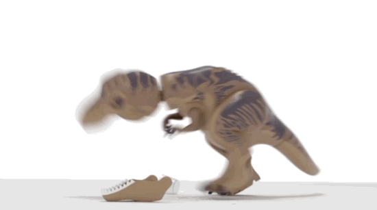

<!-- .slide: class="title" -->
# Velociraptor - Year In Review

## VeloCon 2022

### Mike Cohen, Digital Paleontologist

---

<!-- .slide: class="content" -->
## The year was a productive year!

* Latest release 0.6.6
* Stability and bug fixes with community engagement
* So many new features it is hard to keep track of
* More enterprise ready!

A quick tour of the past year...

---

<!-- .slide: class="content" -->

## Glob plugin has recursion_callback

* This was essential for Linux where symbolic links can cause
  problems.

---

<!-- .slide: class="content" -->
## Purpose built notebooks

Notebooks can be defined inside an artifact.
Makes it easier to offer valuable post processing queries to users.

* Many users asked to be able to export/import their notebooks for
  reuse.
* It is also possible to add "Suggestions" to notebooks now that can
  be added on demand.

---

<!-- .slide: class="full_screen_diagram" -->

## Defining a notebook cell inside the artifact

---

<!-- .slide: class="full_screen_diagram" -->
## Cell is available as a suggestion

---

<!-- .slide: class="full_screen_diagram" -->
## Instant post processing

---

<!-- .slide: class="content" -->

## Built in binary parser

This very powerful binary parser has improved and allows us to write
very complex parsers in pure VQL.

Examples include:
* `Windows.Forensics.Lnk` parse lnk files in VQL
* `Windows.Carving.CobaltStrike`: Allows decoding of configuration from memory.
* `Windows.Forensics.Prefetch`: Example of a hard coded parser converted to dynamic VQL parser.

---

<!-- .slide: class="full_screen_diagram" -->
## Profile based binary parser

---

<!-- .slide: class="full_screen_diagram" -->
## The Lnk parser artifact

---

<!-- .slide: class="full_screen_diagram" -->
## Parsing Cobalt Strike config

---

<!-- .slide: class="content" -->
## In-memory search index

Makes searching and operating on clients extremely fast!

* Search by MAC or IP addresses
* Can estimate hunt impact quickly
* Resolving client id -> Hostname is instant

---

<!-- .slide: class="content" -->
## Estimating hunt impact

---

<!-- .slide: class="content" -->
## Parse PE and Authenticode

On Windows Velociraptor can parse all parts of the PE file and
calculate authenticode signatures - even for catalog signed files!

---

<!-- .slide: class="content" -->
## Many artifact parameter types

* Yara rules supported naturally
* Regex editor and validator UI
* Upload file form element for large files

Makes it very easy to write user friendly artifacts!

---

<!-- .slide: class="full_screen_diagram" -->
## Artifact parameters have different types

---

<!-- .slide: class="content" -->
## Multiple Oauth2 Providers

Sometimes we would like to invite external users to Velociraptor, but
they are not in the same identity org as us!

Instead of integrating random people into our own identify provider,
we can simply support more than one provider at once!

Very useful to provide collaboration with customers and consultants.

---

<!-- .slide: class="full_screen_diagram" -->
## Supporting multiple Identity providers

---

<!-- .slide: class="content" -->
## The Velociraptor Knowledge base and Artifact Exchange

The Knowledge base is a place to share your experiences and tips in
small searchable pages!

The Artifact Exchange is where the community can share content.

It is easy to import all Artifact Exchange entries into a running server!

---

<!-- .slide: class="full_screen_diagram" -->
## The artifact Exchange

---

<!-- .slide: class="full_screen_diagram" -->
## The Knowledge Base

---

<!-- .slide: class="content" -->
## More accurate path handling in VQL

* Using pathspecs we can chain together accessors in a more accurate way.
* Pathspecs make it easier to manipulate paths correctly
* No more split on "/" type VQL
* An OSPath is a list of path components

---

<!-- .slide: class="full_screen_diagram" -->
## OSPath supports inherent path manipulations

---

<!-- .slide: class="content" -->
## Dead disk analysis

Remapping accessors allows us to "trick" Velociraptor into analysing a
dead disk image as if it was a live filesystem.

* Can write the VQL once and run it in different contexts.
* Can easily create unit tests for artifacts

https://docs.velociraptor.app/blog/2022/2022-03-22-deaddisk/

---

<!-- .slide: class="content" -->
## The process tracker

* Using client side monitoring to retain important information client side.
* This information becomes important when we need to enrich data.
* Unprecedented visibility into past process execution!

---

<!-- .slide: class="full_screen_diagram" -->
## Accurate process call chains

https://docs.velociraptor.app/blog/2022/2022-08-17-process-tracker/

---

<!-- .slide: class="content" -->
## GUI improvements

* We now have a large number of themes to choose from...

---

<!-- .slide: class="content" -->
## GUI improvements

* To reflect the global nature of our community we have a number of
  languages available!

---

<!-- .slide: class="content" -->
## GUI improvements

* Display timezone can now be adjusted by the user!

---

<!-- .slide: class="content" -->
## GUI improvements

* Send-to menu allows easy sending of results to `CyberChef`,
  `VirusTotal` etc.

---

<!-- .slide: class="content" -->
## Multi-Org support

* Many people asked for this feature!
* Being able to separate clients into org groups allows the same
  Velociraptor deployment to be used with multiple customers.
* Organizations can be easily created and destroyed.
* Users can be bound to orgs by ACLs

https://docs.velociraptor.app/blog/2022/2022-08-15-release-notes/

---

<!-- .slide: class="full_screen_diagram" -->
## Multi Org feature

---

<!-- .slide: class="content" -->
## Resource controls on endpoint

* One of the most important considerations is the impact on endpoint
  performance.
* Can limit average CPU load, IOPs and total query time.
* Limit total uploaded data
* Can limit upload bandwidth too ...

---

<!-- .slide: class="full_screen_diagram" -->
## Fine grained control over endpoint impact

---

<!-- .slide: class="content" -->
## Performance and scalability

* While Velociraptor is pretty fast it was originally designed for
  deployment size of 10-15k clients.
* Many people wanted to go higher!

Master/Minion architecture is now available to work to scales of >100k endpoints.

---

<!-- .slide: class="full_screen_diagram" -->
## Multi Frontend design

https://docs.velociraptor.app/docs/deployment/cloud/multifrontend/

---

<!-- .slide: class="full_screen_diagram" -->
## Example of a large deployment

---

<!-- .slide: class="content" -->
## The Future awaits!

Where do we need to go next year?

* Better scalability options with cloud Velociraptor.
* More artifacts, parsers etc.
* Client monitoring queries
* Alerts as first class objects...

---

<!-- .slide: class="content" -->
## We need your help!

Velociraptor needs you to join the community and help drive future
development!

Filing bug reports and feature requests helps building the ultimate
DFIR tool **YOU** want to use!

---

<!-- .slide: class="content" -->
## Conclusions

* Join all the fun on Discord and Github!
* If you have not yet played with Velociraptor what are you waiting for?

<table class="noborder">
<tr>
    <td>Docs</td><td>
        <a href="https://docs.velociraptor.app/">https://docs.velociraptor.app/</a>
    </td>
</tr>
<tr>
    <td>Github</td><td>
        <a href="https://github.com/Velocidex/cloudvelo">https://github.com/Velocidex/cloudvelo</a>
    </td>
</tr>
<tr>
    <td>Discord</td><td>
        <a href="https://docs.velociraptor.app/discord/">https://docs.velociraptor.app/discord/</a>
    </td>
</tr>
<tr>
    <td>Mailing list</td><td>
        <a href="mailto:velociraptor-discuss@googlegroups.com">velociraptor-discuss@googlegroups.com</a>
    </td>
</tr>
</table>
